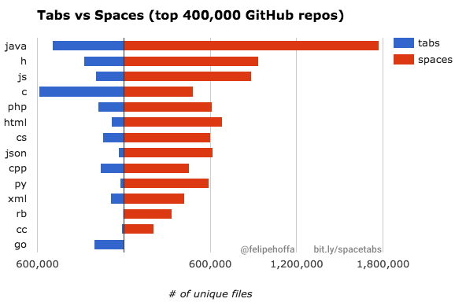

Tabs vs Spaces - which one should be used when indenting code? I'm going to spoil the suspense right away by saying that the answer is clearly Tabs. However, it would be remiss of me not to describe what we're talking about, and why Tabs are the correct^(TM)^ choice.

<!-- more -->

## Primer

When writing computer code, there are parts of code that sit hierarchically inside other pieces of code. Something that's only run under certain conditions, for example (in an "if" statement) or a piece of code that runs more than once (in a loop such as a "for" loop or a "while" loop). Usually these pieces of code are enclosed in a delimiter, normally curly brackets: { }. However unindented code can be hard to read, and so coders tend to indent their code by adding spaces or tabs at the beginning of lines to show their hierarchy.

There are many websites that will indent code for you, and most modern IDEs (Integrated Development Environments - software, akin to MS Word and LibreOffice Writer for writing documents, that coders use to write their software) come with plugins that will automagically indent and clean up your code for you. There's even a language - Python - that doesn't use bracketing to mark code hierarchy, and instead relies on indenting to tell it what the hierarchy of the code is. I have friends who hate that idea, but I quite like it - Python doesn't care what indenting scheme you use, as long as you remain consistent.

## My History

I care about the indenting scheme I use, and I've used a few in my time. I've always indented my code, right back to the '90s when I was writing in Pascal and C++. However, I never cared too much about consistency until I started coding in Python in the mid 2000s - at which point I was forced to care. Before then, most of my code was a mix of tabs and spaces - with my editor set to show a tab as four spaces (which is pretty standard in editors), and therefore a tab was interchangeable with four spaces in my code.

When it came to python, I started off by following whatever standard I accidentally started with. After a while it got a little bit annoying having to go back and fix code where the only issue was that some new lines I'd added were using the wrong indenting, so I decided to settle on a single standard.

That standard was two spaces. I felt like spaces were easier to manage: a space always shows up as a single character of whitespace, whereas a tab has a variable width, and will push code to the right until the next tab stop. So, for example, if you have your tabs set to show as four spaces and you hit tab at the beginning of a line of code, that code will move four spaces to the right. But if that line starts with two spaces and you click tab after those spaces, the code will only move two spaces to the right, as far as the next multiple of four characters along the line.

I also felt like using four spaces was pushing my code too far to the right for deep nesting, although I've read an argument that if your code becomes pushed too far to the right with a tab indenting of four characters, your code is probably too complex and needs to be broken down and simplified. This is something I wouldn't have cared about too much in the past, as I tended to enjoy creating long lines of code that minimised the creation of new variables. But now, with the wisdom of age, I've realised that having readable code is much more important than trying to skip a couple of CPU cycles - and that readability is useful not just for others who want to use my code, but for me when I come back to my code six months down the line.

Having settled on two spaces for a while, I tried out a single space. This seemed to be fine, as I was saving a little file space and the code was still readable. However, although my single space indented code was readable to me, it wasn't readable to others. I had a couple of comments from people who I shared code with that the single space indenting was a nightmare to read for them.

And this is where we arrive at my current solution. I now use a tab to indent my code, and I set my tab spacing to two characters. However, because I use a tab, people can choose in their editor to display my indenting however best suits them. I'm getting the same file size reduction as using a single space, but without making it a pain for others to read and edit my code.

At a pinch it's also easier to swap a single tab out for something different using Search and Replace, as it's much less likely that a Tab will be used inside code than a space. If you try to replace spaces with tabs in code, you're going to have a whole heap of mess when every space in your code (rather than just at the beginning of each line) is replaced by a tab. Of course, in a modern IDE this is all moot - prettifiers, indent swappers and inline block indent options (e.g. select a block of text and click tab to indent that code by one tab) make it a breeze to work with whatever indenting scheme you choose to use.

## Pub thoughts

I had a chat with a fellow coder in the pub recently, and asked him whether he uses tabs or spaces, and why. Here are a couple of extra points that came out in the conversation about why tabs are superior (and, by the way, he prefers to use tabs):

It's quicker to scroll right with tabs than with spaces - each keypress will scroll right by four characters, if we're comparing a tab to four space indenting.

When using spaces to indent, it's easy to be out by a single space - it's relatively hard to spot when indenting by four spaces if your code block is indented by just three spaces or by five spaces. However, it's pretty hard to mess up your indenting with tabs - getting the indent wrong by a single tab will be easy to spot.

## Summary

Tabs are the winner here, because of:

- Flexibility in display
- File size reduction
- Easier search and replace
- Quicker scrolling
- Less chance of mistakes

## Conclusion

For now, I stand by my choice of using a single tab for indenting. I think that this solution is the most flexible, and is also the most likely to allow easy adoption when sharing code in a team or publicly somewhere like GitHub. However, it appears that I am in the minority if this analysis of code on GitHub is accurate:

## This is serious

In case anyone's unsure of the importance of this question, here's a clip from Silicon Valley showing just how serious a disagreement over Tabs vs Spaces can be.

@[youtube](https://youtu.be/SsoOG6ZeyUI)

## Examples

As a way of illustrating what code indenting is, here's some of my software with different indenting:

:::: tabs

::: tab "Single Space (PHP)"

<<< @/docs/blog/code/decrypt/rotx.php

:::

::: tab "Single Space (Python)"

<<< @/docs/blog/code/kodi/Convert-to-MKV.py

:::

::: tab "Tab (Python)"

<<< @/docs/blog/code/kodi/Resize-Album-Art.py

:::

::: tab "Tab (JavaScript)"

The beauty of this is that although it shows here with a four space indenting, when I edit the code I only see two spaces of indenting per tab.

<<< @/docs/.vuepress/components/code/cyphers/caesar.js

:::

::: tab "Tab (Vue SFC)"

<<< @/docs/.vuepress/components/code/divider/voltage.vue

:::

::::
