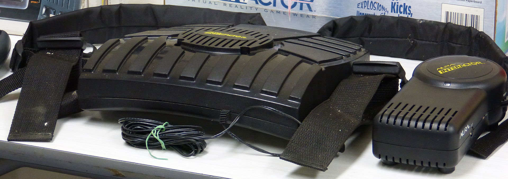

Thanks to the generosity of a friend, my lounge now not only has a 7.2 embedded wall speaker setup, but the sofa also vibrates when there is a low bass rumble in the audio of whatever media I'm consuming. This effect has been achieved with the (mis)use of an [Aura Interactor](https://en.wikipedia.org/wiki/Aura_Interactor) Shaker. The Aura Interactor was a device sold in the 1990s to gamers, and was a backpack with a low frequency speaker inside it. Rather than being designed to make noise, this speaker moves a large piece of metal back and forth without a diaphragm, and shakes whatever it's attached to. The rig comes with an amplifier, and takes a mono RCA input - which, thankfully, most subwoofers these days have an output for. My friend has collected a few of these devices over the years, removing the shaker from the backpack each time and bolting it to a piece of wood that is then bolted to the inside wooden frame of a sofa.

<!-- more -->

The controls on the amplifier are pretty simple. There's a volume dial, a frequency dial (which adjusts a filter that cuts out high frequency sounds) and a switch to put the device in Game mode. I wondered what this mode did, and was hopeful that maybe it would filter a high frequency sound from specially crafted games and downshift the frequency to the bass range for the shaker. This would be a nice effect, as it would allow you to send shake events to the backpack not whenever there's a low frequency rumble, but rather when an event happens on the screen such as being punched in a beat 'em up, shot in an FPS or hitting an obstacle in an endless runner. The audio signal would be of a high enough frequency that it wouldn't be audible through the room's speakers, but once translated to low frequency by the Aura amplifier would shake the shaker and give you a thump.

If the Game mode worked as I'd hoped, I could possibly write plugins for newer games that monitored for these kinds of events - in game impacts - and generated these high frequency chirps to engage the shaker.

So, to test this, I borrowed a friend's intact shaker and sat on it - with it still embedded in the foam insert of the backpack. Then, with laptop in hand and the audio output of my laptop plugged into the audio in of the Aura amp, I started looking online for a simple tone generator. Unfortunately I couldn't find what I needed on the interwebs, but I figured that with modern JS Audio functions in the browser, it shouldn't be too hard to code one.

So, without further ado, here's the result of a few minutes' effort while sitting on a triangle shaped vibrating pillow:

<code-audio-tone />

And here's the (relatively) simple code that generates these tones:

<<< @/docs/.vuepress/components/code/audio/tone.vue

In the end, it appeared that the Game mode was somewhat more mundane. From what I could tell, because some early gaming systems like the Nintendo SNES didn't output much in the way of low frequency sound (which is understandable, given how cruddy most TV speakers were), the Game mode is likely to have simply shifted frequencies just above those that the Aura usually reacted to (maybe 50-100Hz) down to frequencies that the shaker would output (around 25-50Hz).

As a bonus, here's a review with an unboxing of a set that will give you a good idea of how the whole thing works:

@[youtube](https://youtu.be/K1Dzm7LeuGM)
