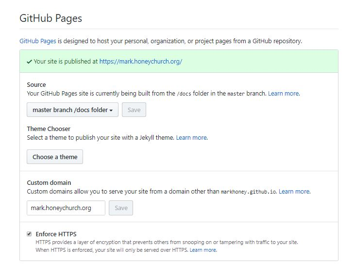

This website is built using [Vuepress](https://vuepress.vuejs.org/) and a little bit of Vue magic. The [entire source](https://github.com/markhoney/mark.honeychurch.org) for this site is on GitHub, and the config.js file has been set to build the site to the /docs folder. In GitHub this repository has been set to publish the site at /docs and has been given a custom domain name - mark.honeychurch.org.

<!-- more -->



This solution allows me to have both the source and build for the website in the one GitHub repo, which is clean and simple. All that's needed is for Vuepress to be installed globally, along with the markdown-it extensions I use (video, fontawesome, abbr, sup, sub and attrs), and then for the NODE_PATH environment variable to point to the global node_modules folder.

A development version of the site, with hot reloading, can be launched by running:

```bash
vuepress dev
```

To build the static files for the production website, all I need to run is:

```bash
vuepress build
```

Then I commit the code, push it to GitHub, and the new version of my site is live.

## Vue

Vue components can be created to display content. I've written custom components for listing posts, displaying a single post, etc, as well as writing components.

Components can be dropped into any markdown page by adding the component's HTML tag. For a component at .vuepress/components/code/rotx/decode.vue, for example, the HTML tag would be &lt;code-rotx-decode /&gt;.

For a Vue component layout template that displays a single page, a &lt;Content /&gt; tag needs to be added where the markdown content of the page should be displayed.

## Metadata

### $page

For Vue components, there's metadata available for a single page in the $page object:

<code-vuepress-page />

### $site

There's a $site object which holds metadata for the entire site. I've created a separate page for it, as it's pretty long:

[$site](./site)

<!--
### $route

There's a $route object as well:

[$route](./route.md)
-->

### window.location

We also have all the usual Javascript data available to us, such as window.location (but bear in mind the gotcha described below):

<code-vuepress-location />

This can come in handy for clever hacks like using window.location.search to offer a dynamic page that lists posts in a single category, for example. However, because the window object is only available in the browser, we have to make sure that the code is only run on the client side. This can be done by creating an empty reactive data object, and then populating it on mount with the frontend data.

### location.vue

Here's the component I used above to get the window.location object:

<<< @/docs/.vuepress/components/code/vuepress/location.vue

### Category Page

For example, to list a single category of posts on this site, I have a reactive data object called "category" which is initialised as null. Then, on mounted(), I get the URL query from window.location.search to find out what category I need to show, and dynamically compute a list of pages that match that category:

<<< @/docs/.vuepress/theme/components/post/categories.vue

<!--
## This page

As an example, here is the markdown for this web page. There is a [Front Matter](https://jekyllrb.com/docs/front-matter/) section at the top of the page, followed by the page markdown.

<<< @/docs/blog/code/website/index.md
-->
