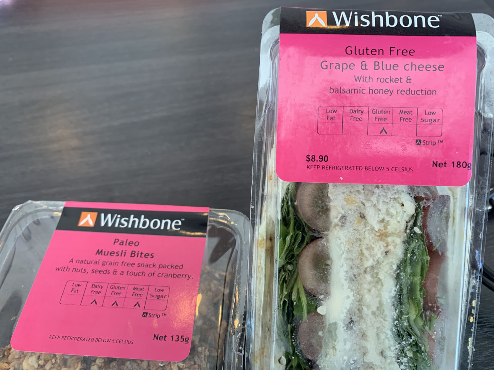
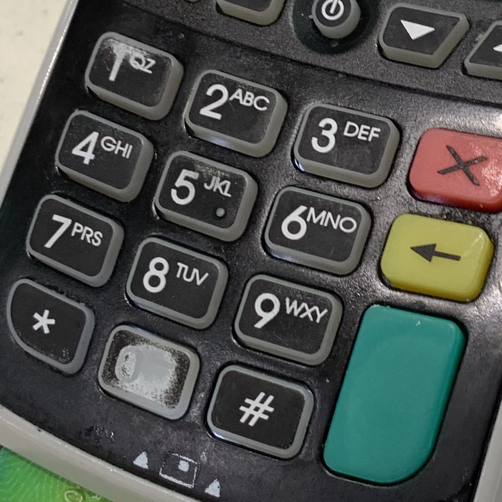

It's my middle daughter's birthday today, and we've had a food centric day.

<!-- more -->

We started with croissants and sausage rolls for breakfast, but by lunch time I was in Christchurch for work, stuck at the airport and unable to change my flight for an earlier one. In a fun, unskeptical moment, I decided to chow down on a Gluten Free sandwich and some Paleo bites.

For dinner we went out for sushi, and I spotted an interesting EFTPOS (card) machine:

What's interesting about this device is the wear of the various buttons. It's obvious from this picture that 0 and 1, and possibly 5 as well, are the most used buttons. Given that 1, 2 and 3 are used by many EFTPOS machines as choosing to pay via a Debit, Savings and Credit card respectively, and that most people would likely pay by debit, I can understand that the 1 key is worn. But I'm not sure about the 5 and 0. Are they part of the PIN used by staff to initialise the system before payment? Are these both frequently used digits in people's PINs? Are the buttons manufactured differently, and the 0 button wears out quicker than the others?
