I don't play computer games very often, as it often feels like wasted time that could have been more productively spent elsewhere. However, I've come round to the idea that games can be used as down time, and that it's okay sometimes to just take time off and relax with a controller in hand. Funnily, a lot of the games I enjoy playing probably aren't considered relaxing. I tend to choose games that require a lot of thought - not strategy games but puzzlers, and also games that are artistic or different to the mainstream.

<!-- more -->

So, here's a list of the games I've found myself enjoying over the last few years - they range from those that I've found myself coming back to again and again (Viscera Cleanup Detail), to those that surprise me with their novelty or storyline (What Remains of Edith Finch) and those that just blow me away with their innovation and style (Death Stranding). I've roughly broken them down by genre, but there's some overlap.

## Puzzle - single player

### [Braid](https://store.steampowered.com/app/26800/Braid/)

I think Braid may have been the earliest puzzle game I played that really had an interesting twist. It's one of several puzzle games that I really like that involve manipulating time.

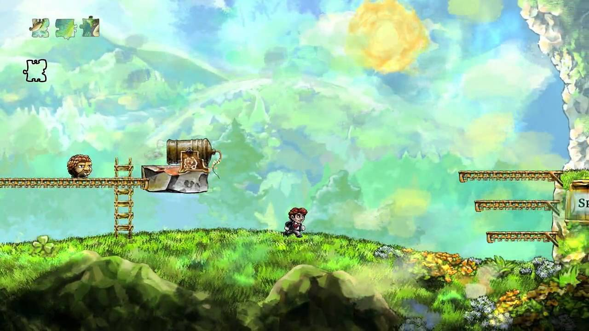

### [The Talos Principle](https://store.steampowered.com/app/257510/The_Talos_Principle/)

I liked The Talos Principle when I first purchased it because it ran well at 1080p on my HTPC graphics card, a lowly NVidia GT 520. The puzzles were difficult enough to be a real challenge as well.

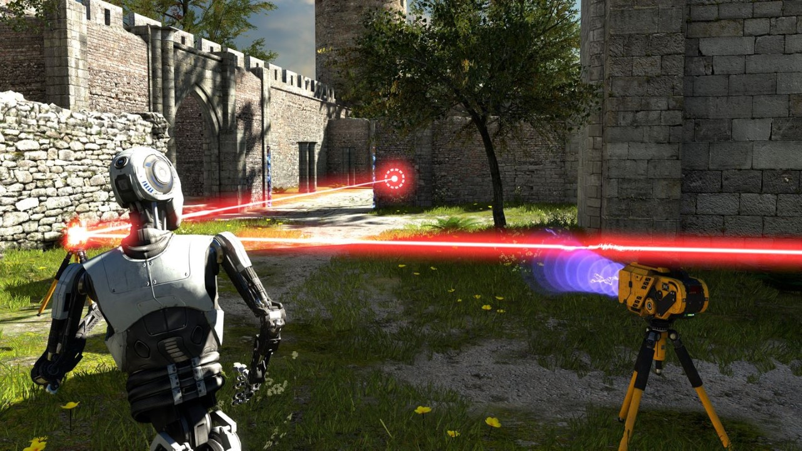

### [The Gardens Between](https://store.steampowered.com/app/600990/The_Gardens_Between/)

This game had a fun way of playing with time, and I didn't mind too much that it was on rails.

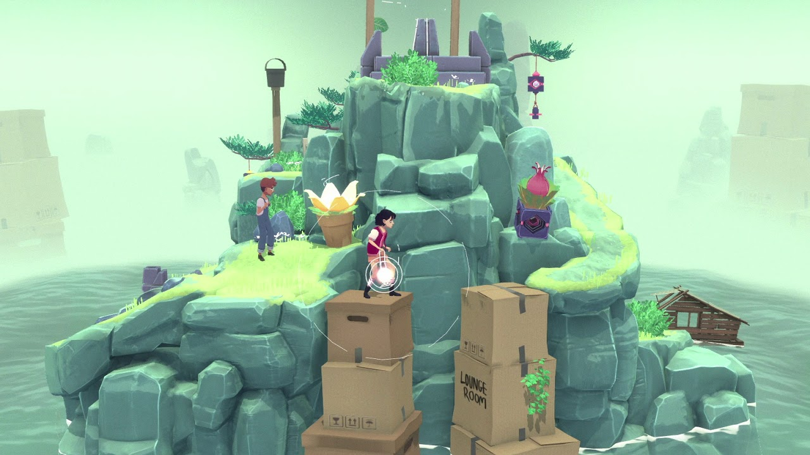

### [The Room series](https://store.steampowered.com/curator/38971635)

The Room games have been really fun to play as a family, with everyone making suggestions about what to try and enjoying the mysterious feel of the games.

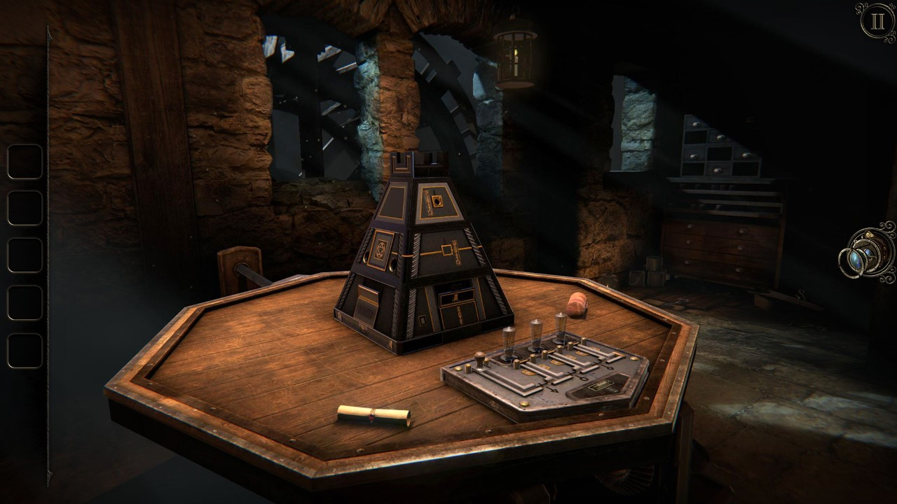

### [Portal 1 & 2](https://store.steampowered.com/bundle/234/Portal_Bundle/)

Both the Portal Games (and their predecessor, Narbacular Drop) have a really interesting, simple mechanic that gets you thinking laterally to solve puzzles.

### [The Unfinished Swan](https://store.steampowered.com/app/1206430/The_Unfinished_Swan/)

The Unfinished Swan's simple concept of making everyting totally white and having to use paint splats to see the landscape looks gorgeous.

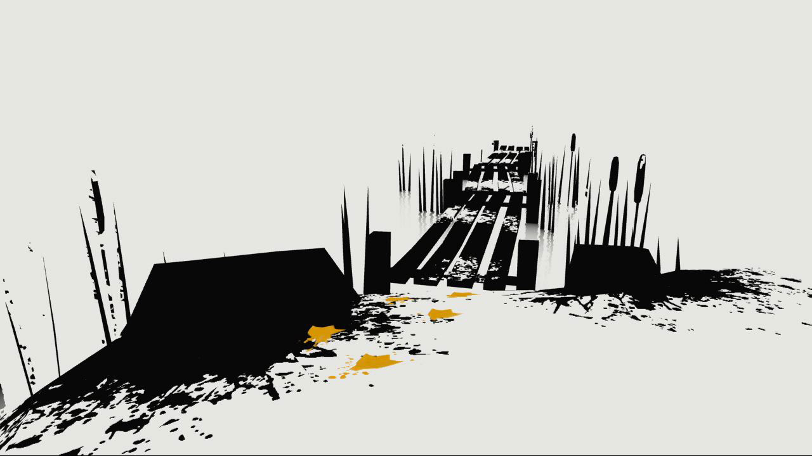

### [Please, don't touch anything](https://store.steampowered.com/app/354240/Please_Dont_Touch_Anything/)

This is a game I first played [in 3D](https://store.steampowered.com/app/529590/Please_Dont_Touch_Anything_3D/), on the Oculus Rift. I later bought the regular 2D PC version, and actually enjoyed it more than the 3D version - possibly because its simple graphics reminded me of [Papers, Please](https://store.steampowered.com/app/239030/Papers_Please/).

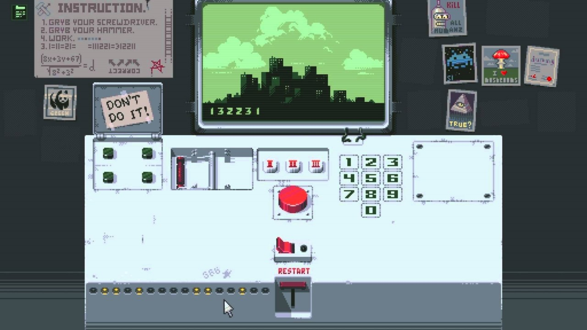

### [What Remains of Edith Finch](https://store.steampowered.com/app/501300/What_Remains_of_Edith_Finch/)

I really enjoyed the unfolding story in this game, which did an amazing job of piecing together a dysfunctional family that felt a lot like a gaming version of the Royal Tenenbaums.

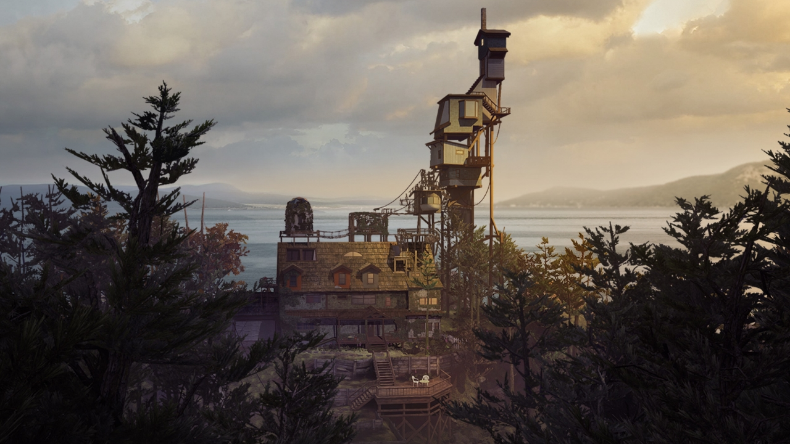

### [The Stanley Parable](https://store.steampowered.com/app/221910/The_Stanley_Parable/)

A clever game with cool narration and some clever manipulation of the game world to create enjoyable conundrums.

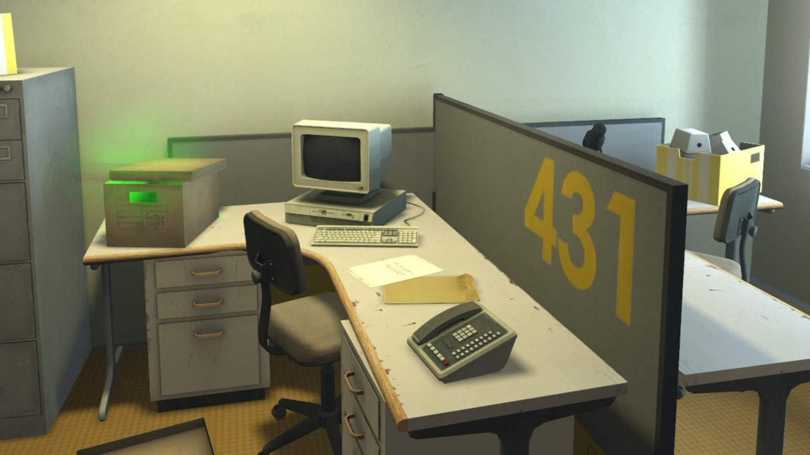

### [Limbo](https://store.steampowered.com/app/48000/LIMBO/)

This is a relatively short game, but with decent puzzles and a simple but effective look and feel.

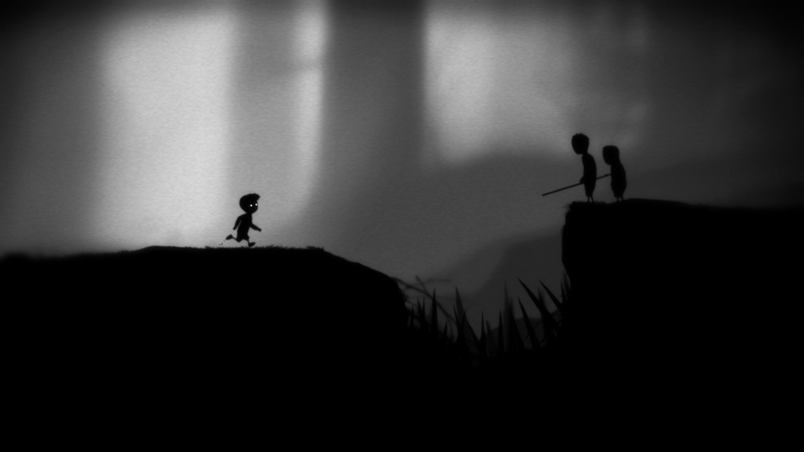

### [Superliminal](https://store.steampowered.com/app/1049410/Superliminal/)

There are moments in this game that left me audibly chuckling to myself because of how weird and wonderful the solutions to puzzles were. I was half expecting this game to be a one-trick pony, but the creators came up with enough tricks to make this an enjoyable play.

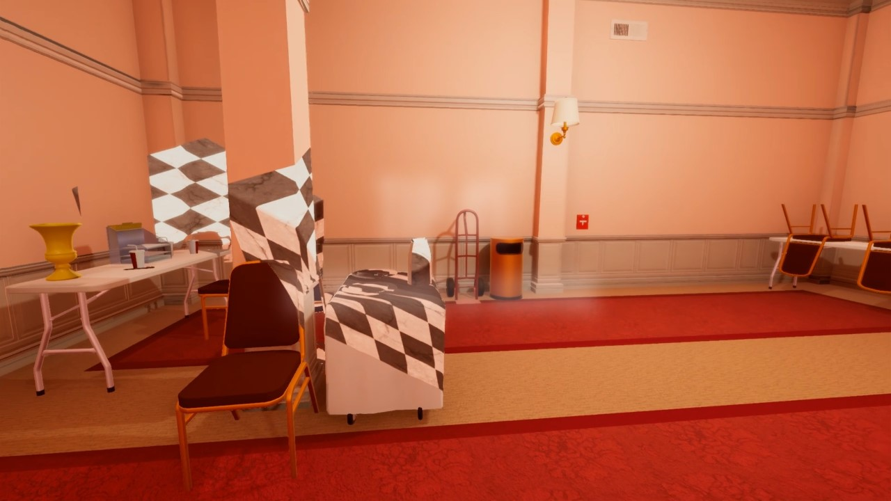

## Puzzle - multi player

### [Human Fall Flat](https://store.steampowered.com/app/477160/Human_Fall_Flat/)

This game works just as well as a single player option, but there's just something about playing with friends that adds the cherry to the top of this game. The novel control scheme, where the triggers control your arms, takes a while to get used to, but gives you a level of control that is ultimately satisfying.

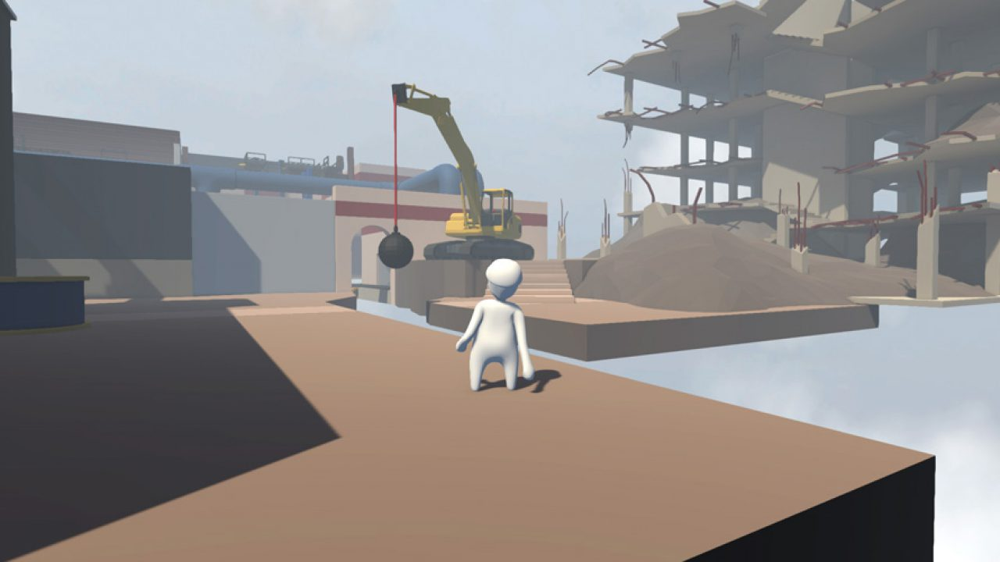

### [Death Squared](https://store.steampowered.com/app/471810/Death_Squared/)

A puzzler that keeps you thinking, trying and dying. Best not to play this one if you anger easily, as your partner in crime is more likely to accidentally kill you on an average level than you killing yourself.

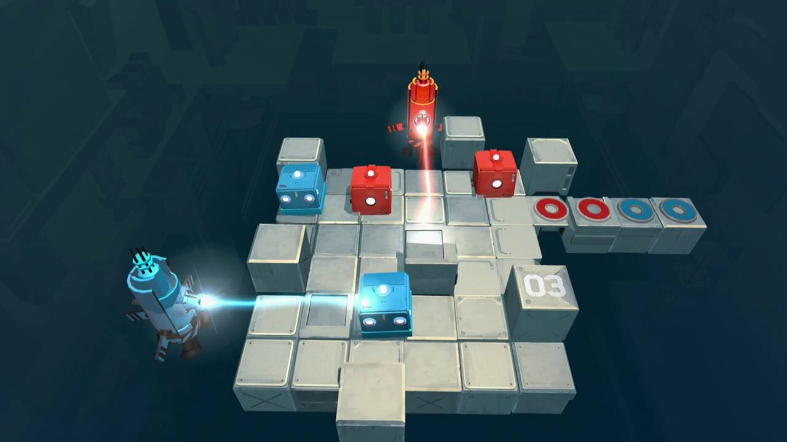

### [Keep Talking and Nobody Explodes](https://store.steampowered.com/app/341800/Keep_Talking_and_Nobody_Explodes/)

Not for the faint hearted, but a lot of fun if you enjoy a little stress, rushing to complete enough modules before the alarm clock runs down and the bomb explodes. For extra difficulty, a friend came up with the idea of playing it with the French manual - it was difficult, but we somehow managed it with a mixture of my 30 year old French knowledge and his total lack of understanding of the language.

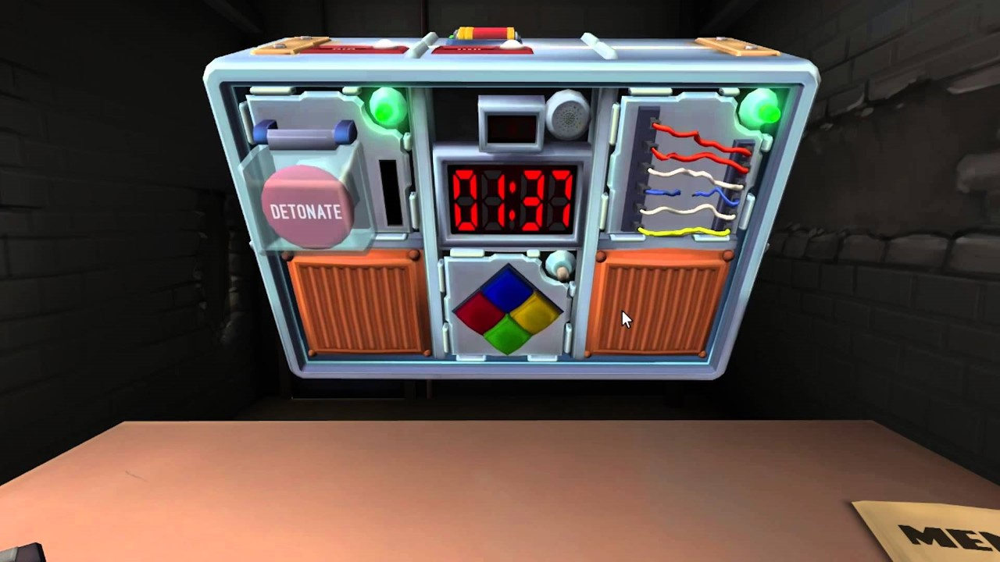

### [We Were Here series](https://store.steampowered.com/curator/28339062)

There are three games so far in this series, and the first one's free to play. All are played via remote co-op, and voice communication is required. The games consist of a series of fairly difficult puzzles that require both players to solve them, and need a lot of verbosity to complete, so speak out and say what you see.

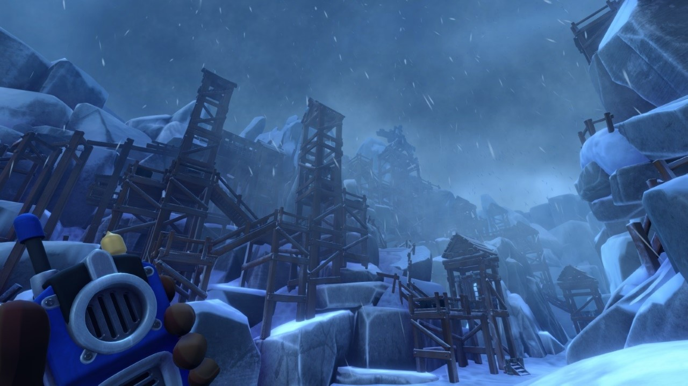

### [Tick Tock: A Tale for Two](https://store.steampowered.com/app/790740/Tick_Tock_A_Tale_for_Two/)

I loved how this simple game used the actions of both players to drive progression without actually needing any kind of internet connection between the two PCs.

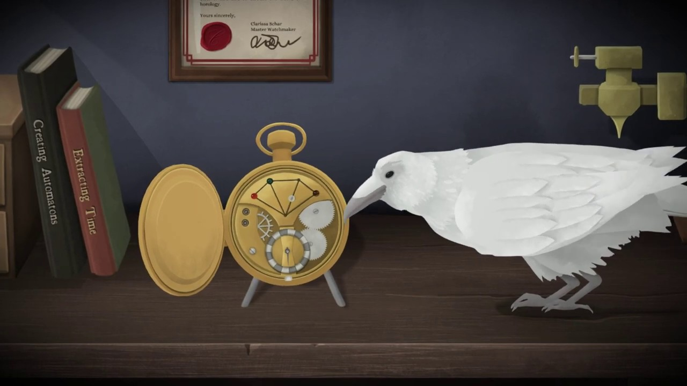

## Challenge - single player

### [Death Stranding](https://store.steampowered.com/app/1190460/DEATH_STRANDING/)

The most amazing gaming experience I have ever had. It's not just a game, it's Hideo Kajima's magnum opus - a love letter to computer games past and present. It's well paced, with an epic storyline, mind-blowing graphics, fun mechanics, genuine scares and some hilarious tongue in cheek dialogue. Hideo Kojima has set a new bar for AAA games, at least for me, and everything else is left wanting.

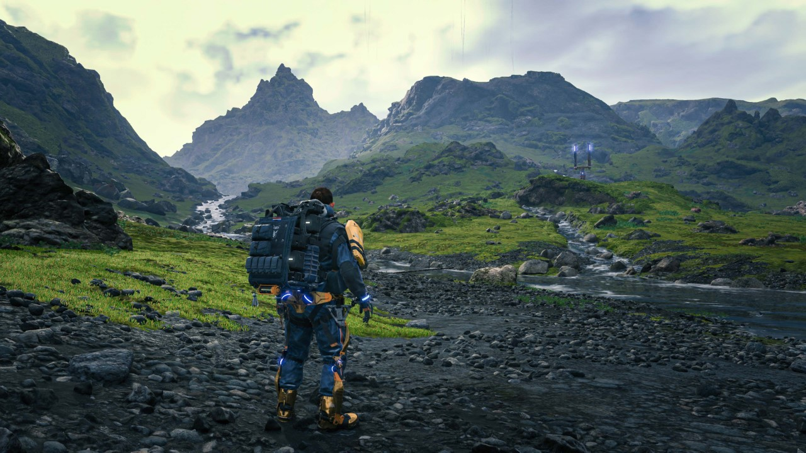

### [Supraland](https://store.steampowered.com/app/813630/Supraland/)

A game I only played recently, but found myself wanting to complete as quickly as I could. Lots of fun physics puzzles.

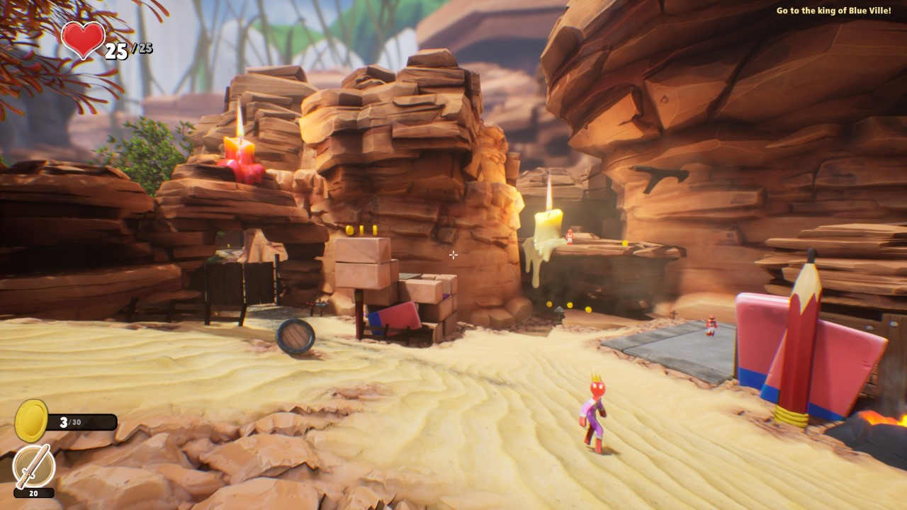

### [Subnautica & Below Zero](https://store.steampowered.com/app/264710/Subnautica/)

A couple of crafting games that I actually enjoyed, more because of the feelings that are created by being underwater, at risk of attack or drowning, than because of the crafting element. The first game especially had a good storyline and some cool aquatic creatures.

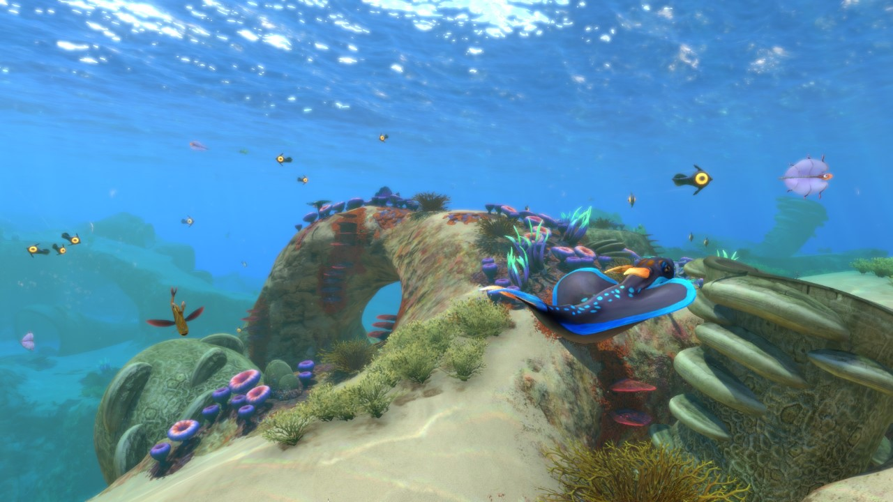

### [Dr. Langeskov, The Tiger, and The Terribly Cursed Emerald: A Whirlwind Heist](https://store.steampowered.com/app/409160/Dr_Langeskov_The_Tiger_and_The_Terribly_Cursed_Emerald_A_Whirlwind_Heist/)

Although this is a free game, I would have been happy to have paid for it. A great, funny story, well paced and well worth my time.

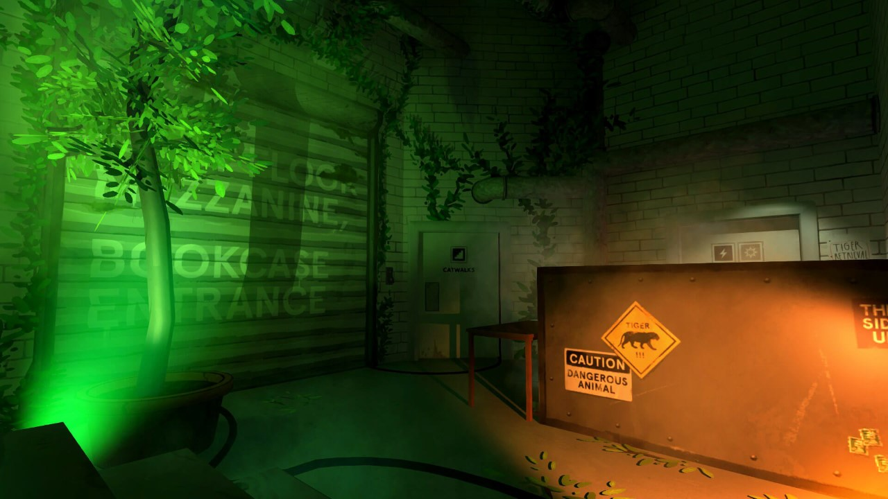

### [Firewatch](https://store.steampowered.com/app/383870/Firewatch/)

An engaging story that takes you along for the ride, leaving you feeling emotionally tired but satisfied.

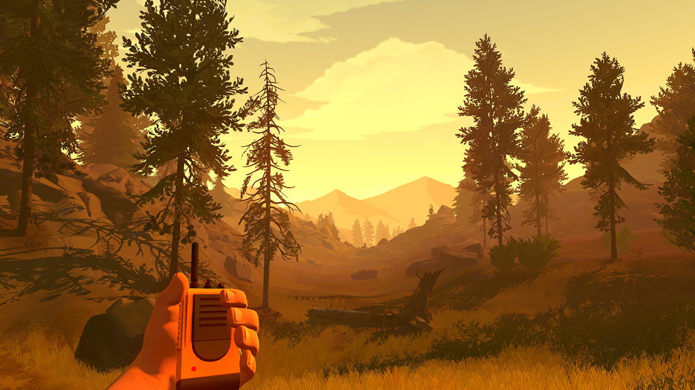

### [Q.U.B.E. 1 & 2](https://store.steampowered.com/bundle/6747/QUBE_Bundle/)

Some really enjoyable puzzles to be solved in these two games, and as a backdrop there's a nice story to follow along to as well.

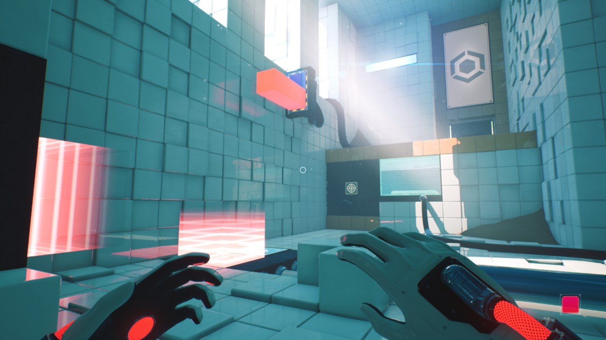

### [N.E.R.O.](https://store.steampowered.com/app/377480/NERO_Nothing_Ever_Remains_Obscure/)

This game has quite dark subject matter, which juxtaposes with the surreal fairy tale look and feel of the levels. I really enjoyed it for the storytelling, which I found to be engaging and believable.

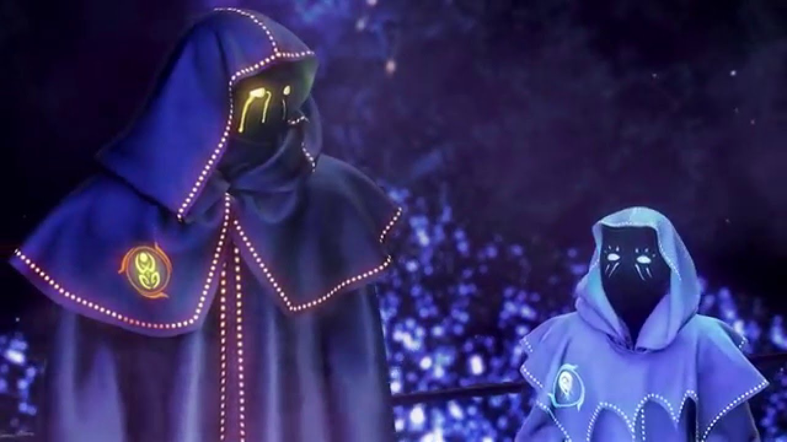

### [Mirror's Edge & Catalyst](https://store.steampowered.com/bundle/15400/Mirrors_Edge_Collection/)

A great way to do parkour in a computer game. I'm a big fan of the Assassin's Creed games, but the aesthetic and speed of the Mirror's Edge games are ultimately more satisfying to me.

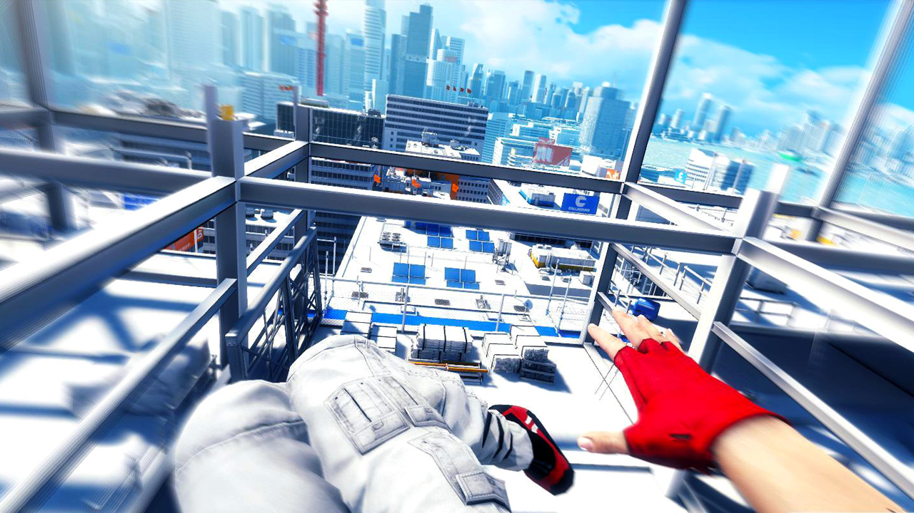

### [The Turing Test](https://store.steampowered.com/app/499520/The_Turing_Test/)

A clever game with some difficult puzzles, solid storyline, and enough twists to keep it fresh.

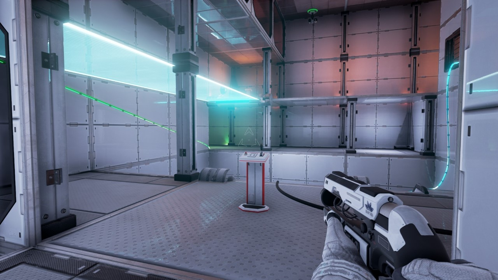

### [Journey](https://store.steampowered.com/app/638230/Journey/)

A stunningly beautiful game, that is a joy to play through. After finishing the game, I enjoyed watching my daughter play it through from start to end as well - especially when she ended up playing most of the game with an online companion who joined her on her journey. The emotional bond my daughter made with this random stranger online, brief though it may have been, nearly brought tears to my eyes.

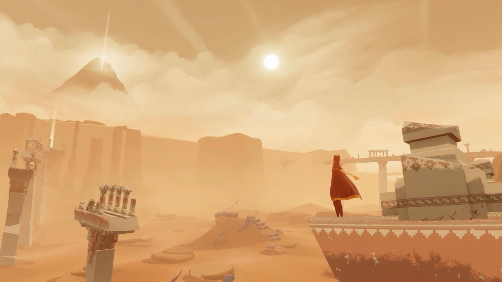

## Challenge - multi player

### [Viscera Cleanup Detail](https://store.steampowered.com/app/246900/Viscera_Cleanup_Detail/)

One of my all-time favourite games to unwind to, especially with friends. Your job in the game is to clean up after epic space battles - incinerate corpses, mop up blood, pick up spent shells, weld bullet holes. It's cathartic, and great to play while chatting online via Discord or with local split-screen.

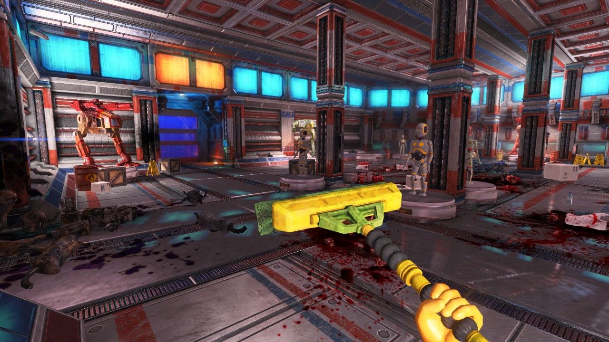

### [Lovers in a Dangerous Spacetime](https://store.steampowered.com/app/252110/Lovers_in_a_Dangerous_Spacetime/)

More difficult than it looks at first, this local co-op game needs good cooperation between the players and a certain amount of doggedness to play through.

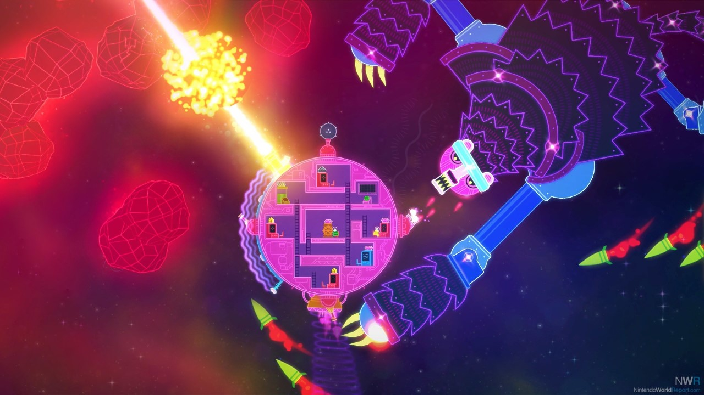

### [Overcooked](https://store.steampowered.com/app/448510/Overcooked/)

A great way to feel the stress of working in a commercial kitchen from the comfort of your own home! Lots of fun with friends as a local co-op game. I'd recommend picking a more experienced game player in your team to coordinate, assigning jobs and calling out the orders that need to be fulfilled.

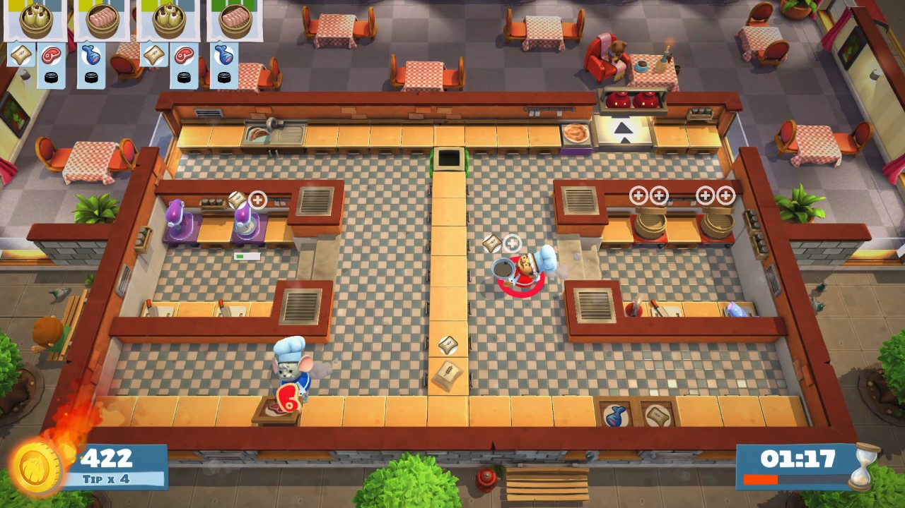

### [Manual Samuel](https://store.steampowered.com/app/504130/Manual_Samuel__Anniversary_Edition/)

What a weird game! Irreverant, difficult and very strange, this game has you cooperating to walk, blink and drive a manual (stik shift) car.

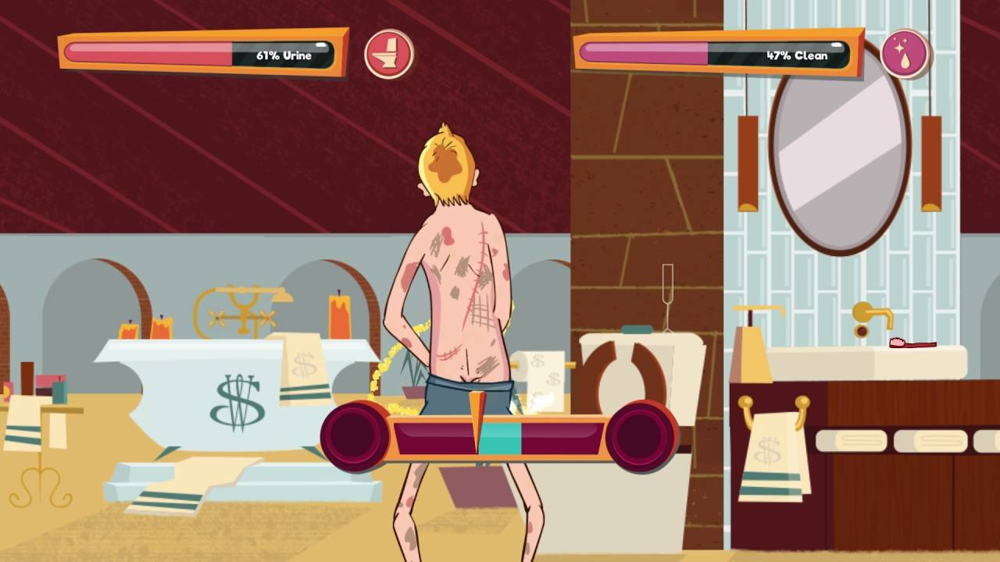

### [Affordable Space Adventures](https://www.nintendo.com/games/detail/affordable-space-adventures-wii-u/)

This is the only non-PC game on this list, as it's on Wii U only. Sadly it's unlikely to ever be ported as it leans heavily on use of the Wii U's gamepad, a controller with a screen in the middle. Each player controls several aspects of the steering of a small space ship through 2D platform levels. The gamepad is used by the Engineer, and shows heat and sound levels, allowing the player to switch engine types, turn features on and off, etc. It's a game that was obviously written for the Wii U's hardware, and does a really good job taking advantage of the Wii U's strengths. I'm almost tempted to pick up a second hand Wii U just for this game.

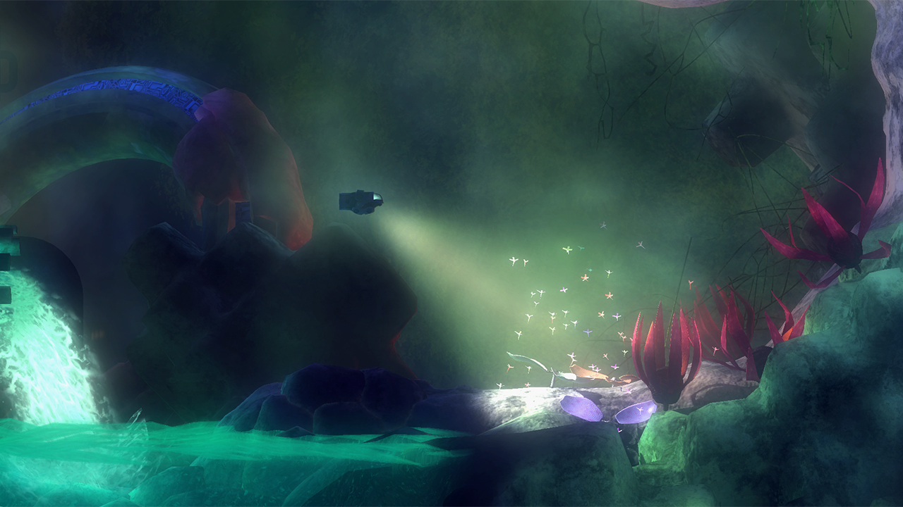

## Platform

### [Celeste](https://store.steampowered.com/app/504230/Celeste/)

A very simple but addictive platformer that will have you dying over and over again. The beauty of this game is that after dying you very quickly re-start the level, giving you a rhythm where you just keep trying over, and over, and over until you finally time your moves just right.

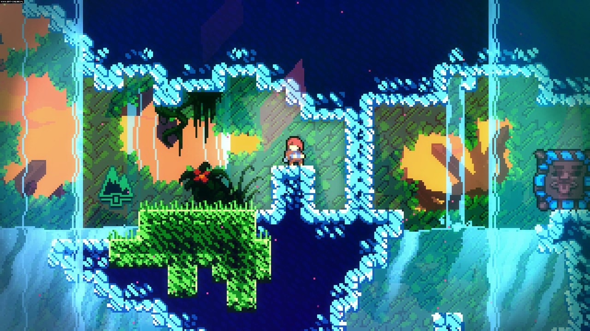

### [Gris](https://store.steampowered.com/app/683320/GRIS/)

A game I didn't play myself much, but instead I watched my eldest daughter play it. The story feels ethereal, leaving enough ambiguity for the player to decide for themselves what the meaning is. Beautiful and haunting.

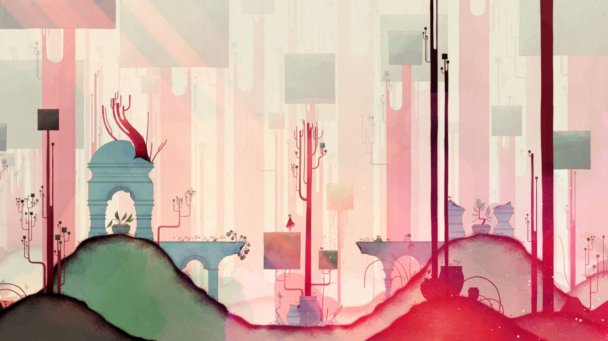

### [Ori](https://store.steampowered.com/bundle/18725/Ori_The_Collection/)

The two Ori games (Ori and the Blind Forest and Ori and the Will of the Wisps) are both solid platformers, with a progression system that works well, causing impossible tasks to become attainable, if difficult, later in the game.

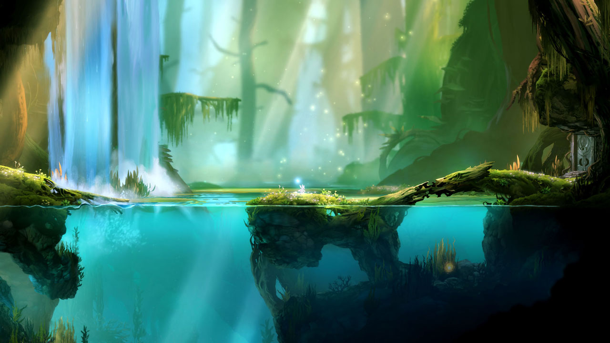

### [Unravel 1 & 2](https://store.steampowered.com/bundle/15296/Unravel_Yarny_Bundle/)

I assume that the limited 3D nature of this game helps with the graphics, because it looks absolutely stunning. The first game is single player, and the second is two player - both are a lot of fun to play.

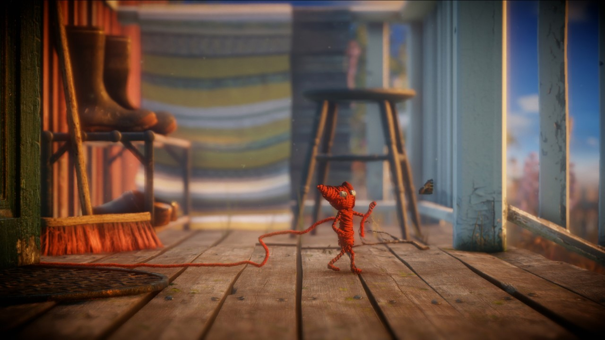

### [Rayman Legends](https://store.steampowered.com/app/242550/Rayman_Legends/)

Great to play multi player, with some really wacky bonus levels - some of which are so fast-paced they leave you wondering how the hell you managed to complete them.

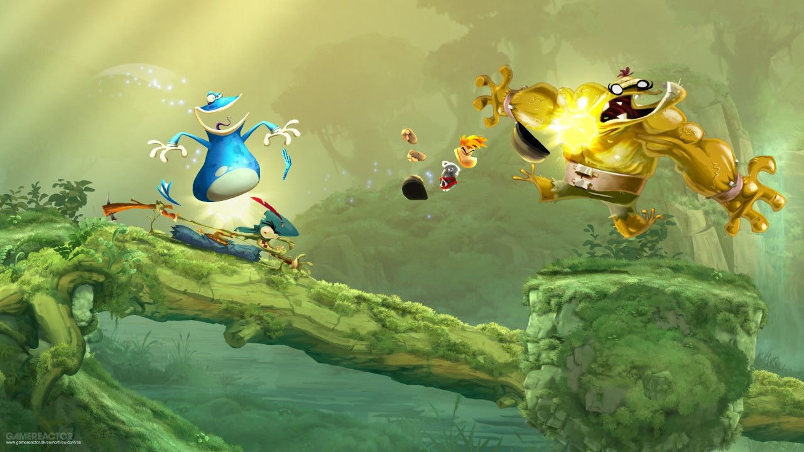

## Competitive multi player

### [Ultimate Chicken Horse](https://store.steampowered.com/app/386940/Ultimate_Chicken_Horse/)

Don't play this game with any friends who are griefers. The aim of the game is to alternate between building platforms and traps and using them to jump from the start line to the finish flag. If everyone's playing good naturedly, it's all good, but if you're playing with someone who doesn't care about winning and just wants to annoy others, you'll be in for a rough ride!

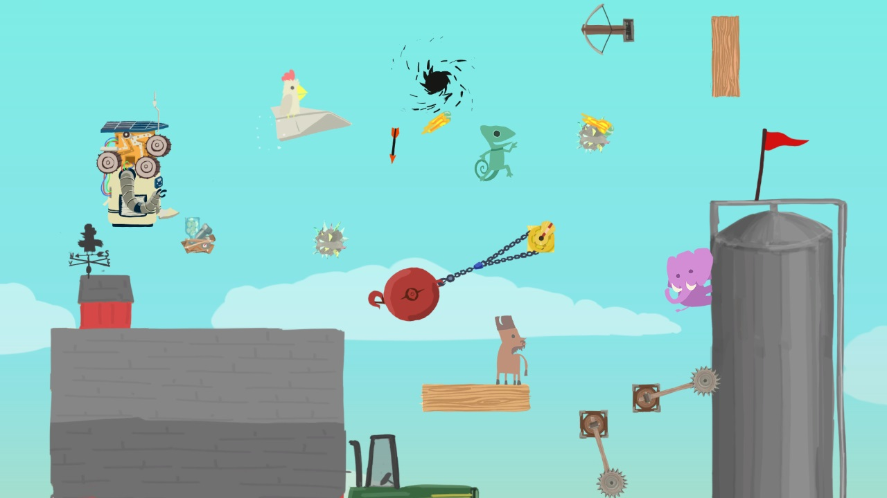

### [Stick Fight](https://store.steampowered.com/app/674940/Stick_Fight_The_Game/)

No, not the snake gun! Nothing good can ever come of it. This is a really nice, simple game with a wide array of guns - some of which are more of a liability than an asset.

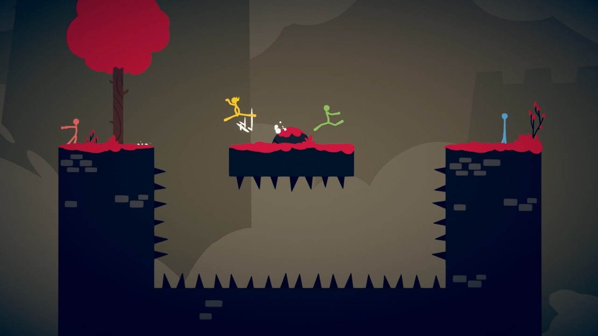

### [Screencheat](https://store.steampowered.com/app/301970/Screencheat/)

A great take on a First Person Shooter with local co-op play where everyone's invisible and you have to look at the other players' sections of the screen to work out where they are and shoot at them.

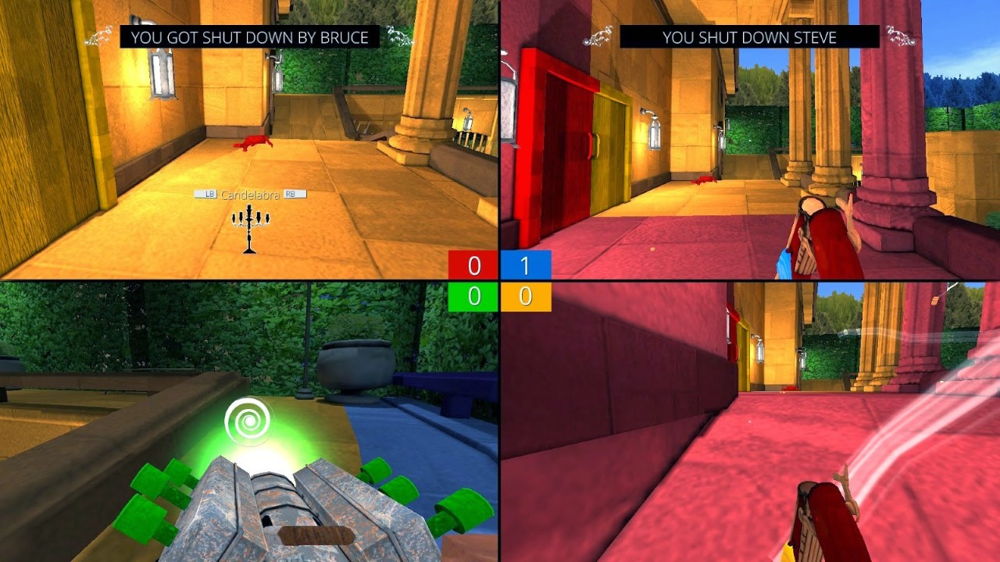

### [Gang Beasts](https://store.steampowered.com/app/285900/Gang_Beasts/)

A fighter with a control scheme very similar to Human Fall Flat, making it a little bit different and a little bit frustrating!

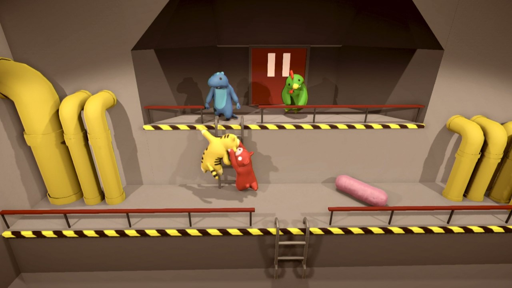

### [Starwhal](https://store.steampowered.com/app/263020/STARWHAL/)

A simple game, where you have to use your space narwhal's horn to pierce other narwhals' exposed hearts. Cool retro graphics and soundtrack.

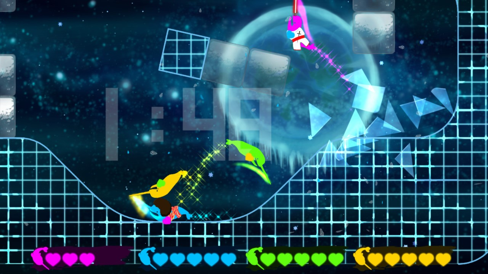

### [Halo](https://store.steampowered.com/app/976730/Halo_The_Master_Chief_Collection/)

The remastered versions of the original Halo games look gorgeous, and I love having the ability to toggle between the updated and original graphics. It's a nice way of showing just how far games have come graphically, something that we often forget as games gradually, iteratively improve. As well as the single player action, there's some great multi-player maps - although for some reason known only to Microsoft, the PC version does not support splitscreen play.

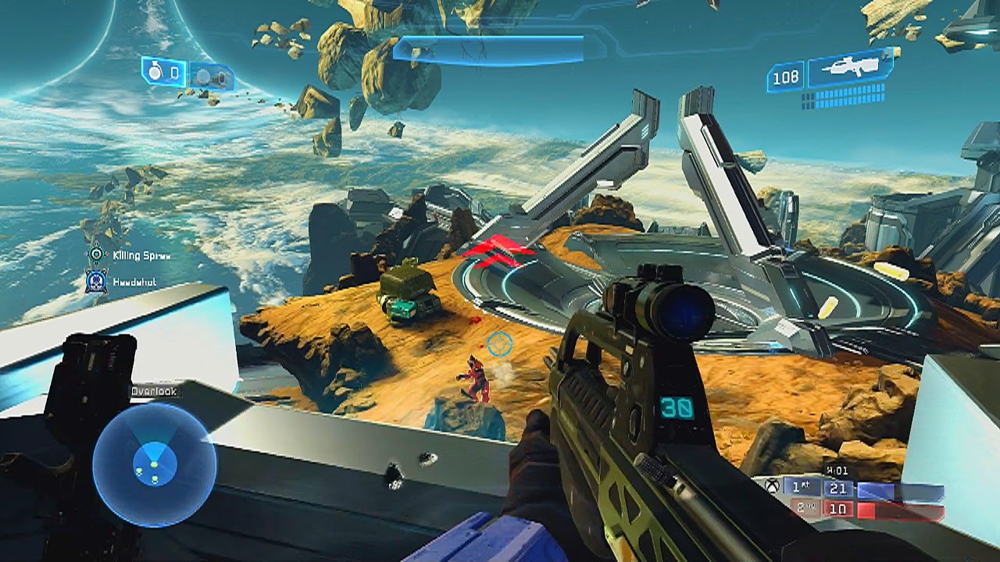
