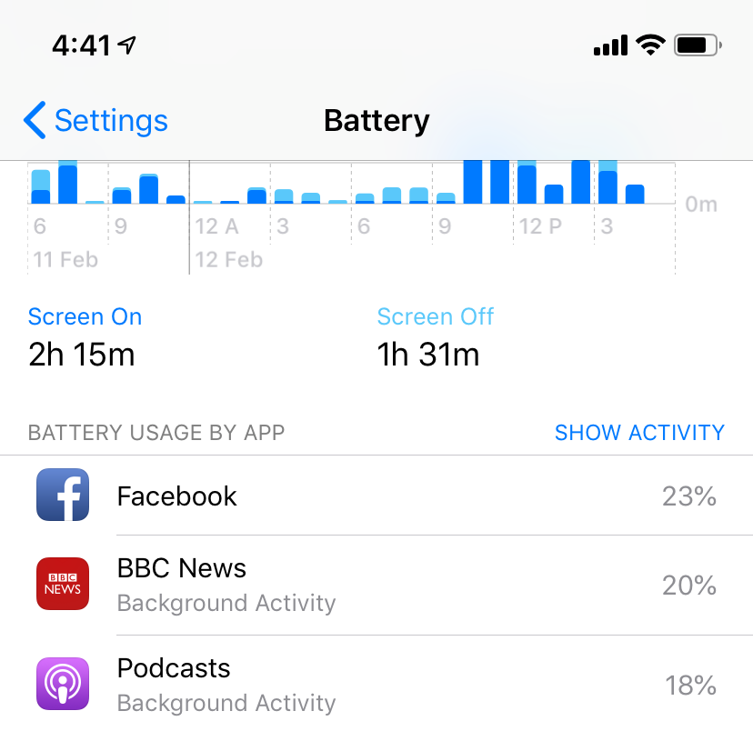
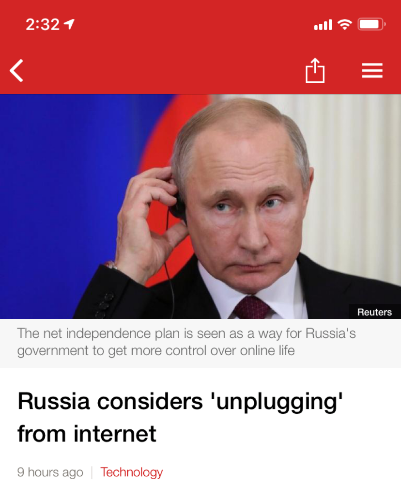

I read the BBC News to keep myself informed, and the BBC News app on my iPhone is one of the most used of all my apps.

<!-- more -->

It's always good to be skeptical, and critical, of all news sources - not just the ones we love to hate (I'm looking at you, Fox News), but also the news sources we trust for our information. These trusted news sources have a hand to play in shaping how we view the world.

I've always liked seeing transparency in news articles. When an article makes clear any edits it makes, including edits to correct mistakes, it makes me feel more confident in that source. Sometimes there's also accidental transparency, such as when the URL for an online news article retains an older article title. Of course, you have to be wary of this - some news sources have a URL (e.g. [http://www.stuff.co.nz/technology/2465985/The-good-and-bad-of-teeny-URLs](http://www.stuff.co.nz/technology/2465985/The-good-and-bad-of-teeny-URLs)) that consists of both a unique identifier for the article (e.g. 2465985) and a human readable, URL friendly title (e.g. The-good-and-bad-of-teeny-URLs) - and making changes to the human readable portion of the URL will still take you to the page in question. Using the above URL as an example, we could edit the URL and still be taken to the same article:

[http://www.stuff.co.nz/technology/2465985/This-URL-has-been-changed-but-still-gives-us-the-same-page](http://www.stuff.co.nz/technology/2465985/This-URL-has-been-changed-but-still-gives-us-the-same-page)

All of this brings me back to the BBC app. Today I read an article about how Russia is potentially planning to run a nationwide test where the country disconnects from the wider internet. Russia's aim is to ensure they are self-sufficient, and that they have the necessary services (DNS, etc) to still have an operational national network if they even lose network connectivity to the wider world.

A couple of hours later, when I returned to the BBC News app to check the news again, I noticed that the headline of the article was quite alarmist - and misleading:

# [Russia considers 'unplugging' from internet](https://www.bbc.com/news/technology-47198426)

I was convinced that, when I read the article, the headline was better - much more descriptive, and less misleading. The new title makes it sound like Russia is considering a permanent disconnection from the internet, not a temporary test. However, there was nothing in the article - either in my mobile app or on the BBC website - that mentioned an older headline.

I figured that there must be somewhere online that is tracking changes to article titles like this one. Hopefully I could find out if I was mistaken, or if the BBC had actually changed the title of the article.

It didn't take long to find [News Sniffer](https://www.newssniffer.co.uk). The News Sniffer website tracks all changes to articles on a variety of news websites such as BBC News, The Guardian, The New York Times and The Washington Post. The site has a simple interface, where you can search by article title to find the article you're interested in. In this case, a search brings up this page:

[https://www.newssniffer.co.uk/articles/1737058/diff/1/2](https://www.newssniffer.co.uk/articles/1737058/diff/1/2)

Although the default link takes you a page that that shows latest two versions of the article, there are navigation arrows that let you move back and forth between pairs of revisions - there's a gotcha here that the earliest version for each article is 0, not 1 (in programming, arrays are 0 indexed, meaning that the first item in a list is numbered 0). There's also an undocumented page if you remove the diff part of the URL, which will give you an overview of all article revisions:

[https://www.newssniffer.co.uk/articles/1737058](https://www.newssniffer.co.uk/articles/1737058)

> ### Russia considers 'unplugging' from internet
> This article is from the source 'bbc' and was first published or seen on February 11, 2019 12:48 (UTC). The next check for changes will be February 12, 2019 06:25
>
> You can find the current article at its original source at [https://www.bbc.co.uk/news/technology-47198426](https://www.bbc.co.uk/news/technology-47198426)
>
> The article has changed 3 times. There is an RSS feed of changes available.
>
> | Version | Created at              | Period             | Title                                       |
> | ------- | ----------------------- | ------------------ | ------------------------------------------- |
> | 0       | February 11, 2019 12:50 |                    | Russia to test cyber-war defences           |
> | 1       | February 11, 2019 14:05 | about 1 hour later | Russia plans to 'unplug' from internet      |
> | 2       | February 11, 2019 17:00 | about 3 hours later| Russia considers 'unplugging' from internet |

Haha! Now we can see that the original, less misleading, title of the article was:

# [Russia to test cyber-war defences](https://www.bbc.com/news/technology-47198426)

I don't know why the BBC decided to edit that headline, but I really hope that it wasn't an effort to turn the article in to clickbait. It's not going to be good if my preferred news source starts writing misleading article titles in an effort to increase readership.
