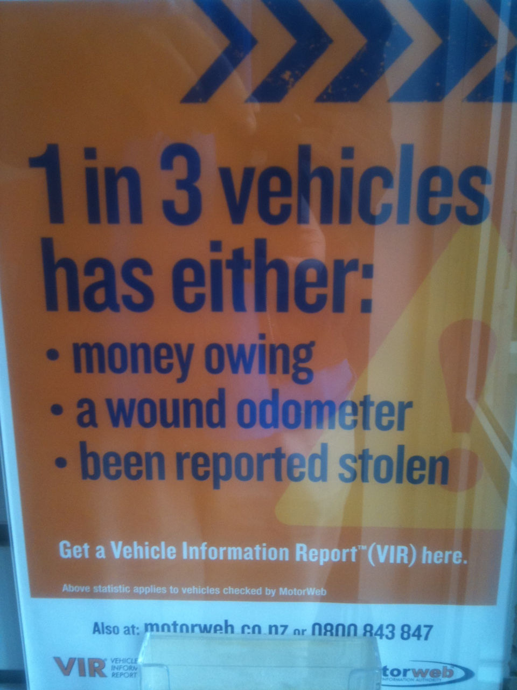

A MotorWeb poster in my local VTNZ made a startling claim about (presumably for sale) cars in New Zealand:

<!-- more -->

> 1 in 3 vehicles has either:
>
> - money owing
> - a wound odometer
> - been reported stolen

This seems pretty shocking - that when you come to buying a second hand vehicle, there's a one in three chance that there's a legal issue with it. That is, until you read the small print:

> Above statistic applies to vehicles checked by MotorWeb

This makes things very different. Now we're not talking about one in three vehicles, or one in three vehicles being sold, but one in three vehicles where someone has enough of a suspicion about the sale that they've been willing to pay for a check from MotorWeb. This is a highly skewed subset of the set of cars that are being sold, where the likelihood of something being wrong with the car is going to be pretty high - the subset has been through a filter, that of people having a reason to be suspicious of the sale.

It seems to me, given this caveat has been given in small print, that MotorWeb are probably well aware that their poster is misleading.

