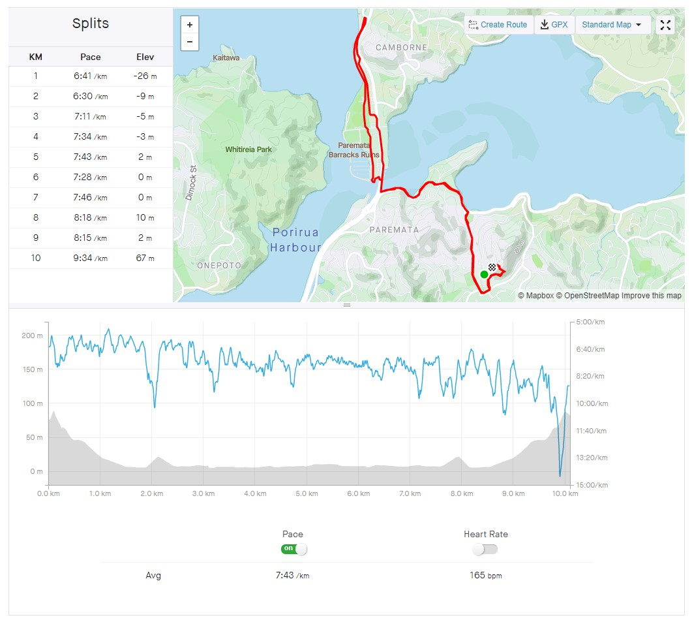

Today is the first day of a new lockdown, now that we have new COVID cases in New Zealand. It must be annoying for anyone who has a special occasion planned for today, like a birthday - hopefully they'll be able to make the best of it!

<!-- more -->

I've not been on the radio for a few weeks now, so instead of my regular skeptical topics I'm going to write another one of my occasional ramblings.

I started my day, at midnight, in the middle of a rather painful run - the first in about a week and a half. It was good to be back out on the road, and not overly surprising to see lots of vehicles out on the road late at night. My guess is a lot of people have been making their way back home before lockdown began.

While on my run I got to thinking about some of my favourite literary quotes.

The first struck me when I first read it maybe 25 years ago, and to this day I find it really helpful. Whatever our dreams, whatever our desires, it's always good to remain grounded and not get carried away by wishful thinking. Good things may come our way, but it's not helpful to obsess over their possibility, especially if they're unrealistic hopes.

> _Der Kaiser - so heißt es - hat dir, dem Einzelnen, dem jämmerlichen Untertanen, dem winzig vor der kaiserlichen Sonne in die fernste Ferne geflüchteten Schatten, gerade dir hat der Kaiser von seinem Sterbebett aus eine Botschaft gesendet. Den Boten hat er beim Bett niederknien lassen und ihm die Botschaft ins Ohr geflüstert; so sehr war ihm an ihr gelegen, daß er sich sie noch ins Ohr wiedersagen ließ. Durch Kopfnicken hat er die Richtigkeit des Gesagten bestätigt.Und vor der ganzen Zuschauerschaft seines Todes - alle hindernden Wände werden niedergebrochen und auf den weit und hoch sich schwingenden Freitreppen stehen im Ring die Großen des Reichs - vor allen diesen hat er den Boten abgefertigt. Der Bote hat sich gleich auf den Weg gemacht; ein kräftiger, ein unermüdlicher Mann; einmal diesen, einmal den andern Arm vorstreckend schafft er sich Bahn durch die Menge; findet er Widerstand, zeigt er auf die Brust, wo das Zeichen der Sonne ist; er kommt auch leicht vorwärts, wie kein anderer. Aber die Menge ist so groß; ihre Wohnstätten nehmen kein Ende. Öffnete sich freies Feld, wie würde er fliegen und bald wohl hörtest du das herrliche Schlagen seiner Fäuste an deiner Tür. Aber statt dessen, wie nutzlos müht er sich ab; immer noch zwängt er sich durch die Gemächer des innersten Palastes; niemals wird er sie überwinden; und gelänge ihm dies, nichts wäre gewonnen; die Treppen hinab müßte er sich kämpfen; und gelänge ihm dies, nichts wäre gewonnen; die Höfe wären zu durchmessen; und nach den Höfen der zweite umschließende Palast; und wieder Treppen und Höfe; und wieder ein Palast; und so weiter durch Jahrtausende; und stürzte er endlich aus dem äußersten Tor - aber niemals, niemals kann es geschehen -, liegt erst die Residenzstadt vor ihm, die Mitte der Welt, hochgeschüttet voll ihres Bodensatzes. Niemand dringt hier durch und gar mit der Botschaft eines Toten. - Du aber sitzt an deinem Fenster und erträumst sie dir, wenn der Abend kommt._
>
> The Emperor - so they say - has sent a message, directly from his death bed, to you alone, his pathetic subject, a tiny shadow which has taken refuge at the furthest distance from the imperial sun. He ordered the herald to kneel down beside his bed and whispered the message in his ear. He thought it was so important that he had the herald speak it back to him. He confirmed the accuracy of verbal message by nodding his head. And in front of the entire crowd of those witnessing his death—all the obstructing walls have been broken down, and all the great ones of his empire are standing in a circle on the broad and high soaring flights of stairs—in front of all of them he dispatched his herald. The messenger started off at once, a powerful, tireless man. Sticking one arm out and then another, he makes his way through the crowd. If he runs into resistance, he points to his breast where there is a sign of the sun. So he moves forwards easily, unlike anyone else. But the crowd is so huge; its dwelling places are infinite. If there were an open field, how he would fly along, and soon you would hear the marvellous pounding of his fist on your door. But instead of that, how futile are all his efforts. He is still forcing his way through the private rooms of the innermost palace. Never will he win his way through. And if he did manage that, nothing would have been achieved. He would have to fight his way down the steps, and, if he managed to do that, nothing would have been achieved. He would have to stride through the courtyards, and after the courtyards through the second palace encircling the first, and, then again, through stairs and courtyards, and then, once again, a palace, and so on for thousands of years. And if he finally burst through the outermost door—but that can never, never happen—the royal capital city, the centre of the world, is still there in front of him, piled high and full of sediment. No one pushes his way through here, certainly not someone with a message from a dead man. But you sit at your window and dream of that message when evening comes.

-- Franz Kafka, The Great Wall of China

What I find amazing about the next piece is that, given that it was written around 2,000 years ago, it seems amazingly modern and secular in its outlook. This inscription was found on a tomb near Ephesus, in Turkey, and is considered to be the oldest surviving example of a song.

> _Ὅσον ζῇς φαίνου_
>
> _μηδὲν ὅλως σὺ λυποῦ_
>
> _πρὸς ὀλίγον ἔστι τὸ ζῆν_
>
> _τὸ τέλος ὁ χρόνος ἀπαιτεῖ._
>
> While you live, shine
>
> have no grief at all
>
> life exists only for a short while
>
> and Time demands his due.

-- Seikilos Epitaph

The next is from a book a good friend recommended to me many years ago - the book was filled with great thoughts, and this is one of several that felt profound to me:

> I did not pray for her, because prayer has no efficacy; I did not cry for her, or for myself, because only extroverts cry twice; but I sat in the silence of that night, that infinite hostility to man, to permanence, to love, remembering her, remembering her.

-- John Fowles, The Magus

The last is from a book I wish I'd read sooner in life. It's beautiful, but somehow unobtainable - full of heartache and pain, but with glimpses of hope.

> _Fueron dos novios dichosos entre la muchedumbre, y hasta llegaron a sospechar que el amor podía ser un sentimiento más reposado y profundo que la felicidad de- saforada pero momentánea de sus noches secretas._
>
> They were two happy lovers among the crowd, and they even came to suspect that love could be a feeling that was more relaxing and deep than the happiness, wild but momentary, of their secret nights.

-- Gabriel Garcí­a Márquez, One Hundred Years of Solitude
