While visiting Queenstown on the South Island of New Zealand, I noticed that the town was suffering from a rash of Tourist Information centres. I'm guessing that there's a financial incentive to offering yourself as a tourist information centre and selling tickets to some of the amazing nearby attractions, but do there need to be so many shops selling the same thing?

<!-- more -->

Here are a few images of the ones found:

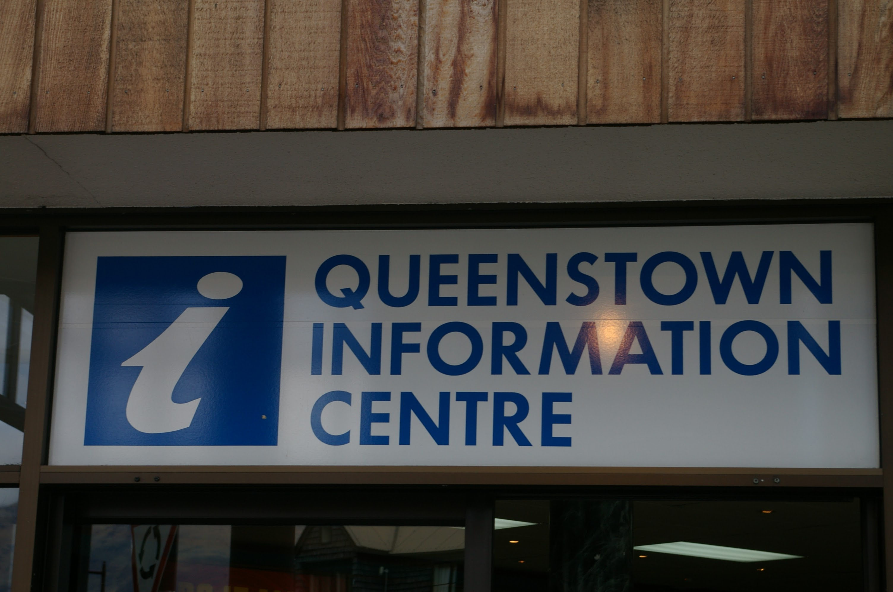
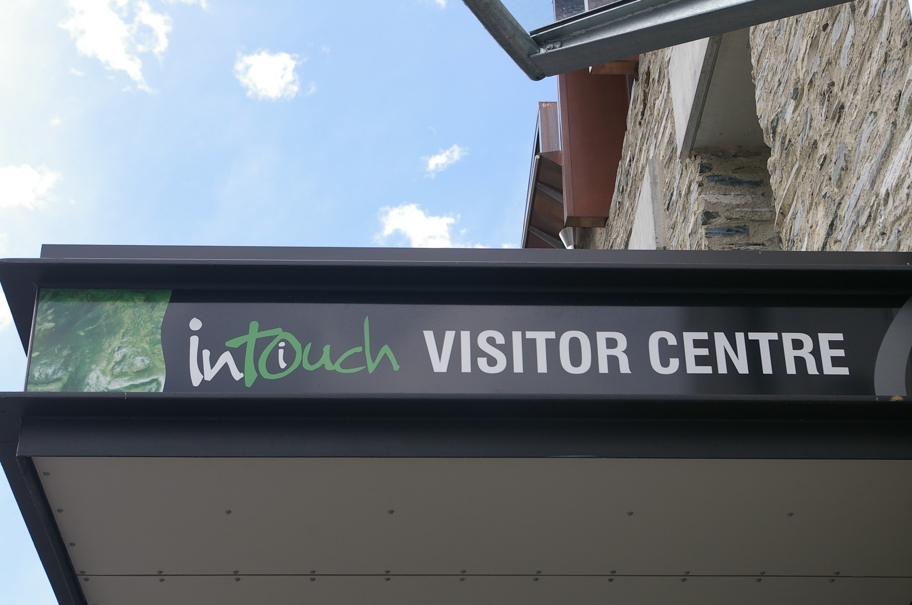
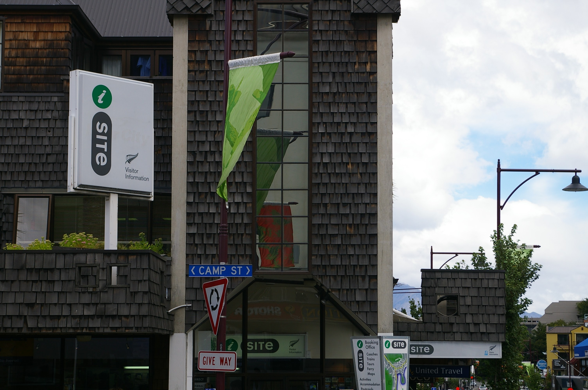
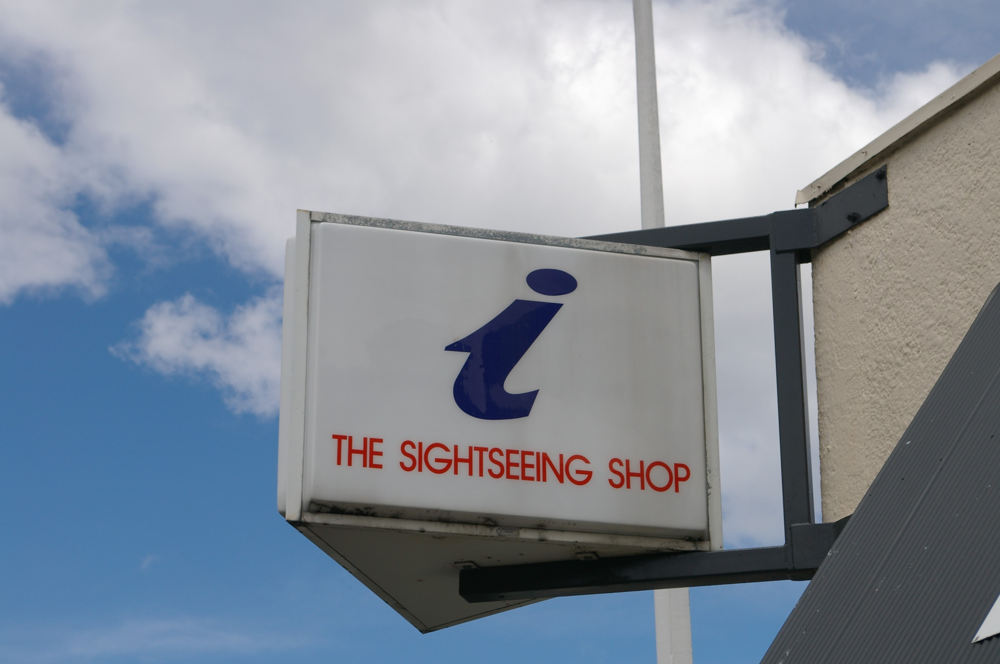

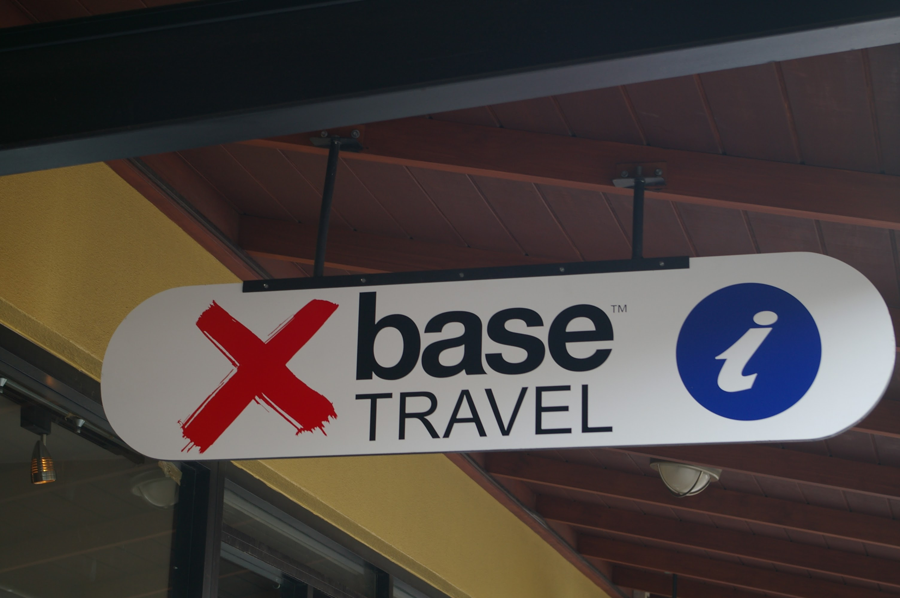
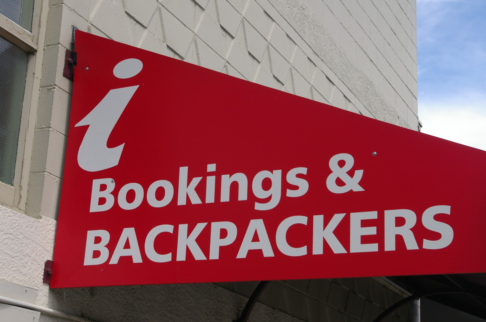
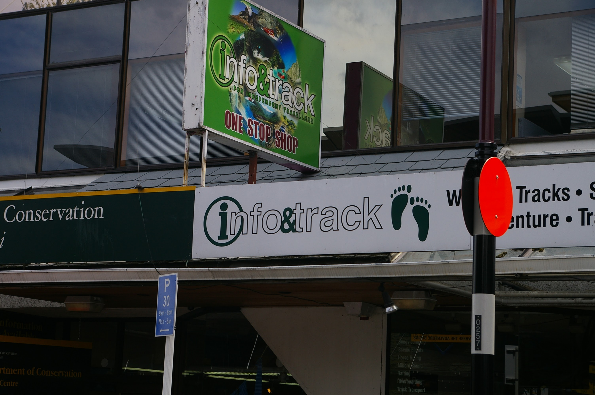
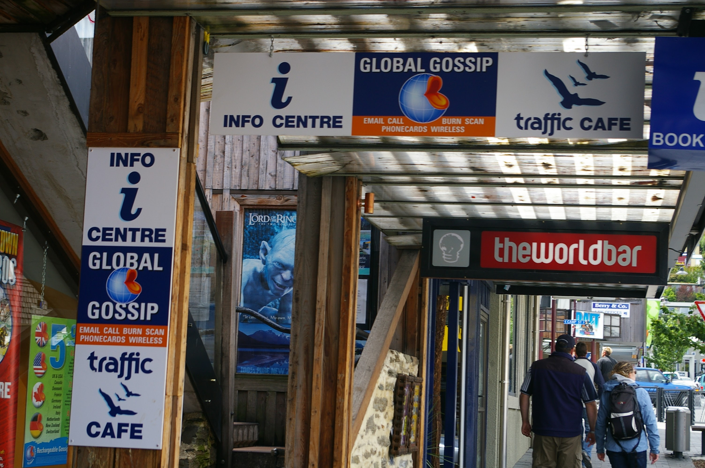
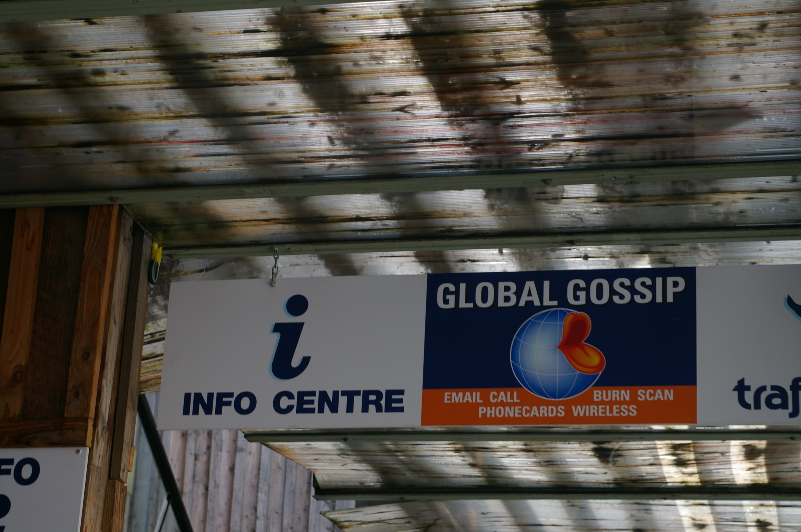

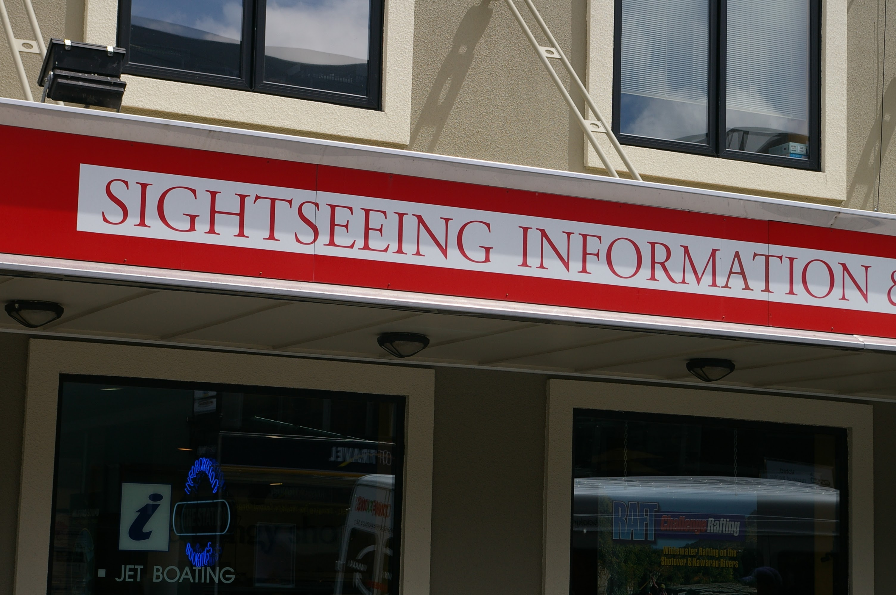
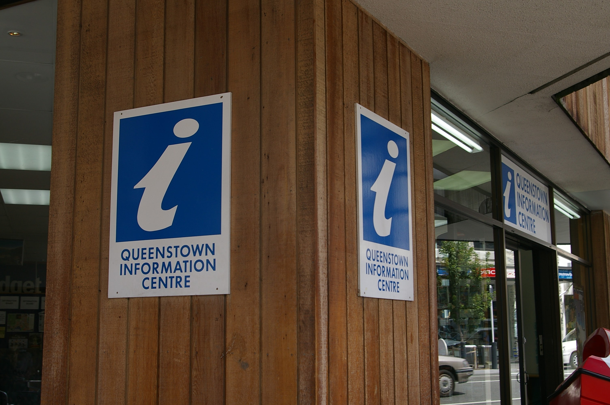
