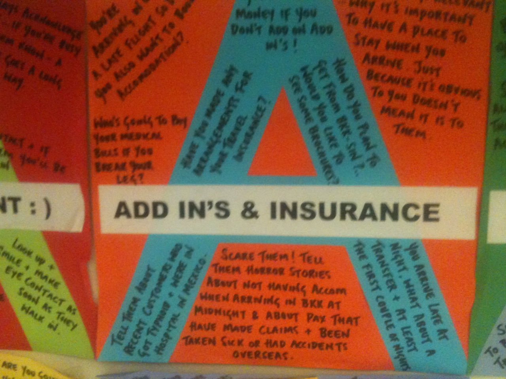
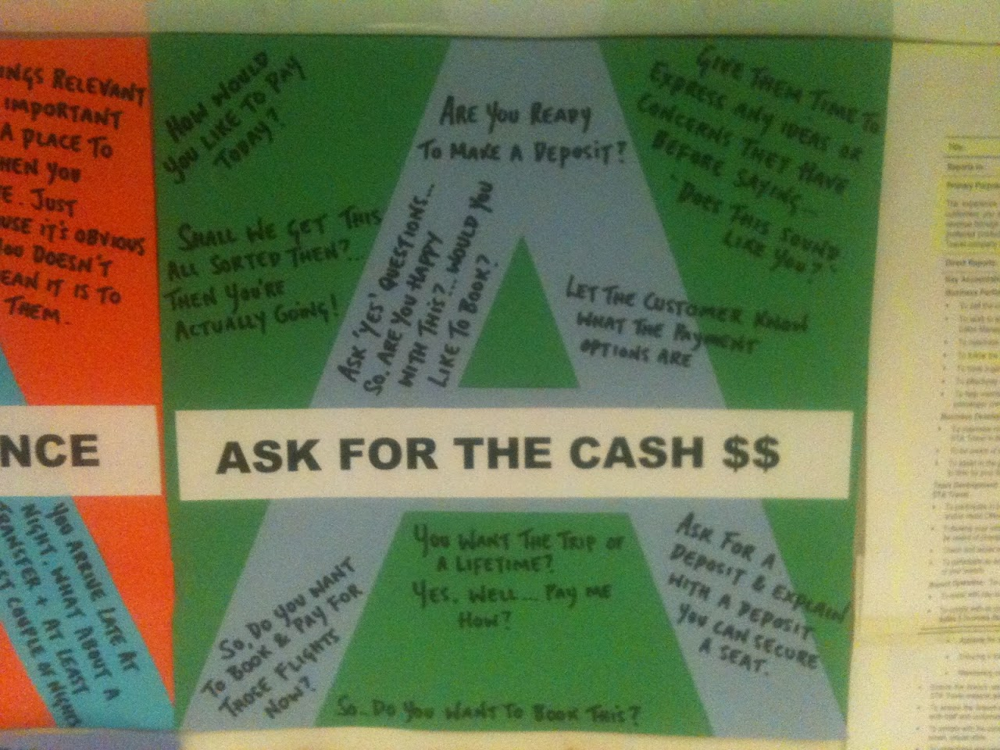

I saw the signs below in the back room of a travel agency in Wellington. Their brazenness shocked me - I've always known that underhanded tactics are used to sell, and upsell, in retail, but I'd kind of assumed that they were unspoken tactics - not officially sanctioned methods of selling to a customer.

<!-- more -->

The pictures are a little blurry, so here's some of what they say:

### Add In's & Insurance

> "Scare them! Tell them horror stories.."
>
> "Who's going to pay your medical bills if you break your leg"
>
> "Tell them about recent customers who got typhoid..."

### Ask for the Cash $$

> "Give them time to express any ideas or concerns they have before saying... - does this sound like you?"
>
> "Ask 'yes' questions..."
>
> "Shall we get this all sorted then?"

