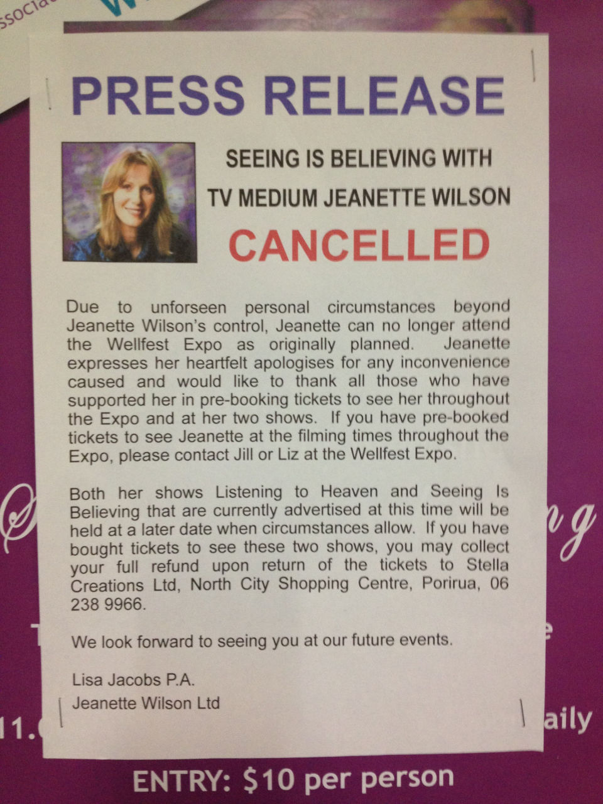
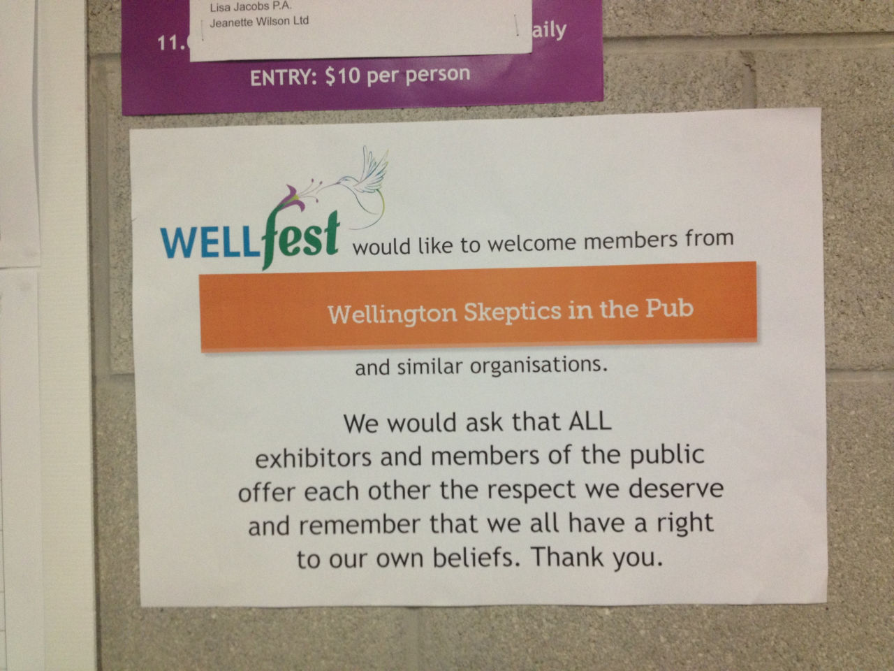

A long-standing joke within skepticism is the idea that a psychic, who is able to see the future by communicating with spirits, would have to cancel an event due to "unforeseen" circumstances.

<!-- more -->

I recently arranged a Skeptics in the Pub visit to WellFest, a local exhibition of alternative wellness therapists. When we arrived at the event, which was slated to be hosting a local psychic, Jeanette Wilson (who has moved to New Zealand from the UK), we were greeted by this sign:

Also, we'd been spotted! Because I'd posted our outing on MeetUp, the organisers had put up a nice sign welcoming us:

I introduced myself to the organisers of the event and let them know that if there were any issues with the skeptics at the event, they could let me know and I would help them to deal with it. In the end, there were no problems, and we were able to gather enough evidence to submit quite a few Advertising Standards Authority complaints about deceptive adverts at the event.
