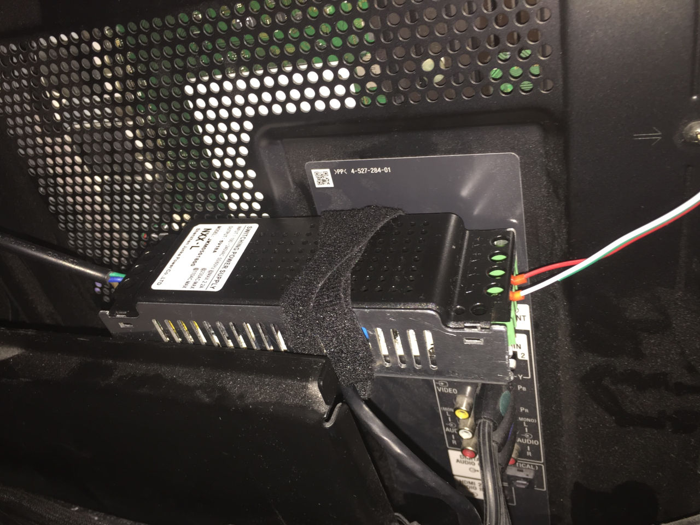
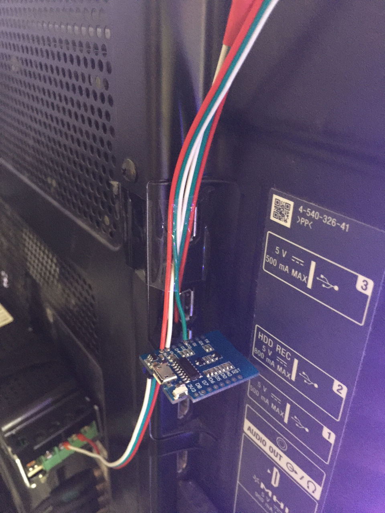
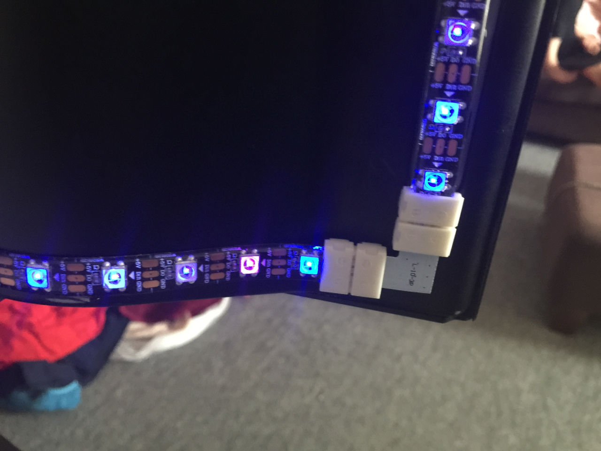
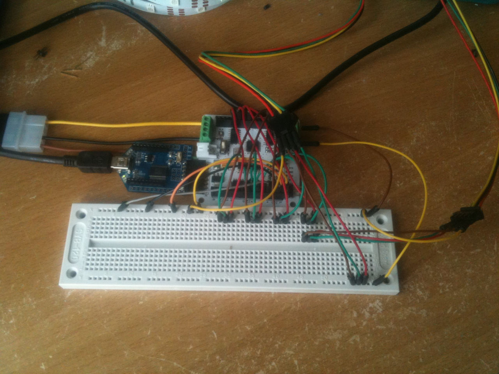
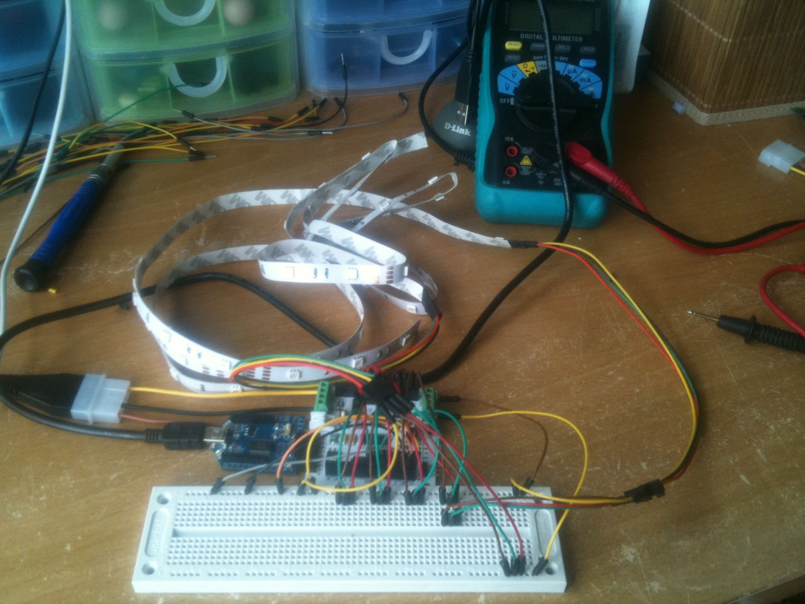
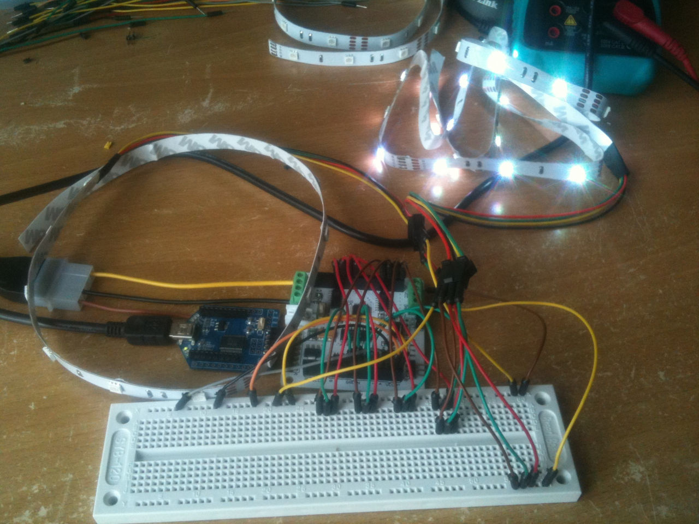

I built a Philips Ambilight clone for my Sony TV using WS2812B LEDs and an ESP8266 controller. The ESP connects to the WiFi network, and Kodi sends updates on which colour each LED should be via UDP to Hyperion running on the ESP. I'm impressed with how well this worked over wireless.

<!-- more -->

## Power Supply

Here's the power supply that I used:

## Controller

This the ESP8266, which is powered from the same power supply that is powering the LEDs.

## LEDS

The LEDs come with an adhesive backing, which makes sticking them to the back of the TV simple. I used plastic joiners for the corners.

## Video

And here's a video of the finished product.

@[youtube](https://youtu.be/mUPjq1NMdJc)

<!--<video controls src="/media/video/Ambilight.mov" style="width: 100%;" />-->

## Previous attempt

I'd previously tried to use a Rainbowduino and WS2811 LEDs, and ended up writing my own Boblight compatible software for the Rainbowduino - [RainbowBob](https://github.com/markhoney/RainbowBob)

