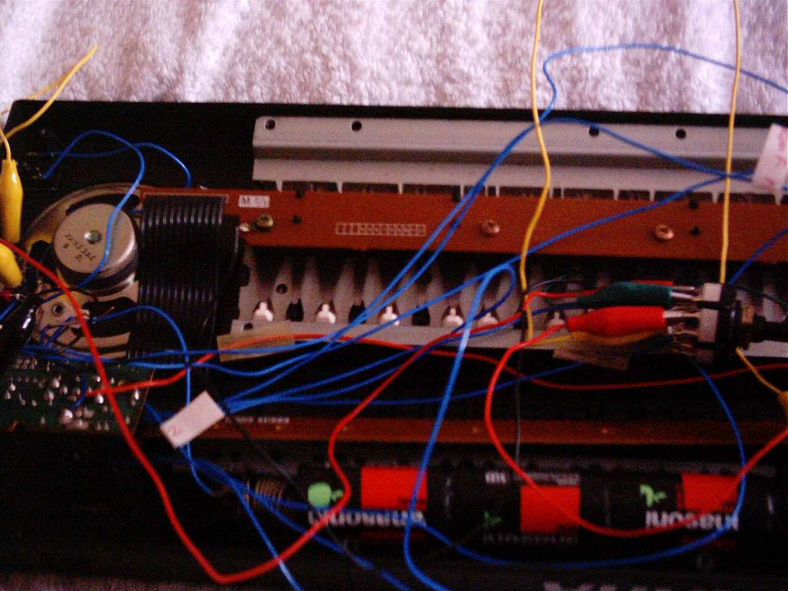
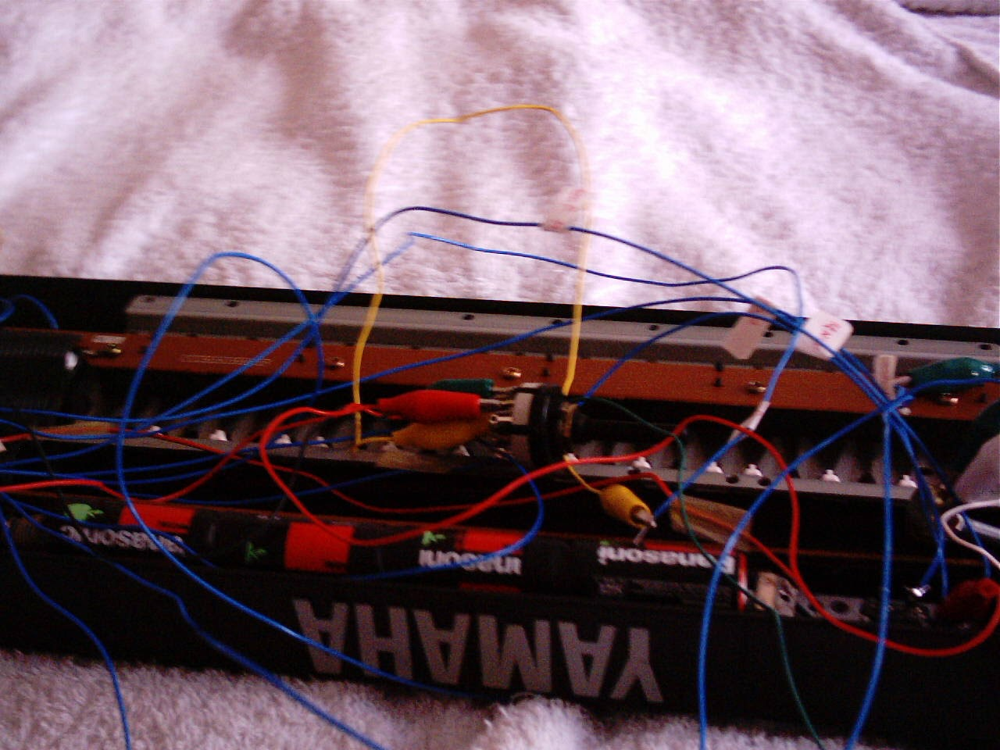
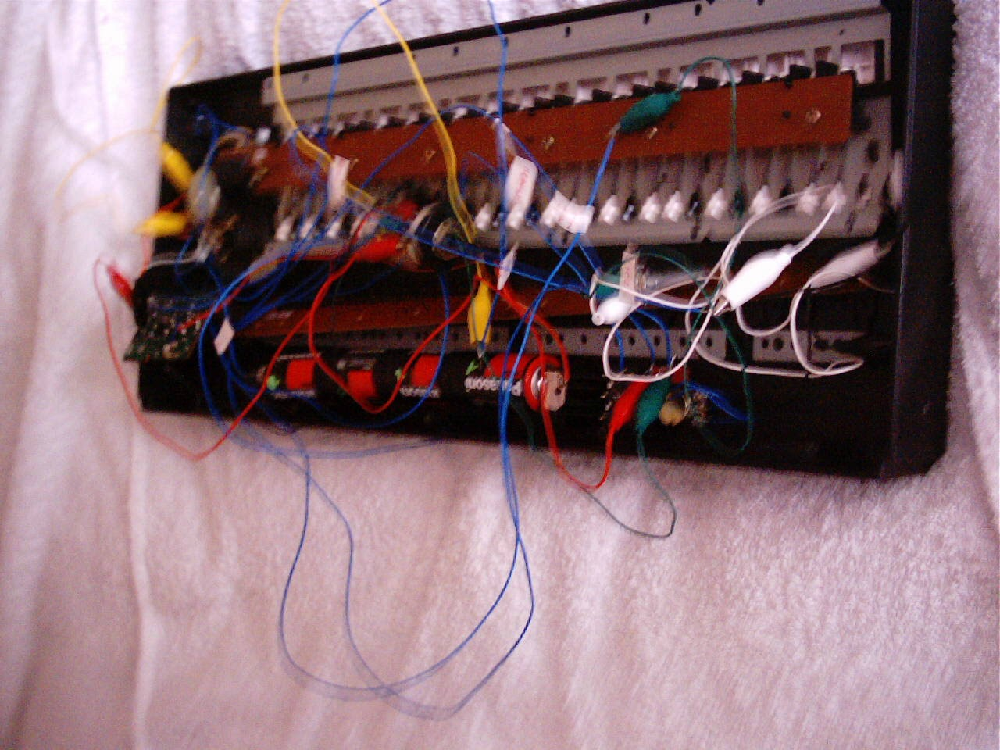
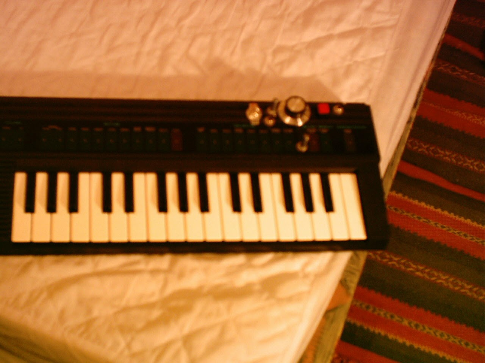

This was a fun hack, although unfortunately I don't have many decent quality images of it. Myself and a friend, Dave, spent a couple of hours glitching a cheap second hand Yamaha keyboard.

<!-- more -->

## Prototyping

The aim of the project is to make the keyboard glitch - to make noises that it wasn't designed to output, along with feedback loops, etc. This is done by re-wiring the internals of the keyboard with some crocodile clips, switches, potentiometers, and even a knife switch!

## Testing

Through iterative testing, we found that targeting the few microchips inside the keyboard worked well, and that by connecting legs of the main chip back to other legs and other places on circuitboard we could get some interesting effects. One leg of the chip reacted well to so many different places that we ended up attaching a rotary switch to it, and it allowed us to select from several different effects.

A couple of places worked well with potentiometers (variable resistors), which allowed for a degree of control over the resulting sounds.

## Finished Product

Once we'd figured out what components worked well attached to which parts of the circuit board, we mounted the components to the front of the keyboard and replaced the crocodile clip wires with soldered wires. We also fitted a 3.5mm headphone jack, so that the keyboard could be attached to an amplifier. Once the back was re-attached, we were ready to go.

Ben, another housemate and musician, spent a while making some very cool music with the keyboard. With the feedback, a single key would sometimes end up making sounds for 10 seconds or more.
