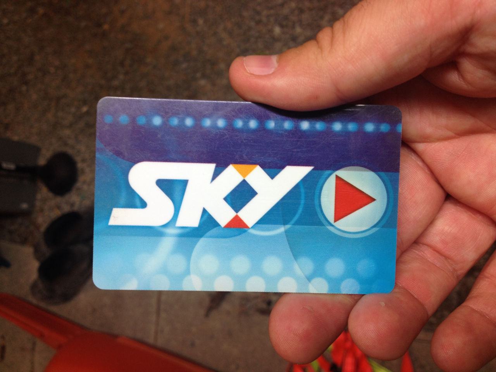
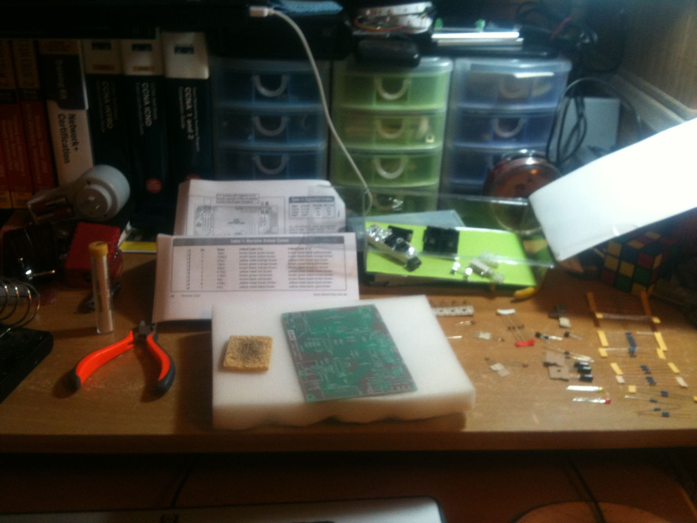
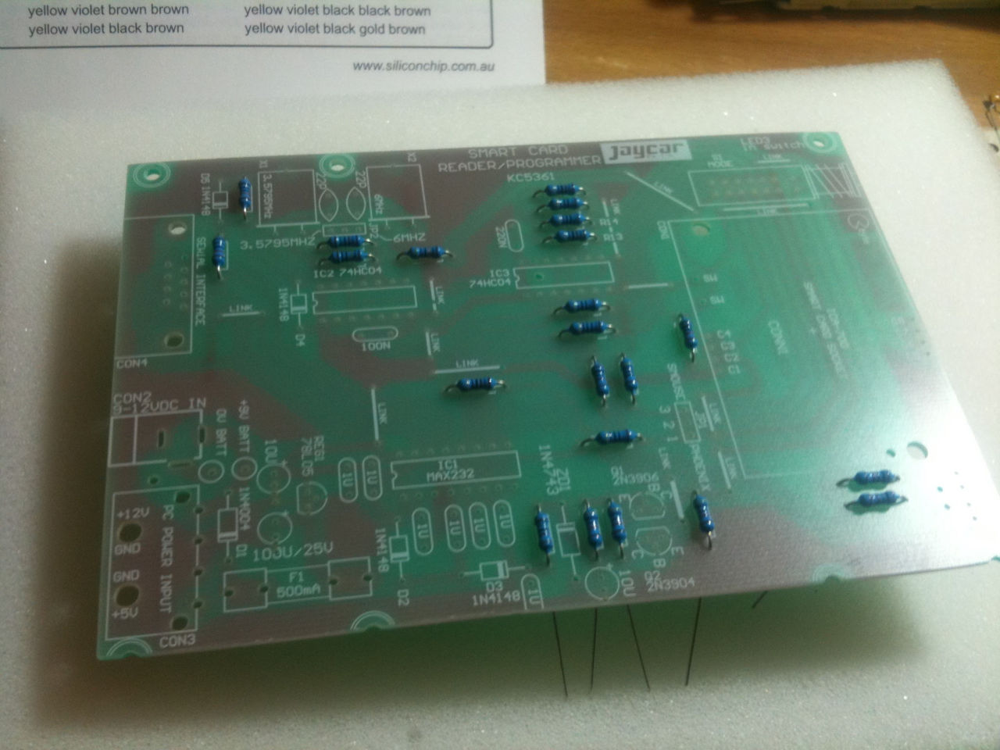
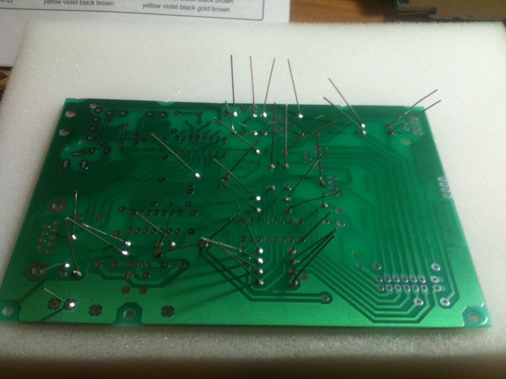
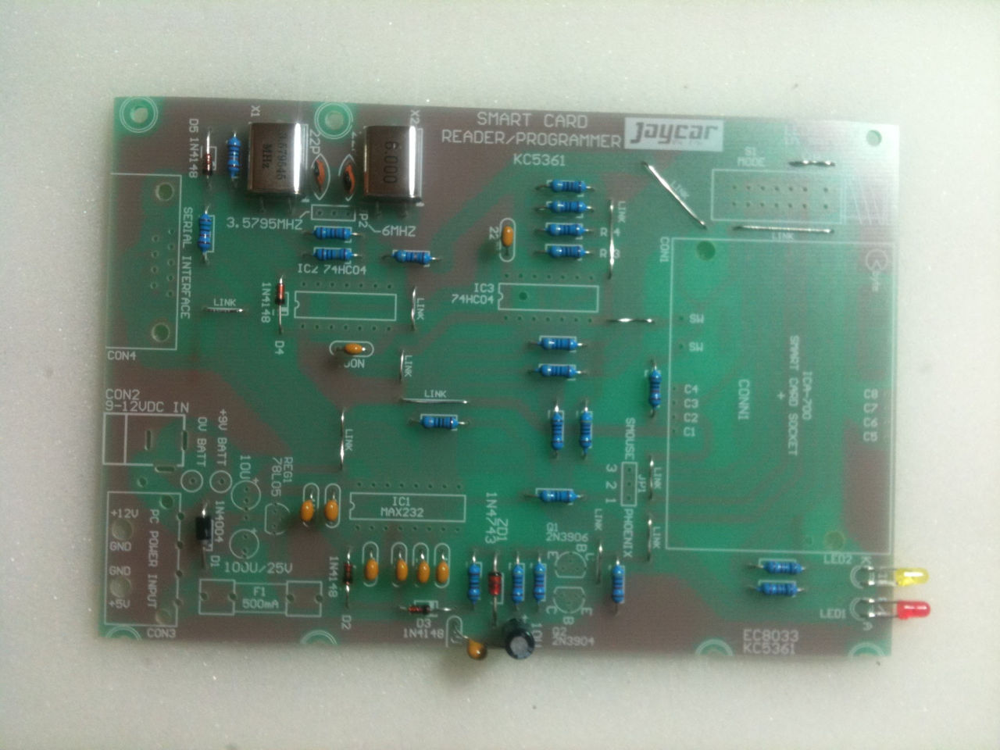
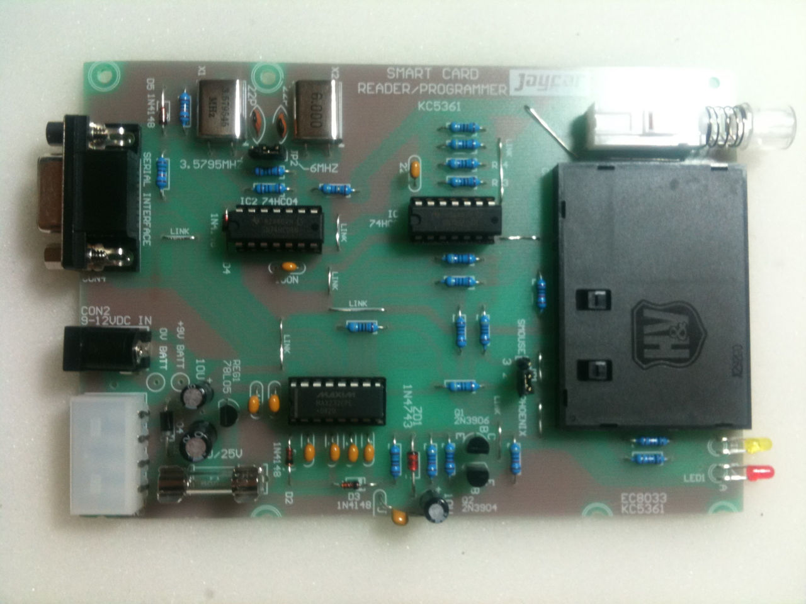
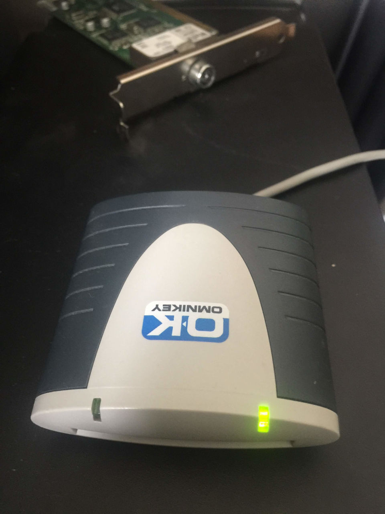

I have a server at home dedicated to media. It holds media files for TV shows and Movies, along with associated metadata, and also has several TV cards. Some of the TV cards are for DVB-S satellite TV, and to decode them I needed to be able to read my Sky card:

<!-- more -->

## Sky Card

JayCar in NZ sell a DIY card reader that does the job for the older cards, so I purchased one and set about putting it together:

## Work Bench

## Resistors

Here are the resistors in place and ready to be soldered.

## Soldered

The resistors have been soldered and just need the ends of the legs snipping off.

## Capacitors and Crystals

More components in their right places:

## Finished Product

This is the finished product, with a serial connection and a power molex connector for powering it. I ended up mounting it inside a 3.5" floppy drive case, which made it neater and also easier to mount inside the PC case.

Eventually I moved to the new Sky system, for which this reader was not able to decode the cards. Instead I maaged to purchase a USB card reader for about $20 from Israel which did the job.

