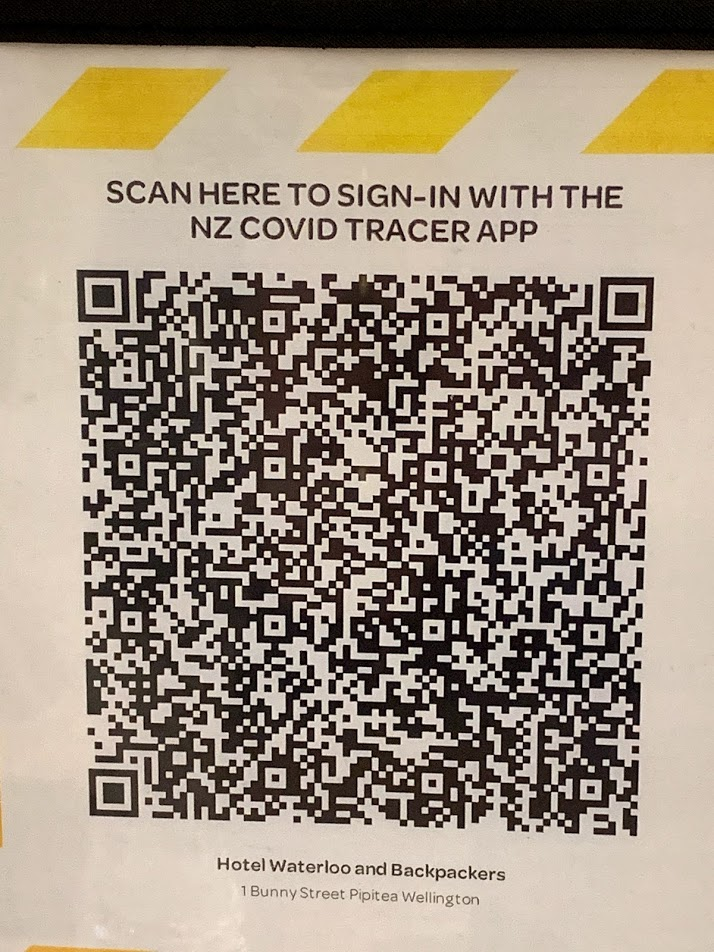

While I was in the pub recently, at a [Puzzled Pint](http://www.puzzledpint.com/) event, I looked across the table at a New Zealand QR code image (used for scanning your location into the COVID tracking app) and wondered what data was encoded in the image. Thankfully, with the wonders of modern technology, it was pretty simple to disassemble the data there and then on my phone.

<!-- more -->

I first took a picture of the QR code:



Then I searched online for a QR code reader, and [found one](https://zxing.org/w/decode.jspx) pretty quickly. The website had no problems reading my picture of the QR code, and gave me this parsed output:

```
NZCOVIDTRACER:eyJnbG4iOiI5NDI5MzAwMzU5ODIyIiwib3BuIjoiSG90ZWwgV2F0ZXJsb28gYW5kIEJhY2twYWNrZXJzIiwiYWRyIjoiMSBCdW5ueSBTdHJlZXRcblBpcGl0ZWFcbldlbGxpbmd0b24iLCJ2ZXIiOiJjMTk6MSIsInR5cCI6ImVudHJ5In0=
```

I then searched for a Base64 decoder, as I was pretty sure that the text after `NZCOVIDTRACER:` was [Base64](https://en.wikipedia.org/wiki/Base64) encoded (using the upper and lower case alphabet A-Z and a-z, digits 0-9 and two extra characters). The site I found had a domain name that really did state plainly what it does: [base64decode.org](https://www.base64decode.org/). Plugging the text into that site gave me the following JSON data:

```json
{"gln":"9429300359822","opn":"Hotel Waterloo and Backpackers","adr":"1 Bunny Street\nPipitea\nWellington","ver":"c19:1","typ":"entry"}
```

This data structure appears to be fairly self-explanatory. Here's a formatted version of the data, with the field names replaced with what it appears each field is used for:

```json
{
	"gln": "<Unique QR code identifier>",
	"opn": "<Location name>",
	"adr": "<Location address - (\n) means a newline>",
	"ver": "<Version of this QR code - in this case COVID 19 version 1>",
	"typ": "<Yype of code - maybe indicating location, e.g. entry, bar, bathrooms>"
}
```

We can see from this that there's nothing nefarious going on with the QR code. It simply uses a custom URI scheme that the app registers with the phone - `NZCOVIDTRACER:` - which is like `HTTP:`, `HTTPS:`, `FTP:` and other protocols that we're more used to seeing. Then, once the URI has launched the COVID tracer app, it feeds the app the Base64 encoded text. The app will decode the text into JSON, and then it's easy for it to read the fields inside. This data allows the phone app to display the location and address even if the phone's not connected to the internet, although presumably when relaying this information to a server it would only need to send the unique ID (`gln`), along with some other data (the date/time the QR code was scanned, and possibly GPS coordinates just in case the QR code is in the wrong place - although I half expect the app wouldn't send that particular piece of data, as people are sometimes wary about sharing GPS location data).

I like that they've future proofed this to an extent with the version - this scheme could easily be re-used for future unknown events that might cause us to have to scan in, such as `inv:5` for the fifth wave of an alien invasion.
