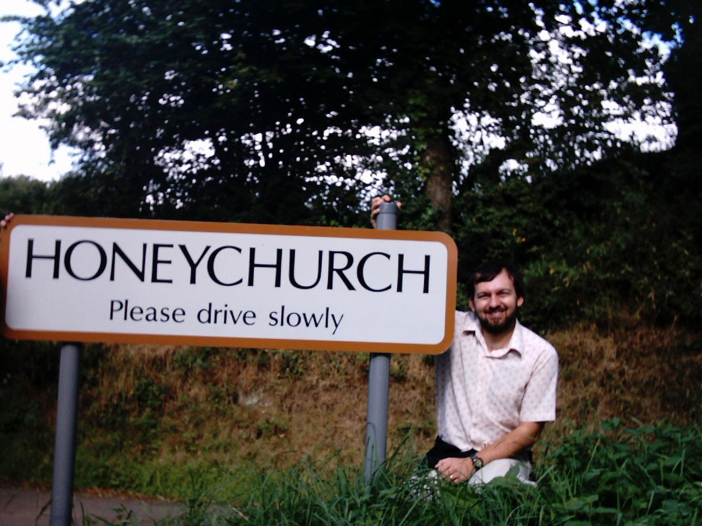
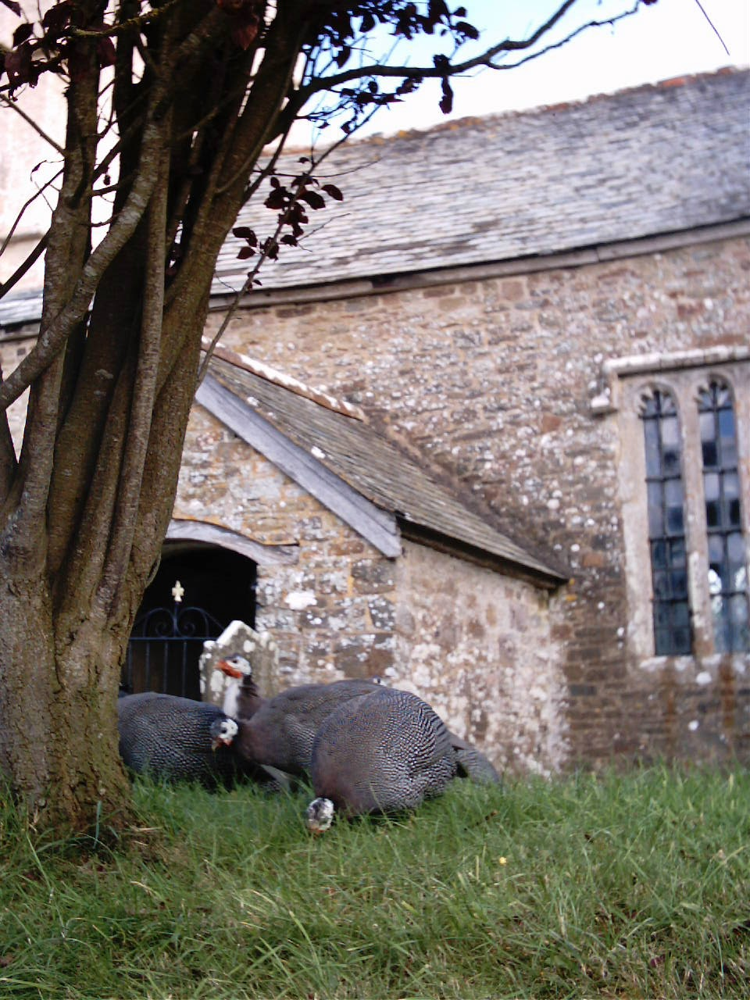
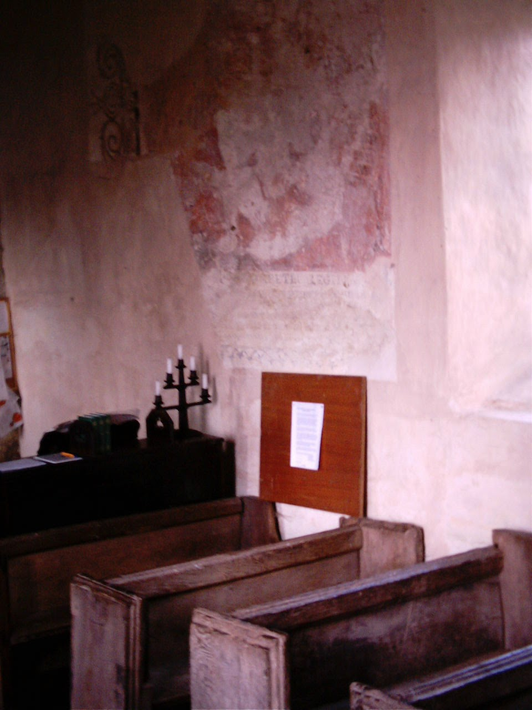

I've always been interested in the history of my surname. Honeychurch is a village on Dartmoor, in Devon, England.

<!-- more -->

<iframe src="https://www.google.com/maps/embed?pb=!1m18!1m12!1m3!1d1575.7577819656549!2d-3.948523509686271!3d50.80870235409596!2m3!1f0!2f0!3f0!3m2!1i1024!2i768!4f13.1!3m3!1m2!1s0x486c4e533e039115%3A0xca5bbab8e32e0223!2sHoneychurch%2C+North+Tawton+EX20+2AG%2C+UK!5e1!3m2!1sen!2snz!4v1538358834160" width="740" height="600" frameborder="0" style="border:0" allowfullscreen></iframe>

I visited the village of Honeychurch, and took a few pictures with a very cheap and crappy digital camera.

Here is the text of a pamphlet I picked up from inside the church, which tells a little of the history of the surname and the church:

## ST. MARY'S CHURCH, HONEYCHURCH

### by Professor W.G. Hoskins

This leaflet is to help you enjoy your visit. We would appreciate a donation in the box by the door to help us to maintain the church

You are standing in a church where Christian worship has been carried on for at least one thousand years.

The derivation of the name - HUNA'S CHURCH - tells us that it was founded by a landowner of that name, probably in the tenth century when so many of our parish churches were founded by landowners for the benefit of themselves, their families and their tenants.

Huna's original church was replaced completely about the middle of the twelfth century by the little stone building which we see today. It was altered and improved in the late fifteenth century, and hardly touched since.

The parish of Honeychurch is very small, being only 607 acres. It is clear from the map that it was probably carved out of the north western corner of the large parish of Sampford Courtenay, when Huna built his church. It is likely that the ecclesiastical parish represents the original small estate of Huna and that he endowed his church with the tithes of this land.

In Domesday Book (1086) we are told that the manor of Honeychurch had been held in Edward the Confessor's time by Alwin Black, and that it passed at the Norman Conquest to Baldwin the Sheriff, though in fact it was held by one Walter under Baldwin. We get a picture from Domesday Book of the manor as it was then, and the remarkable thing is that its five farms as depicted in 1086 have little changed; they have neither been reduced nor increased, except by the late creation of a small farm out of the glebe land.

Walter's demesne farm, worked by four slaves, is represented today by Middleton, the farm immediately west of the church. The Lord of the Manor would naturally have built the church as close to his own household as possible. Middleton was still the largest farm when the Tithe Survey was made in 1840 - one would expect the demesne farm to be the largest farm as in many other places in Devon. The four villein farms of 1086 are represented today by Westacott, Slade, Bude and East Town.

At first sight, the church we now see appears to be a typical little Devon church of the perpendicular period, but in fact it is essentially a Norman church of nave and chancel to which a small western tower and south porch were added.

There are clear indications of the Norman origin of the nave and chancel; for example, the south window of the chancel with its deep spay and a round-headed opening in the north wall of the nave. There are two twelfth century corbels, now placed on either side of the south door. Finally, the font, a sculptured tub font of unusual design, is mid twelfth century in date and almost certainly marks the completion of the rebuilding of Huna's Church in stone.

In the latter part of the fifteenth century the Norman church was partly reconstructed. The chancel arch was rebuilt and several of the small Norman windows were altered or new windows added. The nave was given a new roof with carved ribs, bosses and wall plates, and ceiled over. An entry in the episcopal register of John Bothe, Bishop of Exeter 1465 - 1478, refers to "St. Mary of Honeychurch" when a new Rector was instituted on 18th December 1466. The tower was built, which still contains three bells. Two of these are probably contemporary with the tower. The third - the treble - has been dated from the time of Mary I (1553-58).

The external masonry of nave and chancel, of small uncoursed rubble, is that of the original twelfth century church, in contrast to the coursed masonry of the perpendicular tower.

The church was re-seated at the same time, or perhaps given seats for the first time, and these medieval benches remain substantially untouched to this day. Some have roughly carved ends, but most are plain oak. The plain box pews on the south side of the nave are of eighteenth century date.

Last of all, a porch was added on the south side, perhaps in the early sixteenth century.

Other fittings and features may be noticed in this beautiful little country interior; the pulpit is possibly Elizabethan or early more seventeenth century in date, as is the font cover. The altar rails are simple country carpentry of seventeenth or eighteenth century date. On the north wall of the nave are the remains of a large painting of the Royal Arms of the time of Elizabeth I. When Stabb was writing his "Churches of Devon, Vol 3", he could see an inscription which said in part "Elizabeth Regina ... God Save The Church, Our Queen And Nation".

The east window of the chancel, which had already been replaced more than once and was in a bad state of repair, was designed in 1958 by Colonel Shore, using the existing original granite cill, when the church was conservatively restored under his care.

A puzzling feature is the medieval cooking pots now preserved in a glass case in the nave. The priest's door in the south wall of the chancel was filled in at some date, possibly in the eighteenth century. When it was re-opened in 1914, these pots were found in the filling. It is possible they got there if the material used for the filling came from a site close to one of the farmhouses which had long been used as a rubbish dump, including worn out pots. The transfer of archeological material in this accidental manner is well known to occur on and near long used sites. The old pots would have been regarded as a useful "fill up".

Partly because there has probably never been a resident squire, Honeychurch has only one modest mural monument. This is to John Dunning, who died on 3rd March 1773.

Honeychurch is one of the simplest and most unsophisticated country interiors in the whole of England. It owes its preservation from any kind of vigorous Victorian "restoration" to the fact that it has always been a small parish without a squire, and without the money to ruin it by reckless alterations as happened in so many of our parish churches in the Victorian period. There is occasionally something to be said for not having too much money!

Honeychurch is now reunited with Sampford Courtenay. The union for civil purposes took place in 1894, and for ecclesiastical purposes in 1927.
