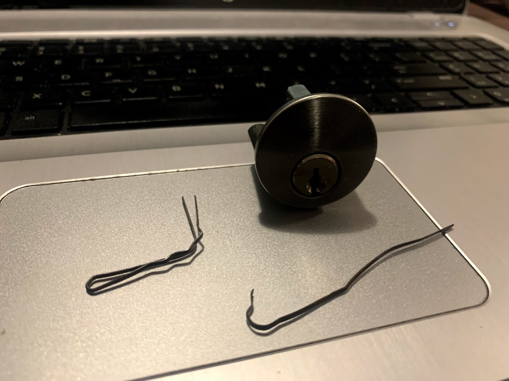
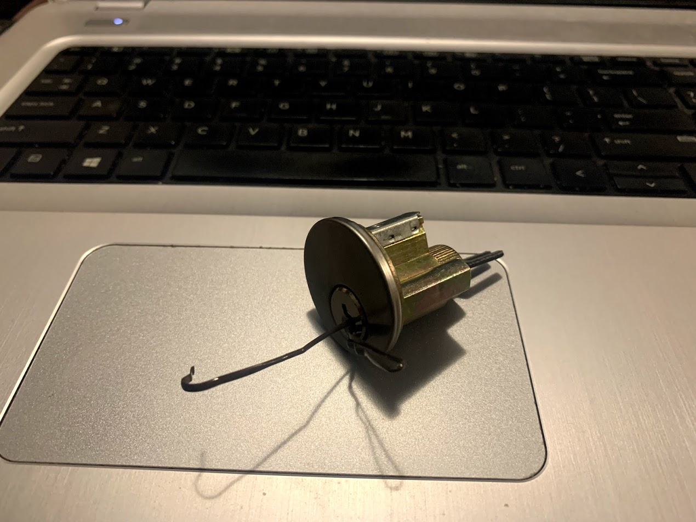
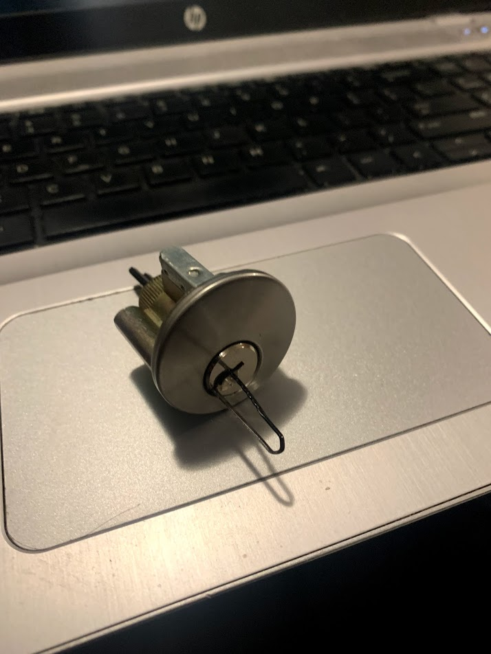
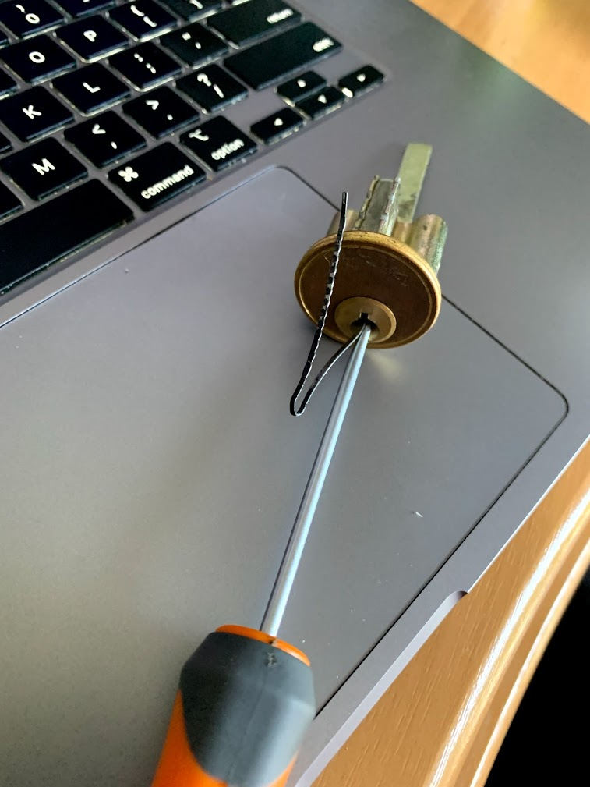
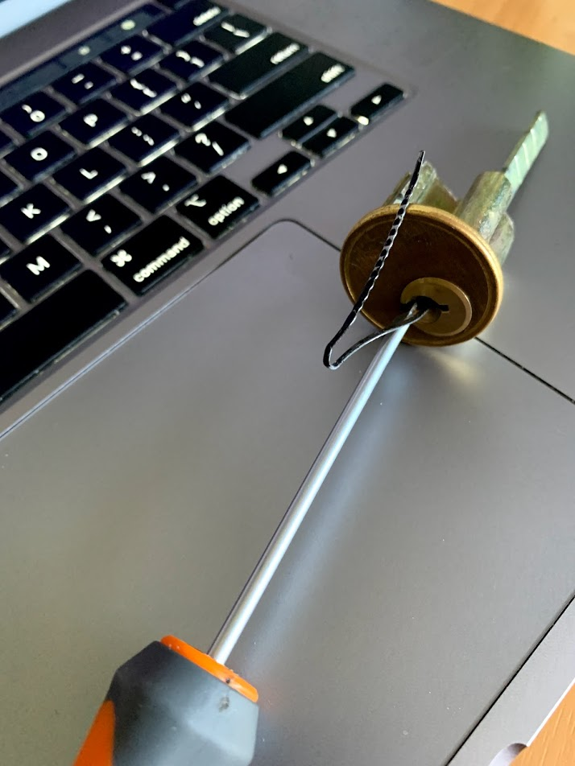

For the last few months I've been honing my lock picking skills, by buying up as many cheap locks as I can find. Recycle shops have been great places to grab residential door locks, and I've found some bargains on TradeMe for padlocks. However, I got to thinking about the way that locks are often picked in movies, TV shows and computer games - with a bobby pin.

<!-- more -->

So, I asked my daughters for a couple of bobby pins (hair pins) and took them on the train with me to work. On the way, I fashioned one pin into an L-shaped turning tool, and the other into a long straight pick. I found that using the pick turned on edge worked best, as that gave it rigidity.

After a few minutes, I'd managed to pop the lock open. When I arrived home, I showed my daughters by performing this feat in front of them:=.

They were underwhelmed - telling me that in the movies people only have to use one bobby pin to do the job. Right, I said, get me another pin. They found one that was thinner than the previous pins, which was perfect for my next picking attempt. I bent the pin into a wide U shape, so that I could use one leg to manipulate the lock's pins, and the other leg to apply leverage and turn the lock. It took a while, but after maybe 5 or 10 minutes I opened the lock.

A week later, while regaling this story to my friends at our regular [Skeptics in the Pub](https://www.meetup.com/Wellington-Skeptics-in-the-Pub) meeting, I happened to mention the game series Fallout. A kindly friend pointed out that in Fallout, the protagonist uses a bobby pin and a screwdriver to open locks. Right, a new challenge!

It turns out (no pun intended) that a screwdriver is a really bad turning tool. Something with some flex, or a right angle, allows you to apply pressure and keep it applied. But with a straight screwdriver you get none of that, and it's hard to keep the turning pressure applied as you're manipulating the lock's pins. However, eventually I managed to keep the pressure applied for long enough to pop a lock open.

And that's the end of that, until the next time I see someone in a movie use a different weird implement to pick a lock, and I decide that I have to find out if it's possible.
