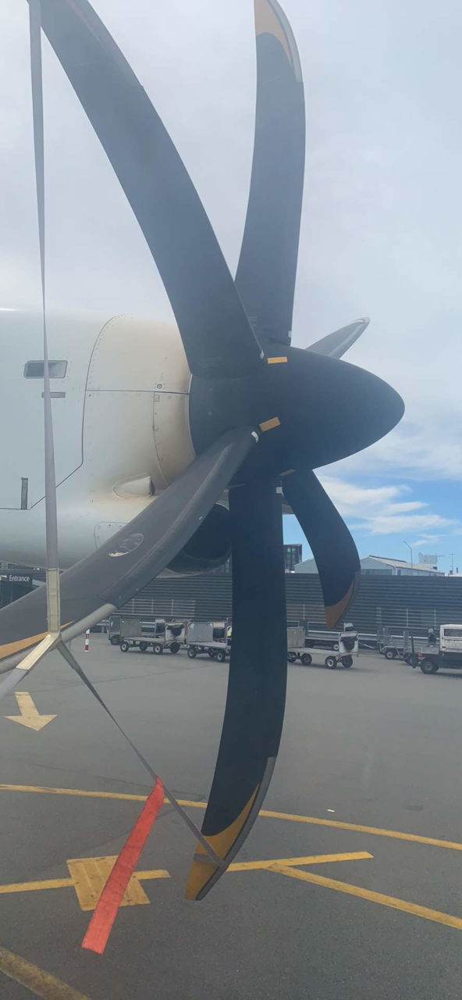
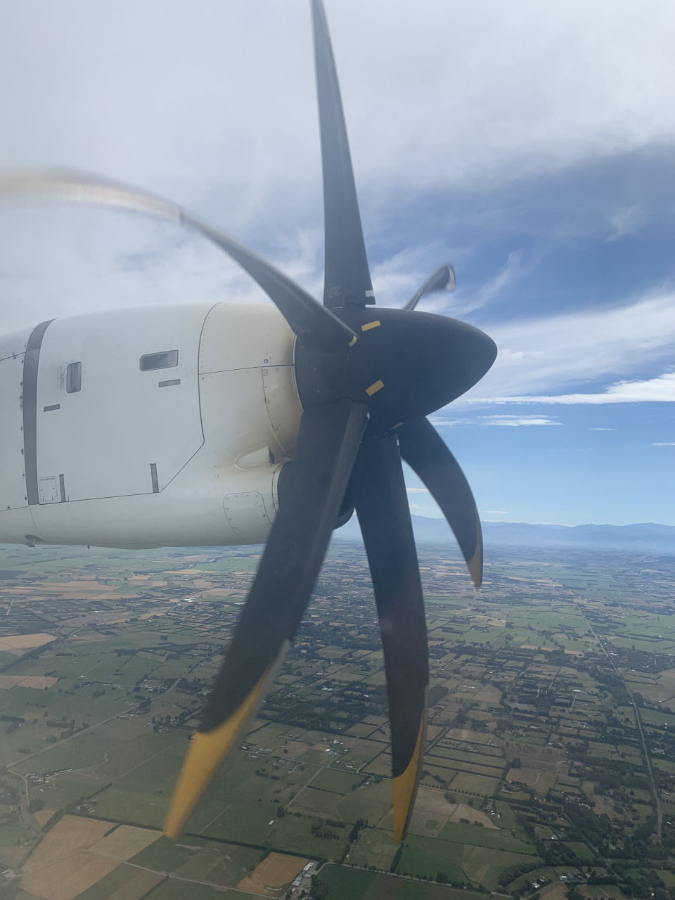
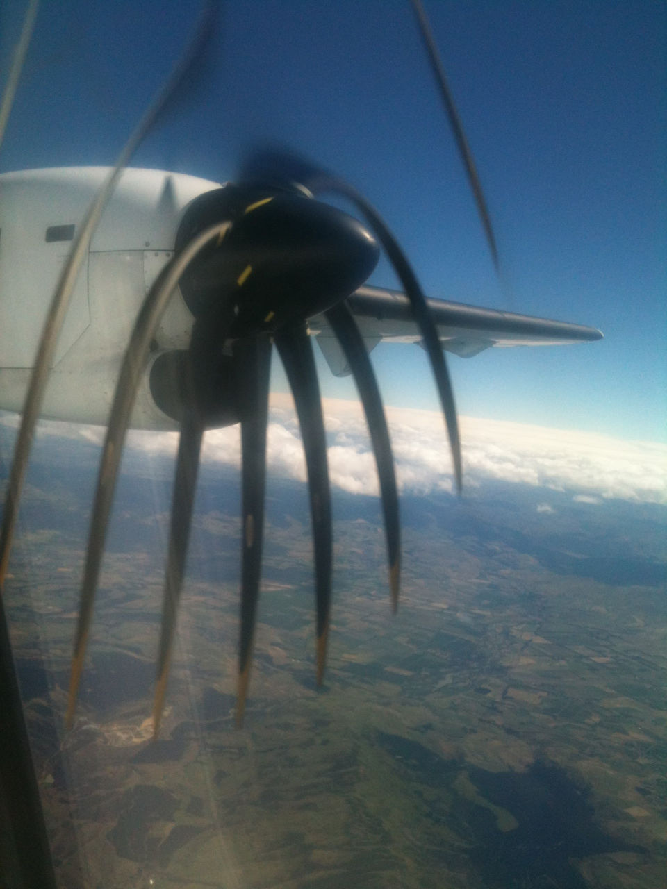

While flying back from Christchurch to Wellington today on a prop plane, I took pictures of a propeller both at rest and while spinning.

<!-- more -->

## At rest

## Rotating

What is interesting about these pictures is that the propeller blades in the second image, where the propeller is rotating, are bent. This is not a true reflection of reality, as these blades don't actually bend. In fact, if the blades did bend you would expect them to all bend in the same direction radially. However, these blades all look like they are bending downwards - which means the blades to the left and right of the top blade are bent in opposite directions, rather than bending in the same direction around the circle.

The reason for this visual effect is that when digital cameras take a picture, they use a CMOS grid of pixels to sample the light. However, due to restrictions in data bandwidth, etc, not all of the pixel light values can be sampled at the same time. So the camera scans, taking a row of pixels at a time. For very fast moving objects, such as propeller blades, the blades move a little between each row of pixels being sampled - and this leads to an image where a straight object can appear to be bent.

The older the camera, the more pronounced the effect is likely to be. In a similar image I took on the same journey just over 7 years ago, with an older camera (an iPhone 3GS), the effect is rather more pronounced. Presumably this is due to slower electronics, possibly due to lower bandwidths of internal components.

## Pronounced

