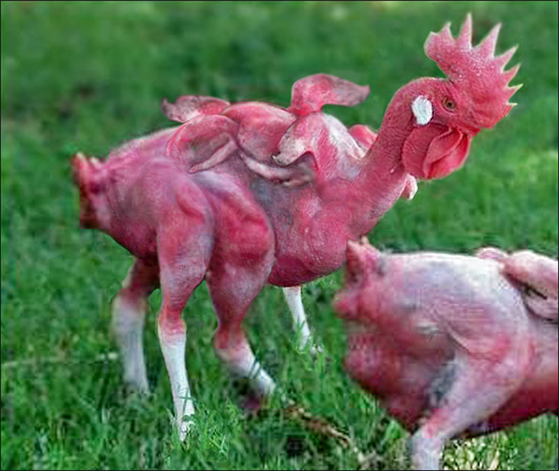
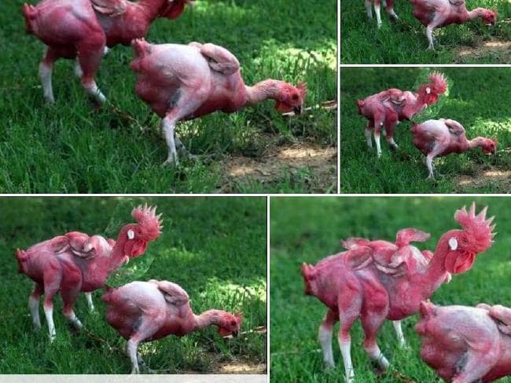

(Although we all know that fast food is not generally a great nutritional choice, there's a lot of nonsense out there about how bad fast food is. The most pernicious is about how fast food doesn't rot, and people have shown this by keeping McDonalds burgers for years, with only minimal breakdown of the food. Of course, it's been shown that in the same conditions where McDonalds burgers don't rot, organic home-made burgers don't rot either)

<!-- more -->

[This story](http://www.stuff.co.nz/business/76552837/kfc-wins-payout-over-china-mutant-chicken-rumours) is about some photos, and rumours, in china that purported to show that KFC have managed to mutate chickens' DNA so that they have six wings and four legs.

The rumours were started by three companies in China on social media sites, in what looks like a deliberate effort to discredit KFC.

The images and ideas were picked up by many anti-science people in New Zealand and other countries, with emails and Facebook posts exclaiming that KFC were using these genetically modified chickens to boost their bottom line by getting more legs and wings from each chicken.

The companies who helped spread these rumours have all been ordered to pay compensation to KFC by a court in Shanghai - a total of around $140,000.

I've looked at the photos and they are obviously photoshopped. There's [even a blog post](http://artofericwayne.com/2014/03/02/this-hoax-has-gone-viral-and-they-are-using-my-photoshop-work/) by the person who made one of the photos, for a joke.

