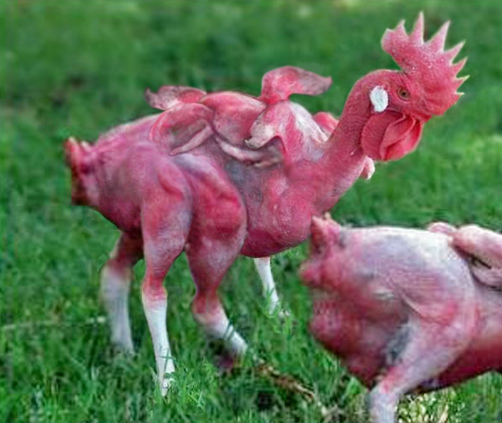

A couple of stories about fast food that set off my skeptical alarm bells this week.

<!-- more -->

## What a Happy Meal looks like after six years

[Yet another story](http://www.stuff.co.nz/life-style/food-wine/76711301/what-a-happy-meal-looks-like-after-six-years) about how fast food doesn't rot, this time in Alaska. A chiropractor (of all people!) keeps a McDonald's happy meal on her desk, to show how because it doesn't rot, it's bad for kids. The unsaid assumption seems to be that it's filled with preservatives.

Of course, it's been shown that in the same conditions where McDonald's burgers don't rot, organic home-made burgers don't rot either. Rotting is more to do with having warm, damp oxygenated conditions for bacteria to thrive than the nutritional value of the food.

## KFC wins payout over China mutant chicken rumours

This story is about some photos, and rumours, in china that [purported to show](http://www.stuff.co.nz/business/76552837/kfc-wins-payout-over-china-mutant-chicken-rumours) that KFC have managed to mutate chicken's DNA so that they have six wings and eight legs.

The rumours were started by three companies in China on social media sites, in what looks like a deliberate effort to discredit KFC.

The images and ideas were picked up by many anti-science people in New Zealand and other countries, with emails and Facebook posts exclaiming that KFC were using these genetically modified chickens to boost their bottom line by getting more legs and wings from each chicken.

The companies who helped spread these rumours have all been ordered to pay compensation to KFC by a court in Shanghai - a total of around $140,000.

I've looked at the photos and they are obviously photoshopped. There's even a blog post by the person who made one of the photos, for a joke.

[http://artofericwayne.com/2014/03/02/this-hoax-has-gone-viral-and-they-are-using-my-photoshop-work/](http://artofericwayne.com/2014/03/02/this-hoax-has-gone-viral-and-they-are-using-my-photoshop-work/)
