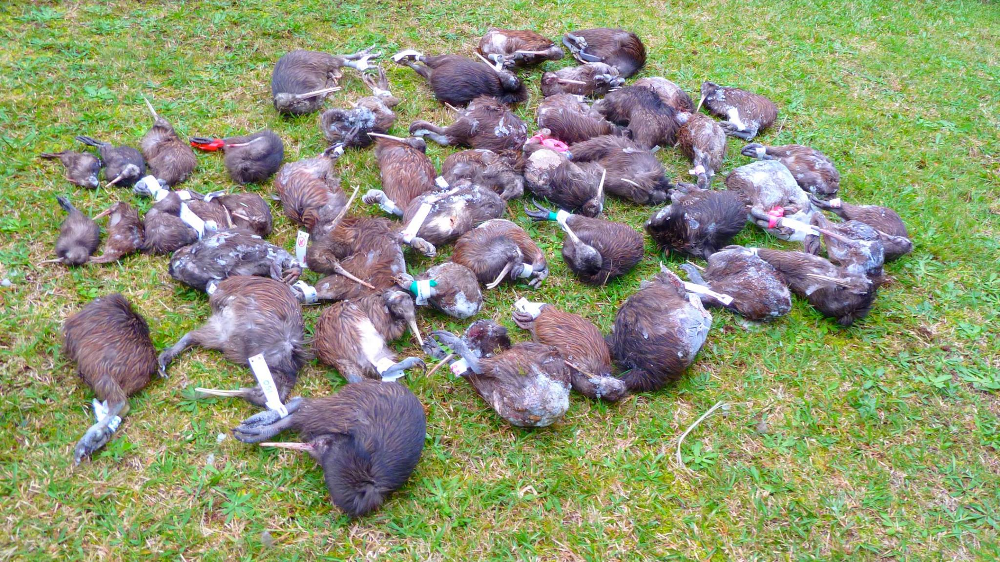

An image of dozens of dead kiwis was recently used by an anti 1080 Facebook activist group, [New Zealand's Not Clean Green](https://www.facebook.com/New-Zealands-not-clean-green-351886364952193/), to show that the poison is harming local wildlife.

<!-- more -->

However, a group called Bush Bay Action has [corrected this distortion](https://www.facebook.com/BayBushAction/photos/a.236323743057452.57504.236296209726872/1129249003764917/?type=3&theater), explaining that the image comes from the Bay of Islands Department of Conservation and shows three years of kiwi deaths due to car collisions and dog attacks.

Bay Bush Action say that:

> "Of 280 kiwi monitored (radio-tagged) through 1080 operations in the Tongariro Forest Park from 2007 to 2011, none were lost to 1080 and chick survival was more than twice as high as before the operation."

New Zealand's Not Clean Green have defended their use of the photograph, saying that the picture has "not been photo shopped".

1080 has been shown to be safe for native birds, despite a lot of scaremongering from local groups.

Evidence based information about 1080 can be read at:

- [Forest and Bird](http://www.forestandbird.org.nz/saving-our-environment/native-plants-and-animals-/protecting-native-forests-1080/1080-frequently-ask)
- [1080 Facts](http://www.1080facts.co.nz/)
