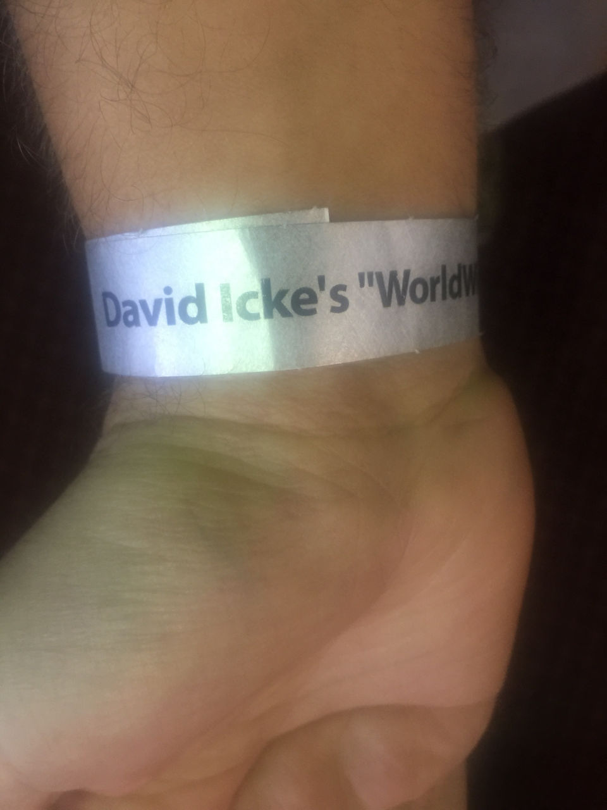
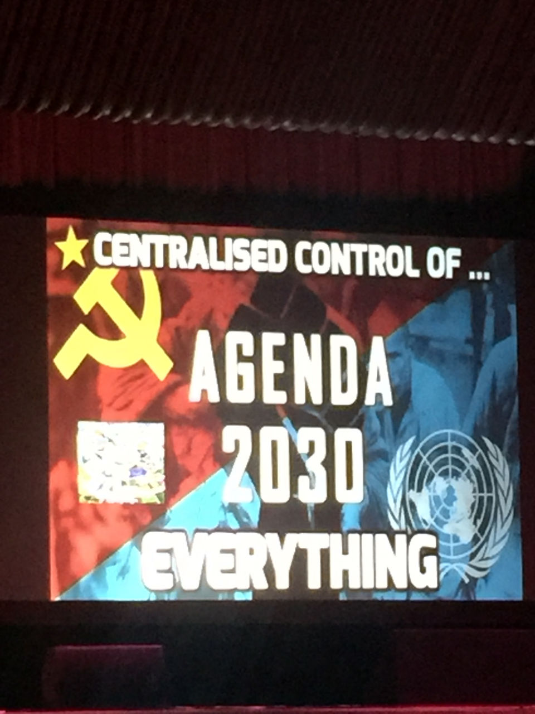
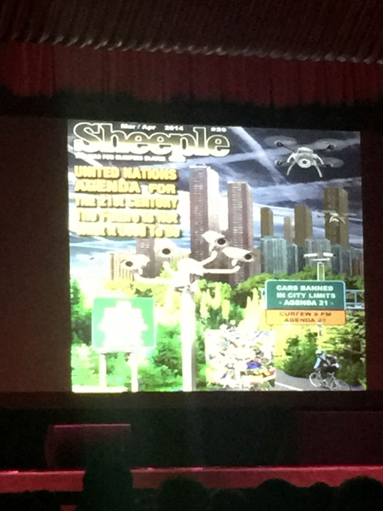
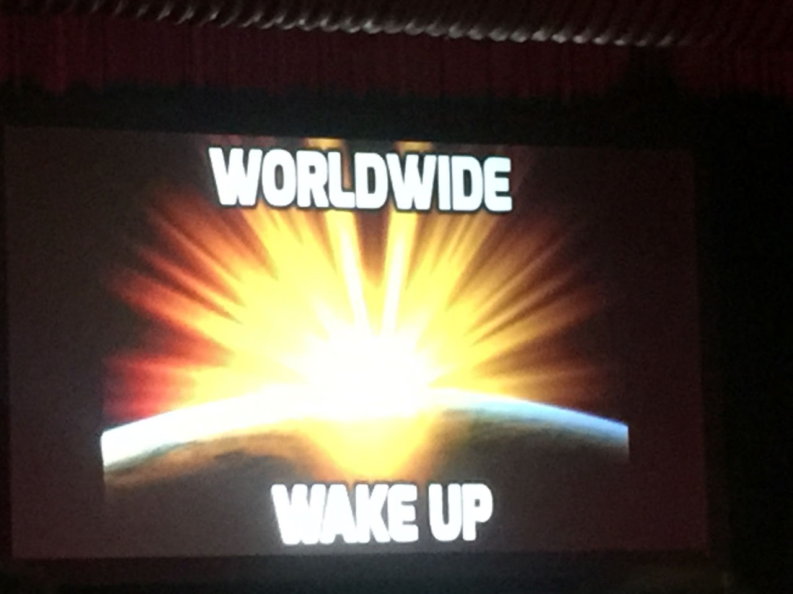
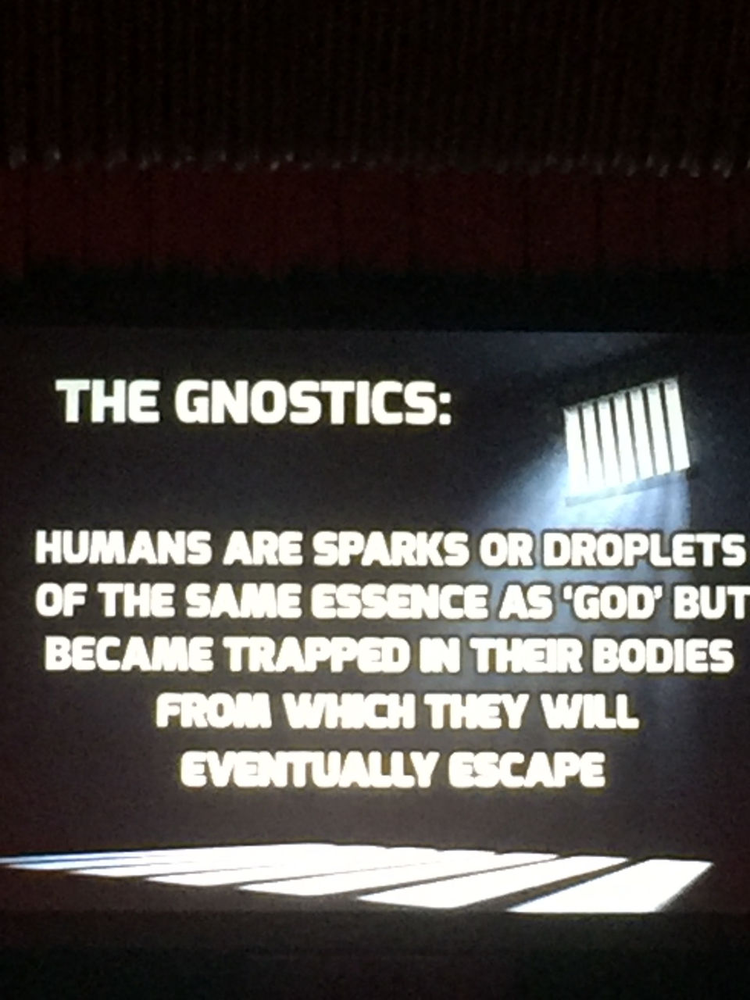
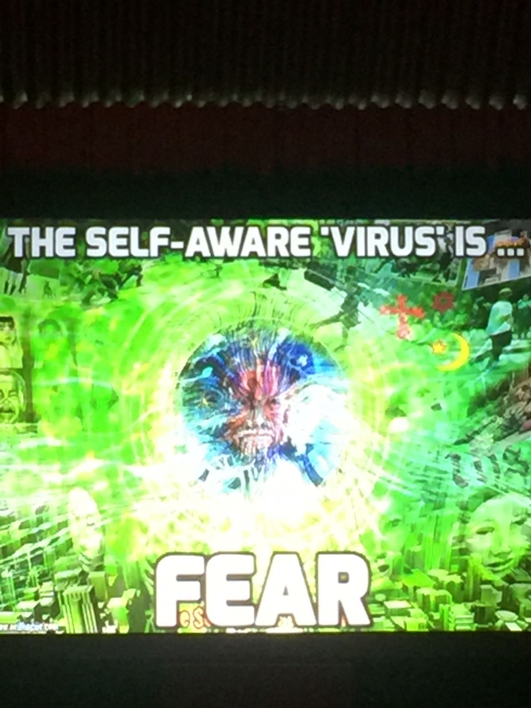
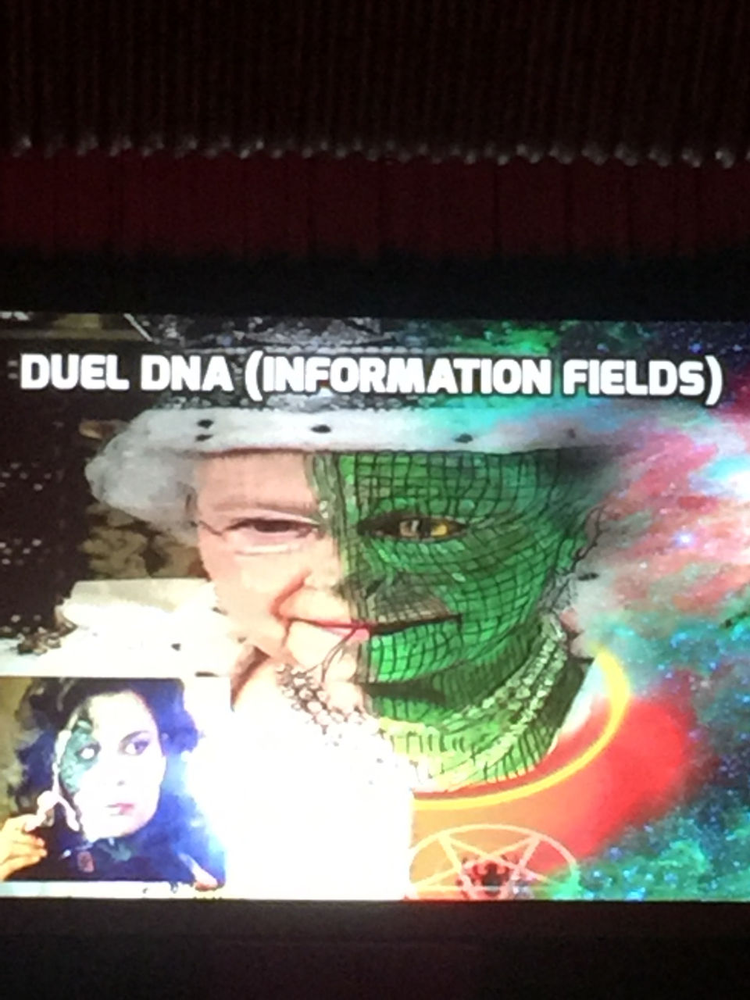
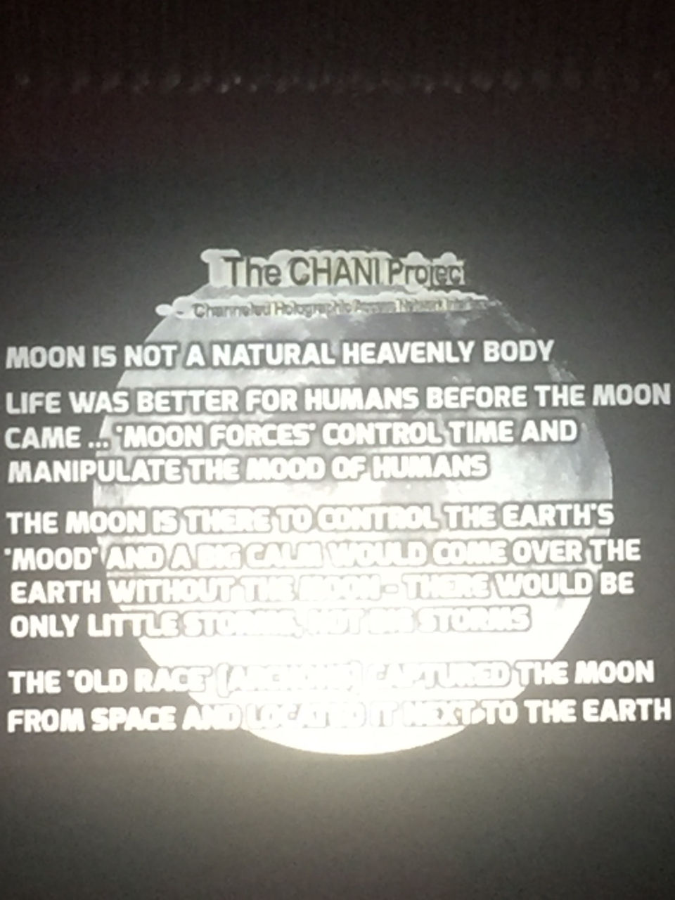

Here are my bullet points and photos from David Icke's recent 12 hour talk given in Auckland:

<!-- more -->

- A lot of the slides looked like internet memes
- Schools are programming prisons - they're programming a distorted view of reality.
- Exams are a hoax (David never took any exams at school)
- Clinton will take us into WWIII
- Frequent mentions of NZ - clever!
- Prophecy is knowing the agenda - Orwell and Huxley knew the agenda, hence why their books were so accurate.
- The 9/11 planes were flown by drone technology
- Project for the New American Century
- The plan is to invade countries in the Middle East
- The Rothschilds created Israel and it's their fiefdom
- George Soros is Mr Evil
- WWIII will happen - the West vs Russia / China
- Russia is being demonised in the press, as is China
- "The program" - is a set of lies told to us about the nature of reality
- The "spider" runs everything - the Hidden Hand
- Problem - a problem is made up by the elite
- Reaction - the public call for something to be done
- Solution - the elite bring in changes they want to make to society
- Bourne style mind control - there are people brainwashed with multiple personalities, waiting for a trigger word to enable them.
- We are heading towards a Hunger Games society
- Acceptance of the police state
- Almost all news articles that David is referencing are from his own website!
- Climate change is a hoax
- Agendas 21 and 2030 depend on climate change
- FBI to make climate change denial illegal
- Tesla died penniless because he knew the secret of free energy
- Weather control is real - HAARP
- He's argued both that there's no climate change, and that governments are changing the climate.
- Fracking destroys water supplies and is a global water crisis.
- Fluoride suppresses brain activity.
- Emoto was a good friend, proved that homeopathy works
- The world is an illusion - our brains decode the data of the world from a data stream - like the Matrix
- The demi-urge created Archons who can't create, but can only change things. Archons feed on fear and radiation.
- The Archons copied the earth, and the copy is corrupted or broken.
- Our brains currently see the corrupted copy of the word. We need to vibrate at a higher frequency to see the original copy, which looks a lot like the movie Avatar.
- Archons control the elite via their DNA, they have partial reptilian DNA which allows them to be manipulated
- Symbols are powerful tools for controlling the subconscious
- Saturn is a sun. Black cubes represent Saturn.
- David kept referencing movies as being accurate portrayals of reality:
- The Matrix
- Avatar
- The Hunger Games
- Star Trek
- Star Wars
- Through the Wormhole
- The moon is hollow and was built. Life would be better without the moon ([Chani project](http://projectavalon.net/forum4/showthread.php?22693-The-CHANI-Project))
- Smart/WiFi/Cloud/Internet is bad
- Transhumanism will turn us into robots.
- Artificial Intelligence will be the end of mankind
- To fix everything we all need to increase our frequency!! To love people, and not be violent.

