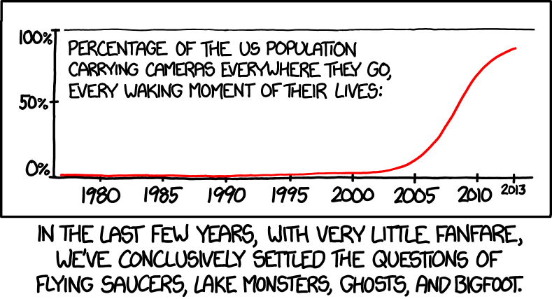

[Footage has emerged](http://www.nzherald.co.nz/world/news/article.cfm?c_id=2&objectid=11730146) from Indonesia that is claimed to be evidence of Indonesia's bigfoot, Orang Pendek.

<!-- more -->

As usual, it's blurry footage from far away that is most likely a human. It appears to be a tall figure, dark, with a big stride and holding something white swinging in its hand. The white object could be a carrier bag. Of course, as the footage is taken from far away so our brains end up doing a lot of guesswork to try to make sense of what we're seeing.

This certainly shouldn't be considered as evidence of a new species of hominid. Not only is it unlikely that Orang Pendek exists, but also Orang Pendek means "short person" in Indonesian and whatever or whoever is walking in the video is in no way small!

This case reminds me of a great graph from XKCD:

