I went to the Go Green Expo yesterday, along with other skeptics. The expo is meant to showcase green products and services, but many of the stalls promote alternative health.

<!-- more -->

The sheer number of bad claims being made was astounding:

- "Apple cider... prevents stroke/cardiac arrest"
- "Spirulina... repairs brain damage"
- "Himalayan salt... cleans teeth, kills all germs and bacteria"
- "Colloidal Silver... kills viruses"

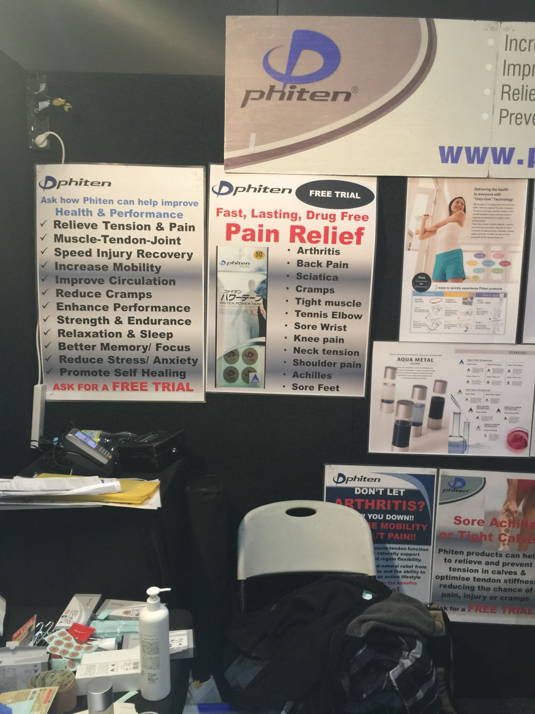

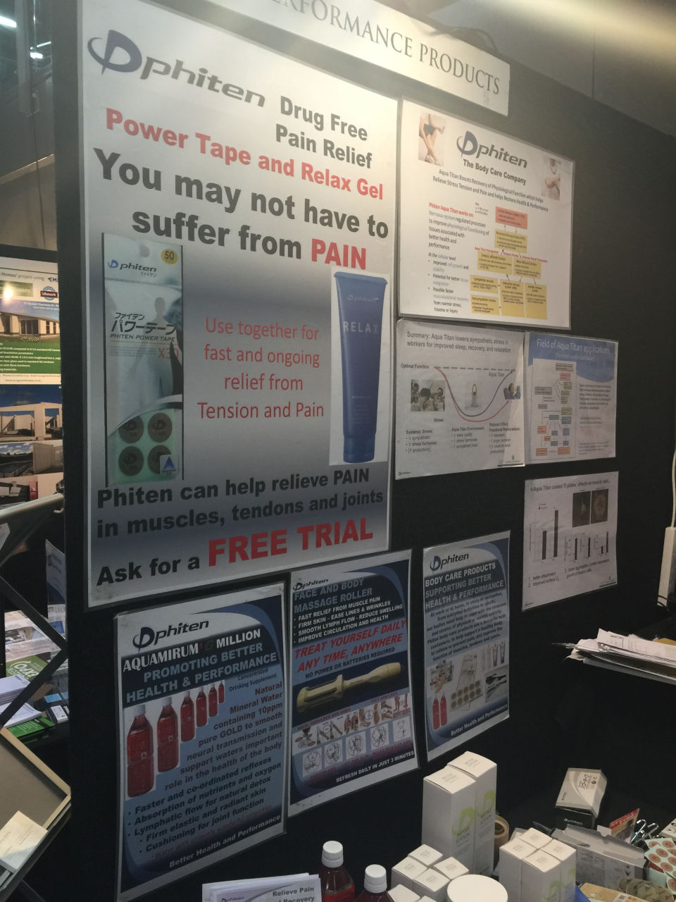

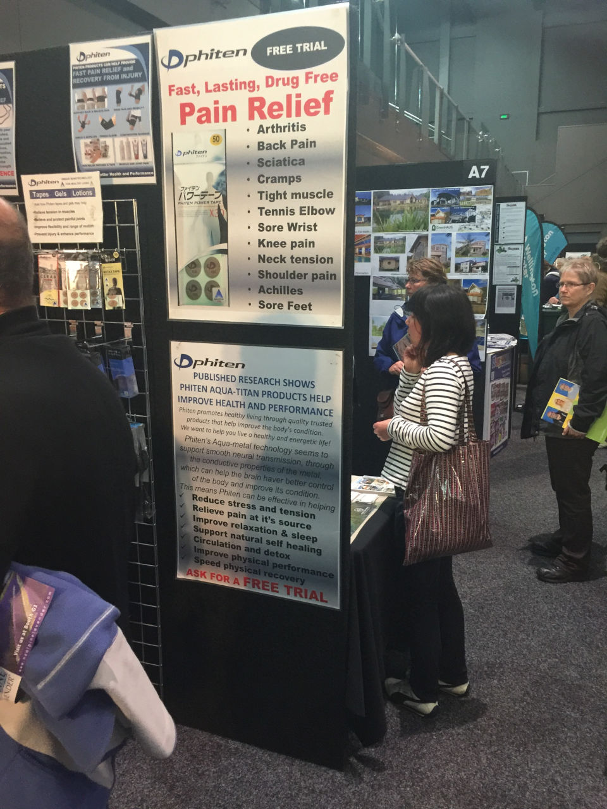

I let the Shuzi Qi people test their microchip bracelet on me. They used a balance test and a finger strength test, both of which have been shown to be easy to fake, to "prove" that their bracelet can increase strength by re-shaping your blood cells. Richard Saunders, of the Australian Skeptics, did a great takedown of these balance and strength tests (for the Power Balance Bands) by using a simple double blinded experiment. When the tests were done with the tester knowing whether the tested had a band on or not, there was a marked difference. As soon as both parties did not know if they had a real or fake band, the difference in balance totally disappeared.

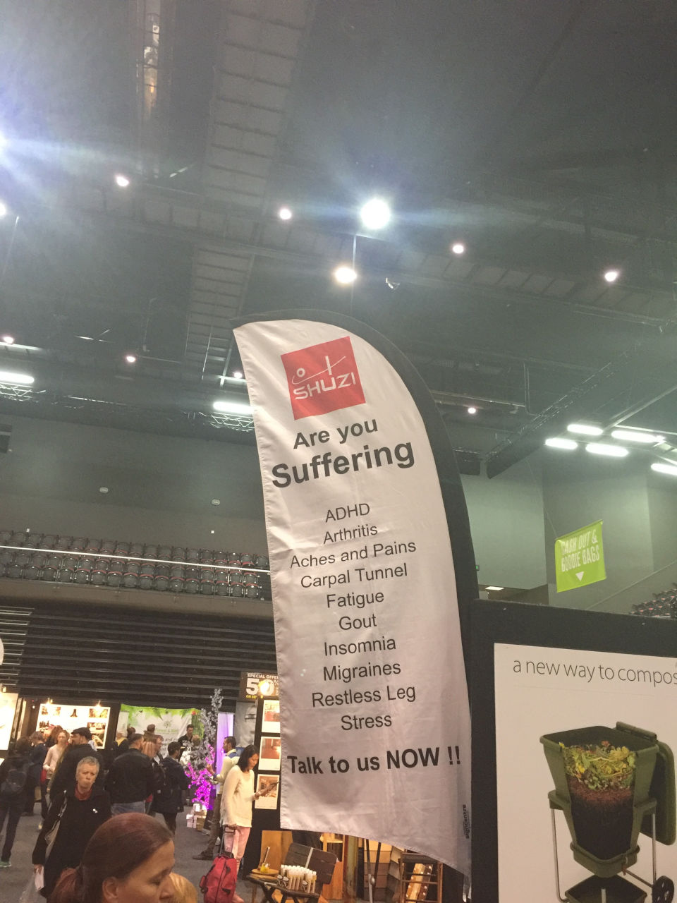

I was treated with Bioptron light, and saw advertising that the company has been asked to cease using. I talked with the Bioptron "therapist" while she treated me.

<audio controls src="/media/audio/skepticism/Bioptron-HealingLight.mp3" />

<audio controls src="/media/audio/skepticism/Bioptron-PremBabies.mp3" />

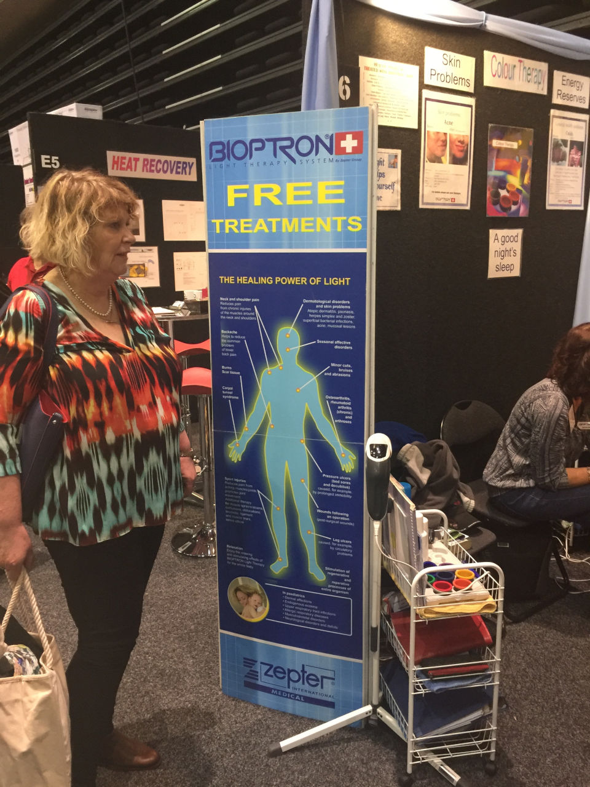

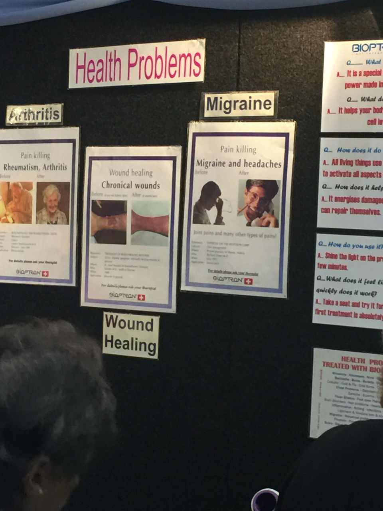

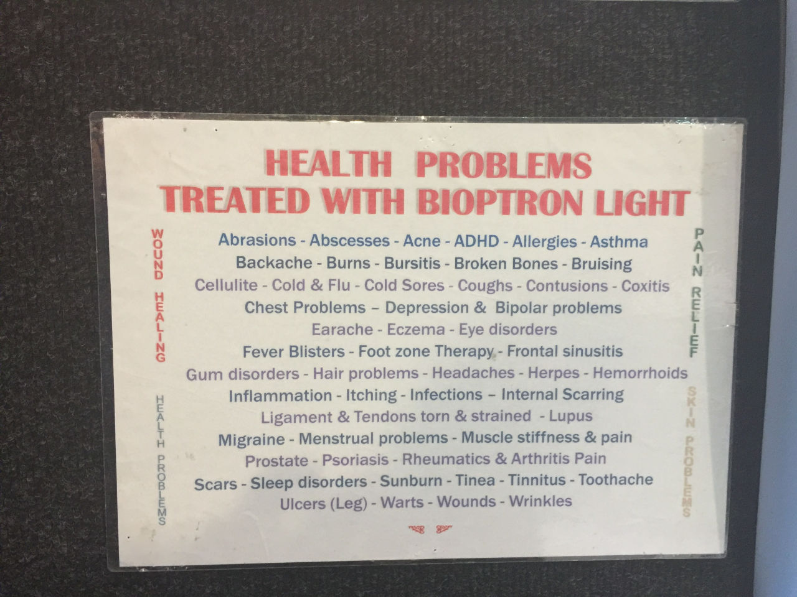

I talked with a herbalist who said that plants are designed by god to contain compounds that treat the side effects they cause when they are used to treat medical conditions. He also told me that his plan was to sell enough of his product so that he could afford to run a clinical trial to prove that it works - it obviously escaped him that it's horribly unethical to sell medicines before you've proved that they work.

Overall, the event was full of crazy!

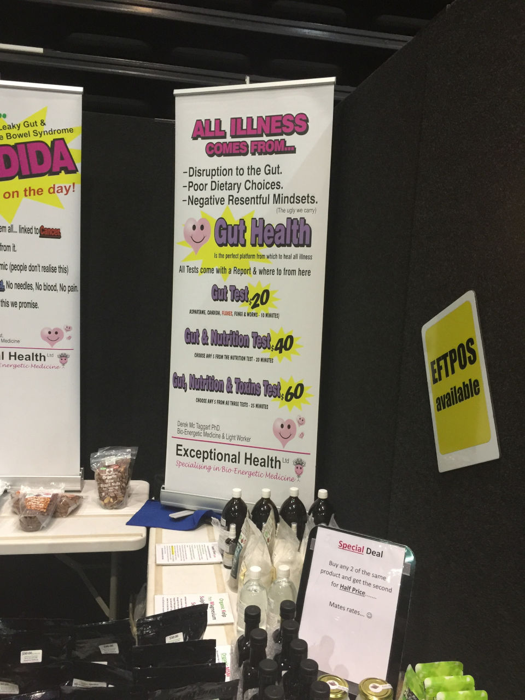

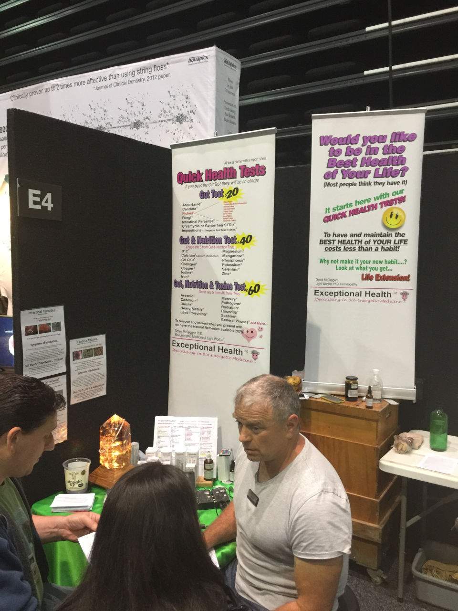

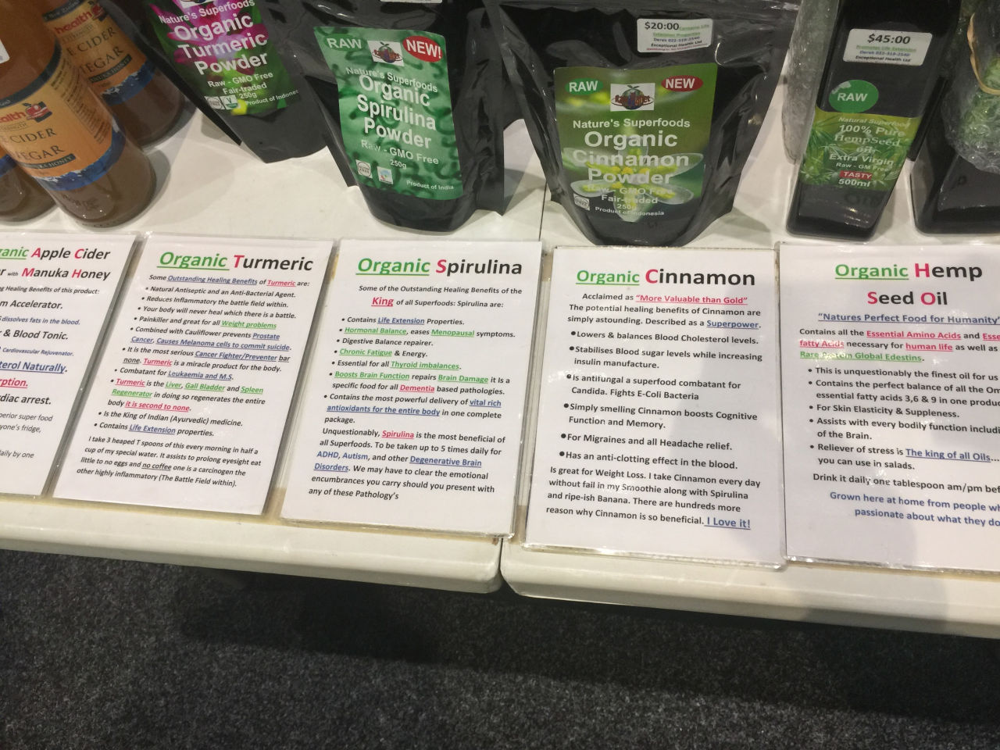

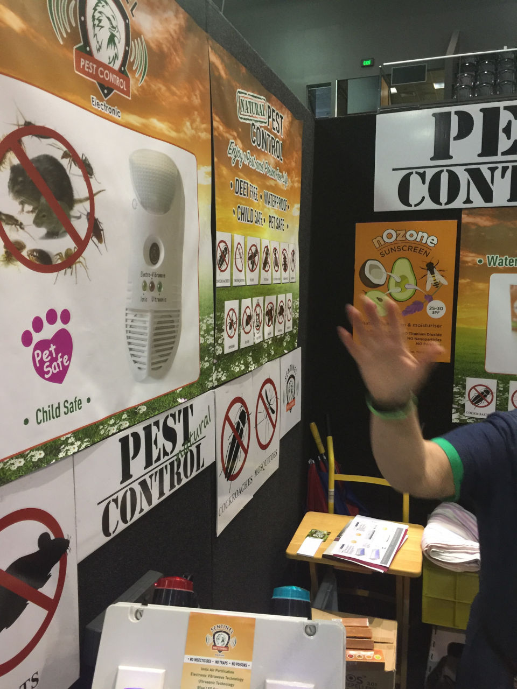

I talked to the organisers last year, and they removed a couple of bad adverts, but they don't seem to be willing to stem the tide. We submitted four ASA complaints about this year's stallholders before the event had even started, and we now have a lot more material available to submit many more complaints - both photos and flyers.
