Scientology are pushing to open new "Ideal Orgs" around the world, and Auckland's old Whitecliffe Art school building has been converted to a new Org. It was purchased in 2007 with a $10 million loan from Scientology central, but recently local Scientologists borrowed a further $6 million to restore and modernise the building.

<!-- more -->

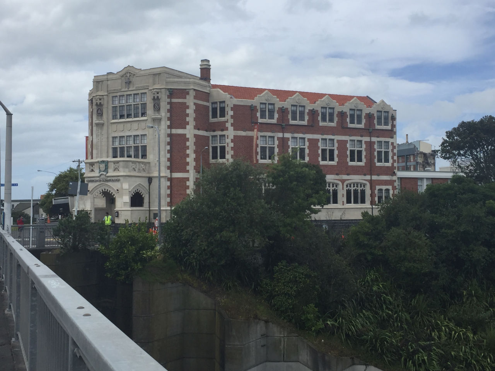

Yesterday, there was a grand opening. I went along with another couple of skeptics, and had no problems getting in. There were probably about 500 people present, and many of them seemed to be Scientologists from overseas.

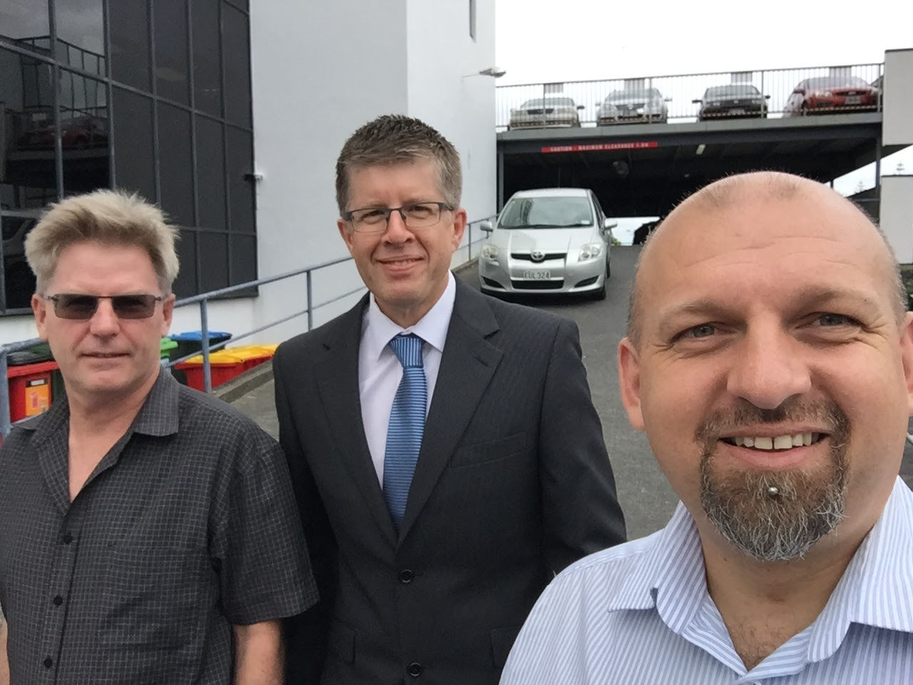

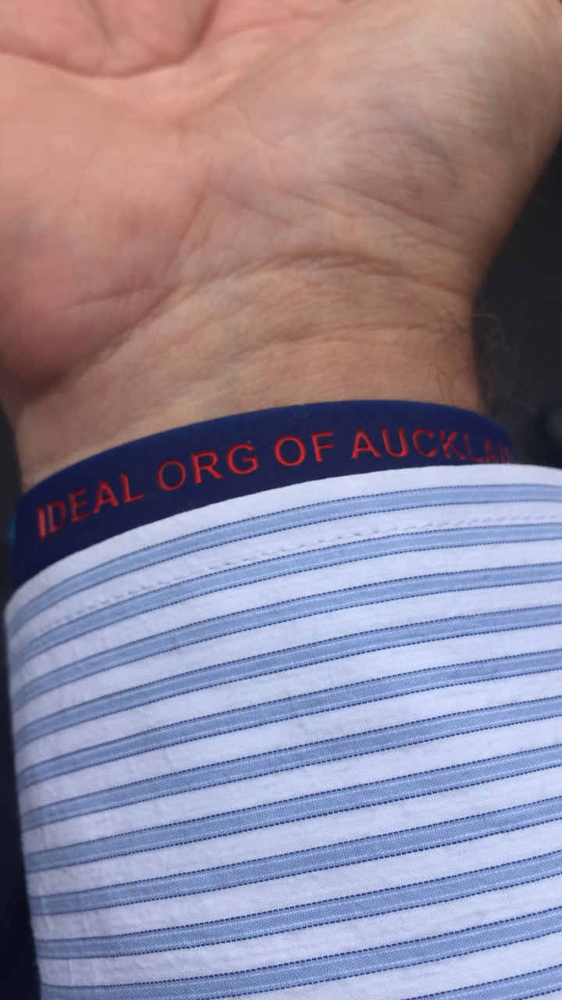

First there was a Maori greeting, followed by a song:

@[youtube](https://youtu.be/2yK3CgjGIgc)

After I'd live streamed a couple of videos, I was asked to stop recording the event. Several others were asked to stop recording as well. Staff members were quiet but strict about where people should sit/stand, what we were and weren't allowed to do, etc.

An American woman MCd. We heard from several "notable" people - an architect who helped with the restoration, a Maori Warden, and an ex senior policeman, all of who believed that Scientology is essential - before David Miscavige, the head of Scientology, [took the stage](http://www.stuff.co.nz/national/88646334/church-of-scientologys-supreme-leader-david-miscavige-in-auckland-for-opening-of-new-headquarters):

<audio controls src="/media/audio/skepticism/Miscavige.mp3" />

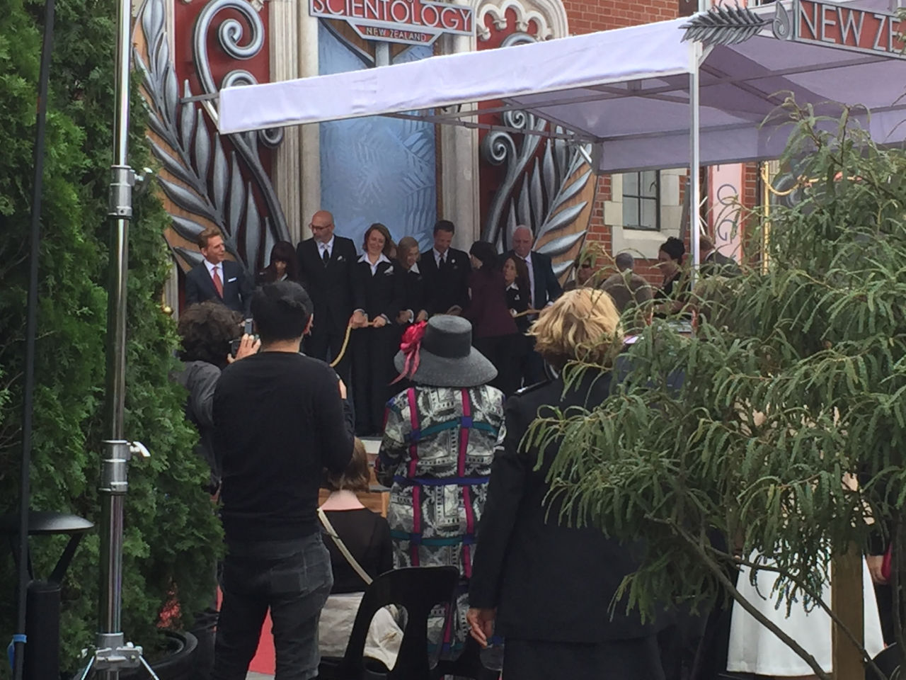

This is the Bridge - a set of levels that people must pay to progress through, learning more about the religion as they go.

This is related to the reason for Ideal Orgs. Apparently David Miscavige has said that there are new OT levels - 9 through 15, and that 9 and 10 can only be released once all orgs are Ideal Orgs.

To be [an Ideal Org](http://www.mikerindersblog.org/ideal-org-lies/), it appears that a local chapter needs to have an impressive building, large floor space, many permanent staff members, etc:

We met a couple of Dr Helen Smith's patients - she [made the news recently](http://www.stuff.co.nz/national/88207117/Scientologist-doctor-invites-patients-to-opening-of-16m-New-Zealand-headquarters) when she invited all of her patients via email to the opening.

After the event we were free to roam around the building, so we tried to see as much as we could. That included the Purification Rundown room (vitamin overdosing to supposedly help with detoxing), many rooms with e-Meters and a closed off room behind the bookstore that appeared to hold all the auditing information from scientologists.

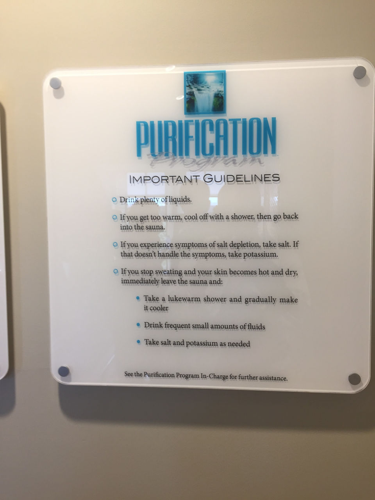

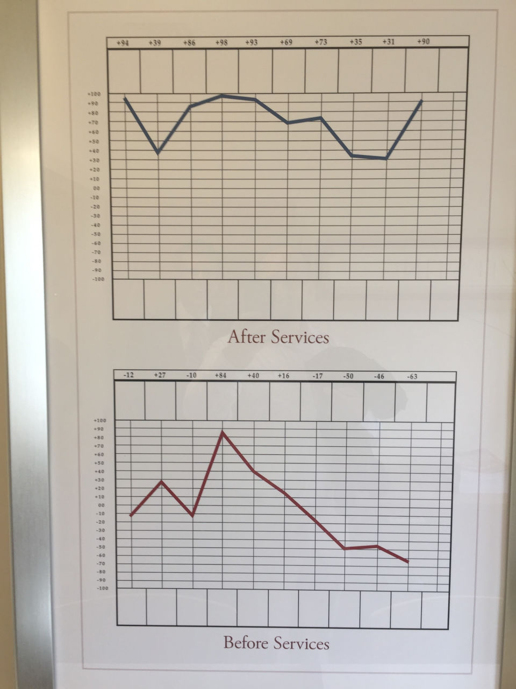

There was also an office for L. Ron Hubbard, awaiting his return from death.

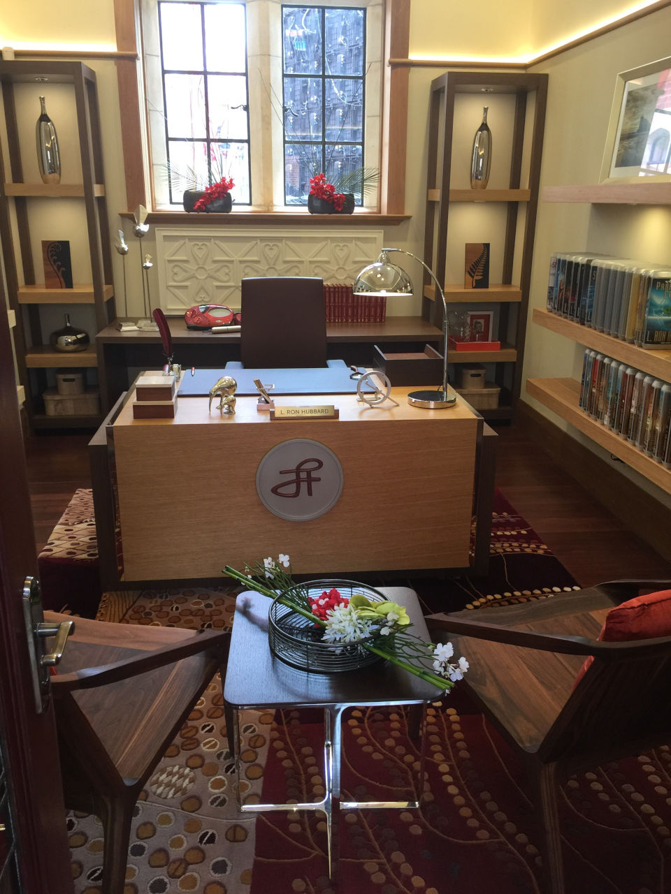

I broke an e-Meter by accidentally changing the language to French!

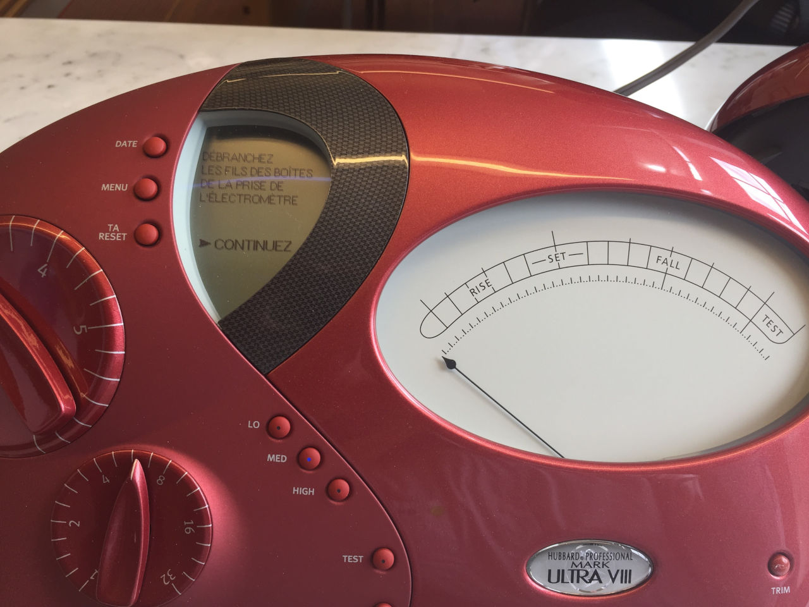

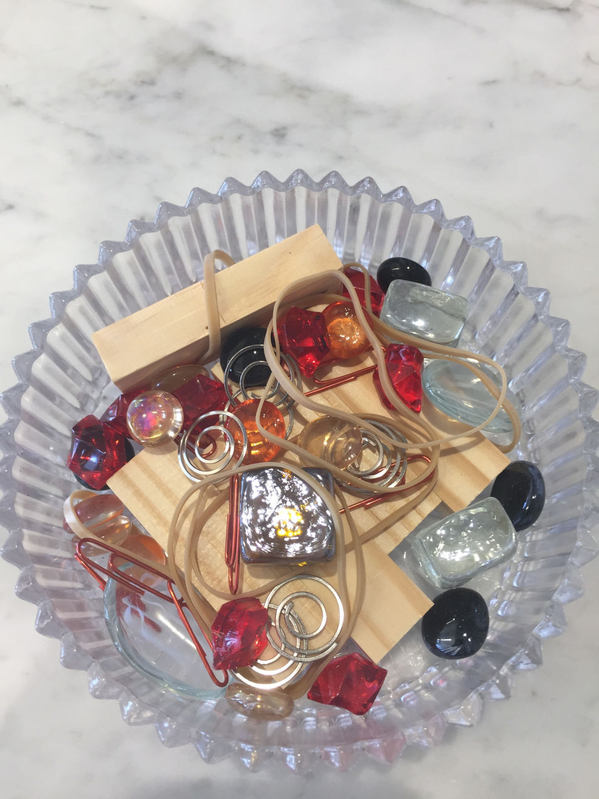

I didn't manage to find Nigel Antony Gray, the earthquake "predictor" who recently admitted he's a Scientologist. He's pretty annoyed with me at the moment, because of [an article](http://www.stuff.co.nz/national/88269767/who-are-the-men-who-say-they-can-predict-earthquakes) where I talked about him.

I was going to say hello to him, but he was nowhere to be seen.

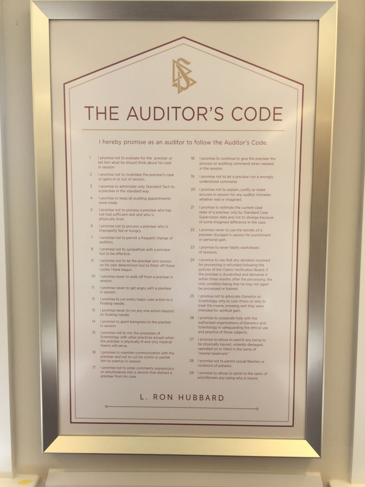

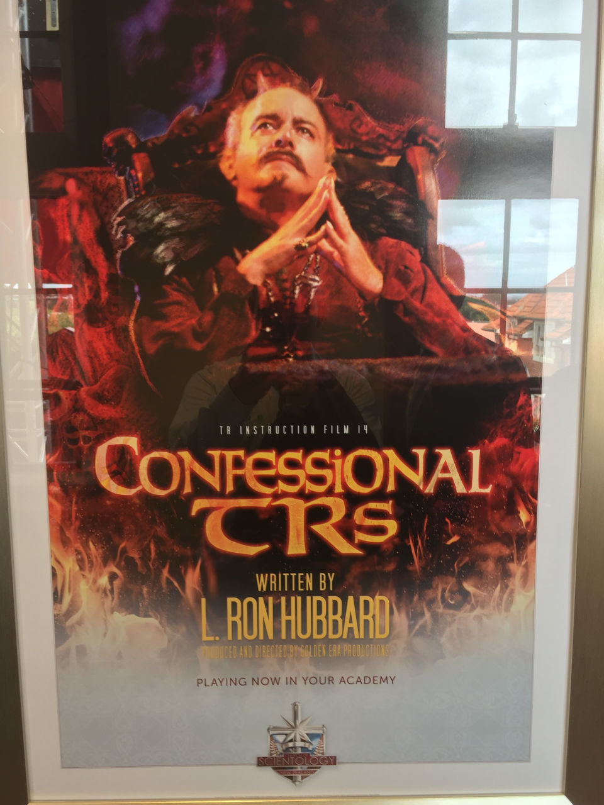

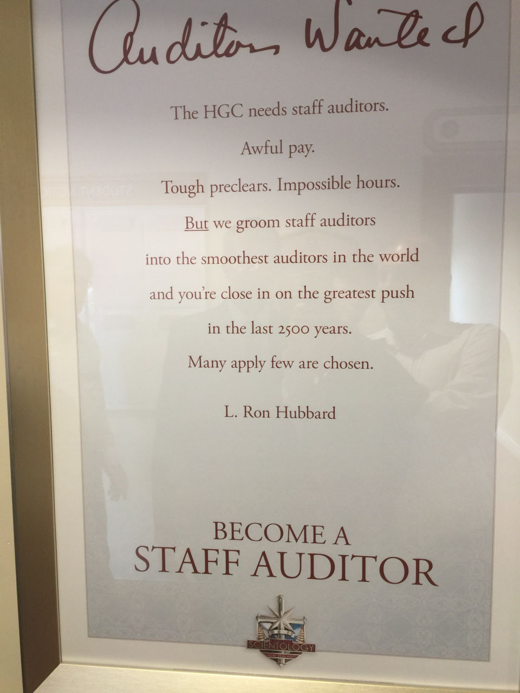
