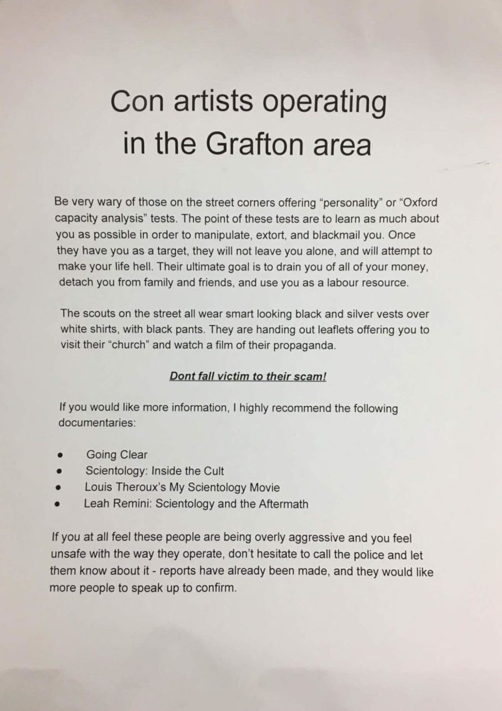

I was messaged this week by someone who works near the new Scientology centre in Auckland. They told me that there are lots of Scientologists out on the streets at the moment, including outside the nearby hospital, trying to bring people into the church. The way they do this is quite disingenuous, normally starting with offering a free personality test - the [Oxford Capacity Analysis](https://en.wikipedia.org/wiki/Oxford_Capacity_Analysis) test (nothing to do with Oxford University)

<!-- more -->

The test has questions such as:

- Do you browse through railway timetables, directories or dictionaries just for pleasure?
- Do you get occasional twitches of your muscles, when there is no logical reason for it?
- Do you often sing or whistle just for the fun of it?

It has been described by experts as "not a genuine personality test," a "terrible mess" and "completely unreliable". A working party from the British Psychological Society even said:

> "No reputable psychologist would accept the procedure of pulling people off the street with a leaflet, giving them a 'personality test' and reporting back in terms that show the people to be 'inadequate,' 'unacceptable' or in need of 'urgent' attention."

The test seems to always come to the conclusion that people are flawed, and that Scientology is able to help them. Confirming this, Hubbard - the founder of Scientology - said in training material about how to use the test:

> The idea is to impinge on the person... Proceed with evaluation on the low points, column by column... look subject in the face and say, with intention, 'Scientology can help you with that' or 'That can be changed with Scientology', or some similar positive statement."

The person I spoke with, for example, said that they had taken the test recently, for fun, and had been told that they are depressed and need Scientology's help.

Thankfully, there is someone in the Grafton area who has taken the matter into their own hands. They are handing out leaflets which do a good job of explaining the basics of Scientology:

Of course, the "help" that Scientology offers is a chance to pay lots of money for a mixture of training materials (books, DVDs, etc) and auditing - a process by which you are supposedly helped to clear engrams - cellular memories that impede you.
