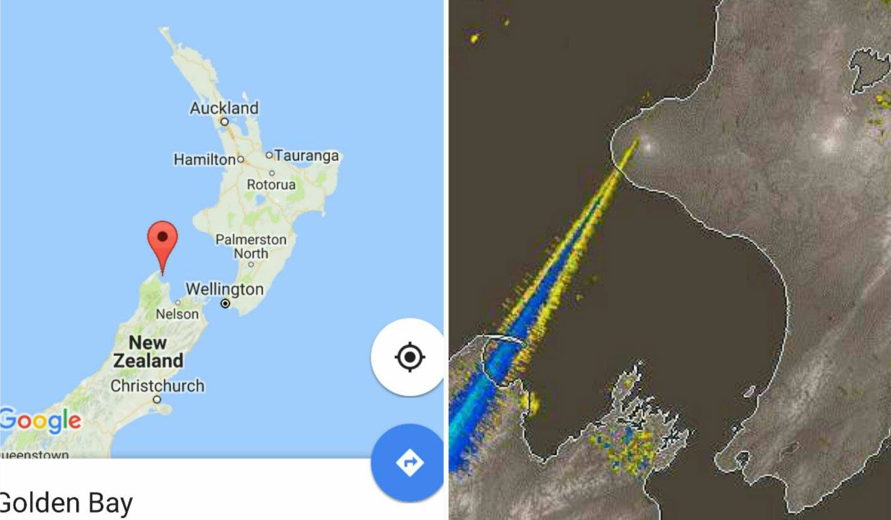
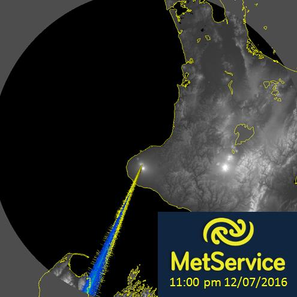

[Apparently](http://stopsprayingus.com/whales/) the recent stranding of hundreds of whales at Farewell Spit was due to an energy beam from Mount Taranaki. This theory has been posited because of a radar map of rain, which shows an expanding beam supposedly originating from the mountain.

<!-- more -->

@[youtube](https://youtu.be/ZKBaRLp1cag?t=38s)

This idea shows a lack of understanding of radar technology, which can be learned pretty quickly [on Wikipedia](https://en.wikipedia.org/wiki/Radar), and a lack of ability to google.

Radar works by sending out a radio signal, and then receiving parts of that signal that bounce back off of objects. Rather than sending out a signal in all directions at once, a radar uses an antenna to send out a beam in one direction, and then the antenna moves around in a circle to cover the area all around the device (about once every 7.5 minutes for the Mt. Taranaki station, from what I can see). A weather radar uses electromagnetic frequencies that bounce off of clouds and rain, rather than the frequencies that air traffic radars use - which pass through water more easily.

I googled for "weather radar lines" and very quickly found a [Met Service blog post](http://blog.metservice.com/Radar_Interference) explaining common types of anomalies that show up on weather radar.

At the bottom of the page is an image from last year that looks almost identical to the "whale stranding" image:

The accompanying description with the image explains how radio interference can cause a radar detection station, such as the one on the top of Mount Taranaki, to mistakenly register the presence of rain, at the time the interference occurs.

The "beam" is just a case of mistaken detection caused by the interference - an overload of the detector, which normally picks up the returning radio waves it has sent out. Whatever is causing the interference was transmitting on the frequencies that the radar station is sending out and then listening for, at the time the radar was pointing South. So whatever radio source was causing this, it was travelling towards Mount Taranaki, not coming from it.

No doubt on the next sweep of the radar, the "beam" will have disappeared. The next "beam" to appear will occur pointing in whatever direction the radar is pointing when the interference occurs.
