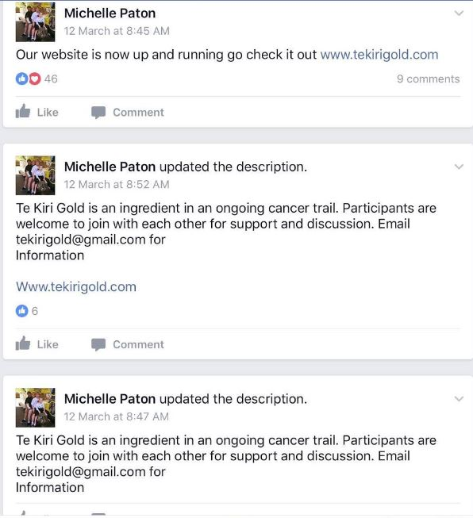
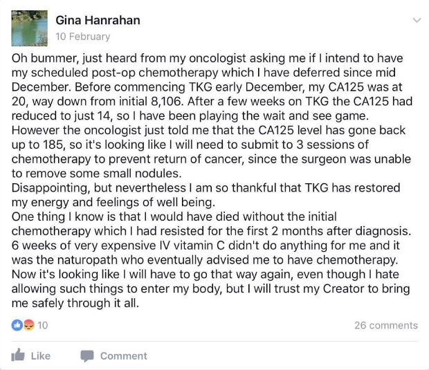

We talked about [Te Kiri Gold](http://www.stuff.co.nz/national/health/91276243/cancer-sufferers-put-faith-in-te-kiri-gold-bleach-water) last year, when [Sir Colin Meads](http://www.stuff.co.nz/national/health/91356942/sir-colin-meads-still-using-te-kiri-gold-water-despite-experts-warning) was in the news endorsing it as a treatment for cancer. Although it wasn't on sale back then, and Vernon had been promising to run proper scientific trials of the product before putting it on the market, this seems to have now been forgotten.

<!-- more -->

A [2 litre container](https://tekirigold.com/shop/) of Te Kiri Gold is now selling for $100, with instructions to drink up to 600ml, or $60, per day to help with serious cancers.

Over 500 people are apparently currently taking this product, which walks like a duck and quacks like it's snake oil.

It appears that the concoction is [essentially a bleach](http://www.nzherald.co.nz/nz/news/article.cfm?c_id=1&objectid=11834818), much like a product called Miracle Mineral Solution. It's made by [electrolysing salt water](https://en.wikipedia.org/wiki/Electrolysed_water). Vernon's product is quite weak, which is a small mercy! It's labelled as less than 1% bleach, but tests performed in a lab, conducted for the NZ Herald, showed a concentration of 3%.

Sir Colin Meads has recently said of the product "I thought it had cured me, but it hadn't.". It's a pity that, without expert medical confirmation that it had made a difference to his cancer, he decided to talk to the media and give free advertising to the product - saying things like "I just tell them that it helped me. I just say I take it."

In the Te Kiri Gold Facebook group, Vernon Coxhead is asking potential customers to call him rather than discuss their needs online. Presumably this is an attempt to avoid leaving a trail of evidence that could get Vernon in trouble with both MedSafe and the Commerce Commission.

The group is also closed, which means that non-members can't see what is discussed inside the group. However, I have some screenshots of people in the group talking about their needs and experiences.

> "As I was feeling a good response from the TKG, I postponed the operation, wanting more time to assess my progress … There has been small shrinkage in the size of 3 tumours."

There are a lot of questions about the company - PureCure. For example, there's a registered doctor who is involved, and his testimonial is on the side of the containers:

> "I've repeatedly seen it work in my surgery. Patients can't believe it and immediately want more. See what you think. That's my guarantee! - Dr Mitch."

No clinical trial has been registered anywhere.

The "trial" seems to simply be an effort to collect testimonials from customers. Presumably at first these were from people who were given the stuff for free, but now people have to pay for it - with the exception of Sir Colin, who gets it for free still.

Vernon says:

> "I can't run around and say, I've got a cure for cancer. They'd just shoot me down straight away."

> "Big pharma and all that do [double-blind placebo testing] because they're all about making money."
