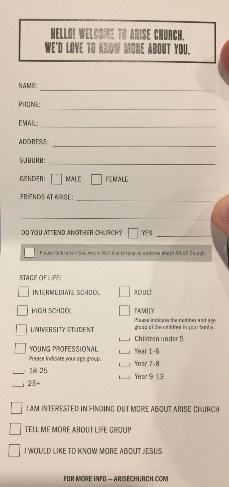
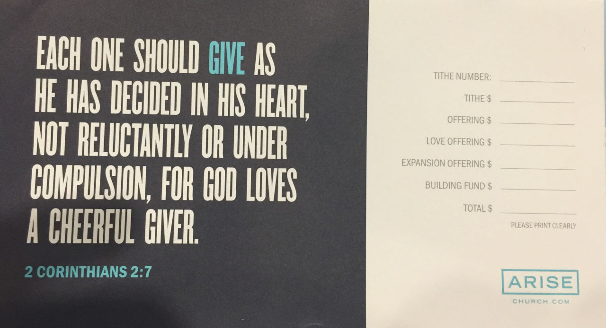
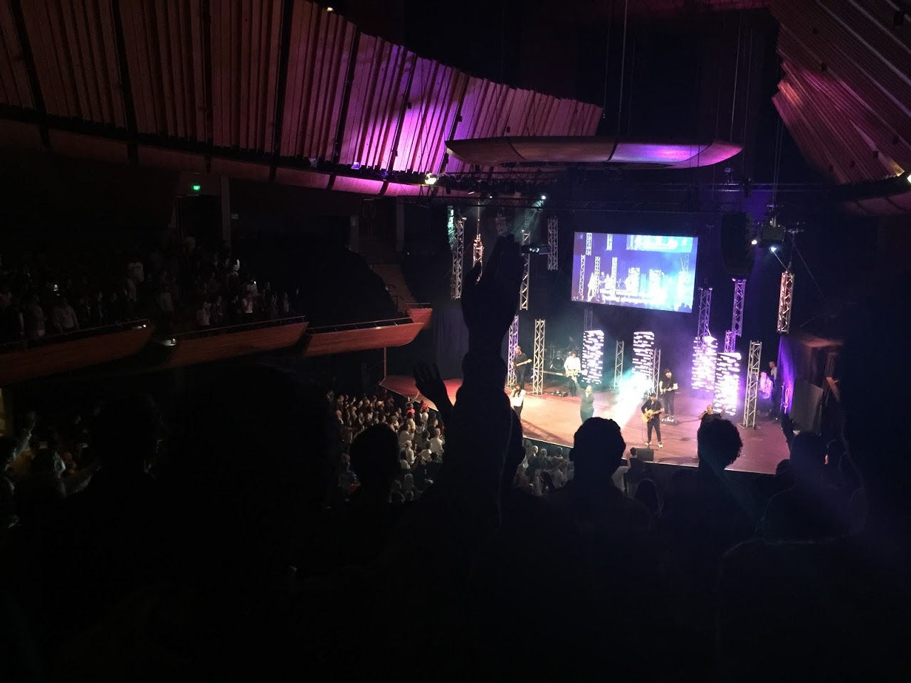

Last Sunday I went to church - not once, but twice. Arise is a large evangelical church that started in Wellington about 15 years ago, and has grown and spread to several other cities.

<!-- more -->

The church prides itself on its growth, and the number of new members they attract every week.

The church has built a new $8.5 million centre in Lower Hutt, Wellington, and so I went to one of the morning services on the day of opening. The service was fairly innocuous, although it was interesting that they stopped the service for about 5 minutes while they asked everyone there to fill in a form with contact details and tick boxes asking questions:

At the end we were all asked to bow our heads and close our eyes. Then John, the pastor, asked people to raise their hands if they fit various categories - feeling far from god, used to believe in Jesus but don't any more, new to Christianity, etc. I put my hand up at one point, as I used to be a Christian.

After this had finished, everyone who had put their hands up was asked to come to the front and dedicate their lives to Jesus. Now, I felt like this was a little cheeky. I'd only put my hand up to honestly admit that I had once believed - I do not believe in a god, and have no intention of re-joining a church. So I sat still, and was surprised when a staff member came over, held me by the elbow and asked me to come to the front to join the others. I politely said no, but by that point I imagine many people in a similar position to me would have relented and agreed to doing something they weren't comfortable doing.

Those people were taken away to be prayed over, and then the collection was taken. If I was being cynical, I would say that the push for new members may be related to the church's expectations for how much is given in an offering - 10% for a tithe, along with various other "offerings":

That evening I went to a second service, this time in the Michael Fowler centre. It was pretty full:

The evening service had guitar music (with many enthusiastic kids jumping up and down at the front of the stage), a play and about 20 minutes of preaching (with emotional keyboard music playing in the background). The sermon included an impassioned insistence that we are not mistakes, and not accidents, but rather we are "meant to be". It also contained a claim that Jesus Christ is the most evidenced historical figure in modern history, and that we have more proof of his existence than for anyone else in the last few thousand years.

Next came the same "bow your heads and close your eyes" that had happened in the morning.

This time, I had a good look around at what was happening. Church staff were stationed all around the venue to spot and point out anyone who had put their hand up. Again, afterwards, these people were asked to go to the front of the church, and were cheered as they were led off for prayer. This time, many of those at the front were teens or tweens - I presume that the kids who attend Arise had been asked to invite their friends to this special event.

From both these events and conversations I've had with ex members of the church (including my wife!), it appears that the church leadership use the number of people who put their hand up on a Sunday as a measure of new membership - people they have "brought to Christ". However, this is a bad measure of joining members, as many Christians will have put their hand up in response to the question of whether they have felt distant from Jesus recently, or feel they haven't committed fully. I can imagine that many church members could answer a yes to these questions once every few months, as their life circumstances change and they resonate with one of the many questions asked.

After the evening service myself three other skeptics retired to the pub for a debrief about what we'd witnessed. I had been joined by an ex church member who is now an atheist, and two skeptics who were somewhat surprised by the spectacle they'd just witnessed - saying it was unlike any church service they'd ever seen.

On Tuesday, the first day back at work, I received a call in the morning from the head pastor of the new church "campus" I'd been to on the Sunday morning. He said that it was great that I'd made it to church, and that he was contacting me because I'd filled in the contact form (which we'd all been pressured to fill in).

The pastor went on to say that he saw that I'd ticked the box on the form saying that I would "NOT like to receive updates about ARISE church", but did I realise that there was a meet and greet event on the Friday? He also wanted to know about whether I attend a church regularly, if I'd been to Arise before, if my kids go to church with me and a raft of other questions. I thought it was all rather cheeky, and I have since found out that the church has an organised effort to ensure anyone who visits the church is phoned up several times to try to get them to return. All results are apparently kept in a spreadsheet to make sure that the correct number of calls are made to each potential new church member.

This aggressive membership drive, along with Arise's controversial efforts to reach into schools and universities (they hand out free ice creams at Unis around the country during orientation week)
