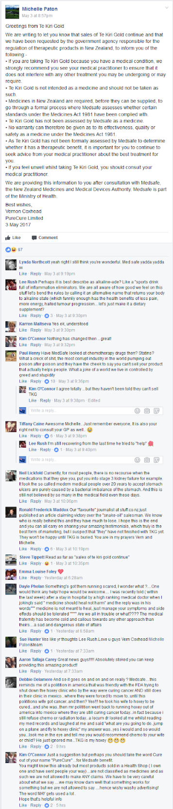

On April 11th I submitted a complaint to Medsafe about[ Te Kiri Gold](http://www.nzherald.co.nz/nz/news/article.cfm?c_id=1&objectid=11849163), a bleach made by farmer Vernon Coxhead which he is selling as a cancer cure.

<!-- more -->

> To whom it may concern,
>
> PureCure Limited ([https://www.companiesoffice.govt.nz/companies/app/ui/pages/companies/6048730](https://www.companiesoffice.govt.nz/companies/app/ui/pages/companies/6048730)) has been in the news in the last week for its product Te Kiri Gold ([https://tekirigold.com/shop/](https://tekirigold.com/shop/)). PureCure is run by farmer Vernon Coxhead and registered doctor Mitchell Feller ([https://www.mcnz.org.nz/support-for-doctors/list-of-registered-doctors/doctor/30432](https://www.mcnz.org.nz/support-for-doctors/list-of-registered-doctors/doctor/30432)).
>
> Vernon Coxhead has been quoted in the media saying “I have to make sure I do everything by the book -- make no claims”, but it appears that serious claims are being made about the product’s ability to treat cancer via testimonials on the company’s website ([https://tekirigold.com/stories/](https://tekirigold.com/stories/)), comments in a closed Facebook group ([https://www.facebook.com/groups/1281026021938723/](https://www.facebook.com/groups/1281026021938723/)) and in the media:
>
> - [http://www.stuff.co.nz/national/health/91356942/sir-colin-meads-still-using-te-kiri-gold-water-despite-experts-warning](http://www.stuff.co.nz/national/health/91356942/sir-colin-meads-still-using-te-kiri-gold-water-despite-experts-warning)
> - [http://www.stuff.co.nz/national/health/91276243/cancer-sufferers-put-faith-in-te-kiri-gold-bleach-water](http://www.stuff.co.nz/national/health/91276243/cancer-sufferers-put-faith-in-te-kiri-gold-bleach-water)
> - [http://www.nzherald.co.nz/nz/news/article.cfm?c_id=1&objectid=11834214](http://www.nzherald.co.nz/nz/news/article.cfm?c_id=1&objectid=11834214)
> - [http://www.nzherald.co.nz/nz/news/article.cfm?c_id=1&objectid=11834685](http://www.nzherald.co.nz/nz/news/article.cfm?c_id=1&objectid=11834685)
> - [http://www.nzherald.co.nz/nz/news/article.cfm?c_id=1&objectid=11834808](http://www.nzherald.co.nz/nz/news/article.cfm?c_id=1&objectid=11834808)
> - [http://www.nzherald.co.nz/nz/news/article.cfm?c_id=1&objectid=11834818](http://www.nzherald.co.nz/nz/news/article.cfm?c_id=1&objectid=11834818)
> - [http://www.nzherald.co.nz/nz/news/article.cfm?c_id=1&objectid=11835017](http://www.nzherald.co.nz/nz/news/article.cfm?c_id=1&objectid=11835017)
> - [http://www.sciencemediacentre.co.nz/2017/04/10/te-kiri-gold-scrutiny-in-the-news/](http://www.sciencemediacentre.co.nz/2017/04/10/te-kiri-gold-scrutiny-in-the-news/)
> - [http://www.nzherald.co.nz/sport/news/article.cfm?c_id=4&objectid=11770533](http://www.nzherald.co.nz/sport/news/article.cfm?c_id=4&objectid=11770533)
> - [http://www.stuff.co.nz/national/87442105/Water-credited-with-beating-back-Sir-Colin-Meads-cancer-developed-by-Taranaki-farmer-from-footrot-remedy](http://www.stuff.co.nz/national/87442105/Water-credited-with-beating-back-Sir-Colin-Meads-cancer-developed-by-Taranaki-farmer-from-footrot-remedy)
>
> Claims made in the media attributed to Vernon Coxhead include:
>
> > "[Te Kiri Gold] is a threat to a lot of money," Coxhead says. "It's like coming up with a car that runs on water."
>
> > "I tell people, 'Look, you'll be fine, just stick with this and you'll be fine.' Someone said to me, 'You can't do that, that's giving people false hope'. How can you have false hope? You either got no hope, or you've got some hope. And if you get told everyday you're going to die, you're going to die."
>
> > "[It’s] the same basic ingredient as your immune system"
>
> > "I can't run around and say, I've got a cure for cancer. They'd just shoot me down straight away."
>
> > "Everybody else that's not taking it is the clinical trial, isn't it? Big pharmac [sic] and all that do [double-blind placebo testing] because they're all about making money."
>
> > "I can't stop making it for six weeks because I'm doing it incorrectly. People will die."
>
> > “[It’s a] game changer"
>
> > “I am not a scientist or a doctor and it worries me that if I change something it may no longer work and I need to give it to people who need it now. So the salt might be high for a short period of time but dying of cancer isn't too flash either."
>
> > "I knew I could help [Sir Colin Meads]. It broke my heart to see him like that - he is such a great Kiwi."
>
> > "I went to see Sir Colin because he's like our king. It broke my heart when I saw the Pinetree was about to fall. I knew I could help him so I did. My son said, 'Dad, you're not taking him a bottle of TKG, you're taking him a bottle of life'"
>
> > "A lady who had cervical cancer drank the water and was clear in 10 days. Another man with a melanoma on the top of his head was so bad you could see his skull. After drinking TKG for three weeks he came back, took his hat off - it was gone"
>
> > "Because it's not a drug it can't be in a medical trial. This is a part of our natural body -- it's not a drug."
>
> > "We don't want to hurt anybody, we know it's intrinsically safe. We also don't want to break the law."
>
> > "There is no such thing as false hope. You either have hope or you have none. Whether you are a skeptic or a believer, the fact is when they turn up at my door I have to face them. I have to make sure I do everything by the book -- make no claims and manufacture it the best I can. The biggest fear is we will get shut down by someone and we have to stop helping people. I don't want anyone coming to my door and I have to say 'I can't help you'"
>
> > "I had a friend who turned up with skin cancer and I was working on it for something else but I gave it to him and it cleared it up"
>
> > "The results have been very favourable. It has been a learning curve and it has been extremely rewarding"
>
> > "To date results involving more than 200 individuals are very favourable and the company has decided to continue enrolment and data collection”
>
> Dr Mitchell Feller has apparently endorsed the product on the packaging:
>
> > "I've repeatedly seen it work in my surgery. Patients can't believe it and immediately want more. See what you think. That's my guarantee! - Dr Mitch.”
>
> The media have reported that the following has been posted in the closed Facebook group by a user of Te Kiri Gold:
>
> > "As I was feeling a good response from the TKG, I postponed the operation, wanting more time to assess my progress”
>
> I’m sure Medsafe are aware of the company, and their Te Kiri Gold product, but Stuff said a few days ago that “Medsafe (NZ Medicines and Medical Devices Safety Authority) and the Ministry of Health are not investigating”. Given the seriousness of the claims being made both publicly and privately by PureCure about their product, the estimated 500 people taking the product for cancer, and the publicity given to the product in the media, I hope that Medsafe can launch an investigation into PureCure before people end up dying needlessly because they have trusted the claims that have been made by PureCure about the efficacy of Te Kiri Gold in treating cancer.
>
> Regards,
>
> Mark Honeychurch
> Secretary, Society for Science Based Healthcare

I sent in the complaint because Medsafe told the media that they were not at the time investigating PureCure, the company which is selling the bleach.

8 days later, on April 19th, Medsafe warned PureCure that they appeared to be selling an unlawful medicine. Supposedly PureCure stopped selling the bleach at that point, but the website still seems to be up and accepting payments.

The company has [apparently taken down](http://www.stuff.co.nz/national/health/92118580/makers-of-te-kiri-gold-back-down-from-medical-claims-after-medsafe-warning) all of their cancer curing claims, but of course the cat's already out of the bag and the public now associate Te Kiri Gold with treatment of cancer.

On Thursday I submitted a complaint to the Medical Council about Mitchell Feller - the other director of PureCure, and a registered doctor:

> To whom it may concern,
>
> PureCure Limited ([https://www.companiesoffice.govt.nz/companies/app/ui/pages/companies/6048730](https://www.companiesoffice.govt.nz/companies/app/ui/pages/companies/6048730)) has been in the news recently for its product Te Kiri Gold ([https://tekirigold.com/shop/](https://tekirigold.com/shop/)), which has been publicly advertised as a treatment for cancer. PureCure is run by farmer Vernon Coxhead and registered doctor Mitchell Feller ([https://www.mcnz.org.nz/support-for-doctors/list-of-registered-doctors/doctor/30409](https://www.mcnz.org.nz/support-for-doctors/list-of-registered-doctors/doctor/30409)).
>
> Vernon Coxhead’s estimate, as reported in the media, is that around 500 people are currently taking his Te Kiri Gold product to treat cancer. It has also been reported in the media that Dr Mitchell Feller, the joint owner of PureCure, has endorsed the product on its packaging:
>
> > "I've repeatedly seen it work in my surgery. Patients can't believe it and immediately want more. See what you think. That's my guarantee! - Dr Mitch.”
>
> [http://www.stuff.co.nz/national/health/91276243/cancer-sufferers-put-faith-in-te-kiri-gold-bleach-water](http://www.stuff.co.nz/national/health/91276243/cancer-sufferers-put-faith-in-te-kiri-gold-bleach-water)
>
> I am concerned that this endorsement is a breach of section 75 of the Medical Council’s Good Medical Practice guide, which states:
>
> > “Act in your patients’ best interests when making referrals and providing or arranging treatment or care. You must not allow any financial or commercial interests to affect the way you prescribe for, treat or refer patients…
> >
> > do not exploit patients’ vulnerability or lack of medical knowledge when making charges for treatment or services”
>
> Given Dr Feller’s position at PureCure, he has a commercial interest in promoting the Te Kiri Gold product to his patients.
>
> At $100 for a 2 litre bottle of electrolysed water, there may also be a risk that promotion of this product to patients is taking advantage of their lack of medical knowledge with respect to the ability of Te Kiri Gold to treat cancer or any other medical condition.
>
> Section 58 of the Good Medical Practice guide states:
>
> > “If you have a conflict of interest, you must be open about the conflict, declaring your interest. You should also be prepared to exclude yourself from related decision making.”
>
> There is a possibility here that Dr Feller has not been open with his patients when making a decision to prescribe Te Kiri Gold to them.
>
> The Council’s Statement on Advertising, section 18, is clear on doctors giving testimonials for medical products or services:
>
> > “Doctors are not permitted to endorse medicines, medical products or medical treatments under section 58(1) of the Medicines Act 1981. The New Zealand Medical Association (NZMA) Code of Ethics also states that doctors should not allow their standing as medical practitioners to be used inappropriately in the endorsement of commercial products… Any endorsement should be based on specific independent scientific evidence, and that evidence should be clearly outlined.”
>
> It appears that Dr Feller is in serious breach of this code with his testimonial.
>
> Given the media attention that this product has received in recent months, and the many people who appear to be paying a lot of money for this unproven treatment for cancer, I hope that the Medical Council can look into this case as soon as is practicable.
>
> Regards,
>
> Mark Honeychurch

Here's a statement from PureCure, posted in their private Facebook group:

Next up I may try submitting a complaint to NZ Food Safety at MPI.
