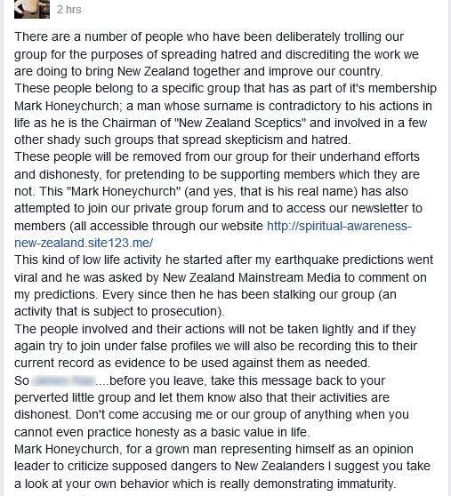

Nigel Antony Gray, who shot to infamy last November when he "predicted" an earthquake, gave a talk in Petone last night.

<!-- more -->

Nigel recently expressed his displeasure with me by saying that I have been stalking his group, and that this is subject to prosecution. He says that my activities are dishonest, and that I am demonstrating immaturity.

Myself and some other skeptics booked a table at the same restaurant that Nigel was due to give a talk at, but at the last minute he changed venues!

Luckily, a group of skeptics including Emily managed to attend and met with us after the event in the pub. We chatted about what Nigel is pushing at his talks that he isn't saying in public.

Regarding his failed earthquake prediction "Why it didn't is because we raised so much awareness that they called it off - and we had an insider, ex CIA, who was telling us this"

Glyphosate ends up in our cereal, poisoning us. Vaccinations are filled with mercury and formaldehyde. Fluoride in the water supply, medications.

> "Now we're getting all this transgendered thing in the schools, the education system is going down"

What's the common element - they're all irrational.

> "There's a lot of doctors getting knocked off for inventing cures for cancer, and I thought I don't really want to be in a body bag"

Here's some audio from the talk:

<audio controls src="/media/audio/skepticism/NigelPetone.mp3" />

Nigel goes on to claim that asthma, allergies and other medical conditions can be fixed once these issues are fixed - this is classic Scientology.

> "$50 is not expensive, to save thousands of dollars on hospital bills"

One quote I loved was "what we need to do is make people rational" - I couldn't agree more!!
