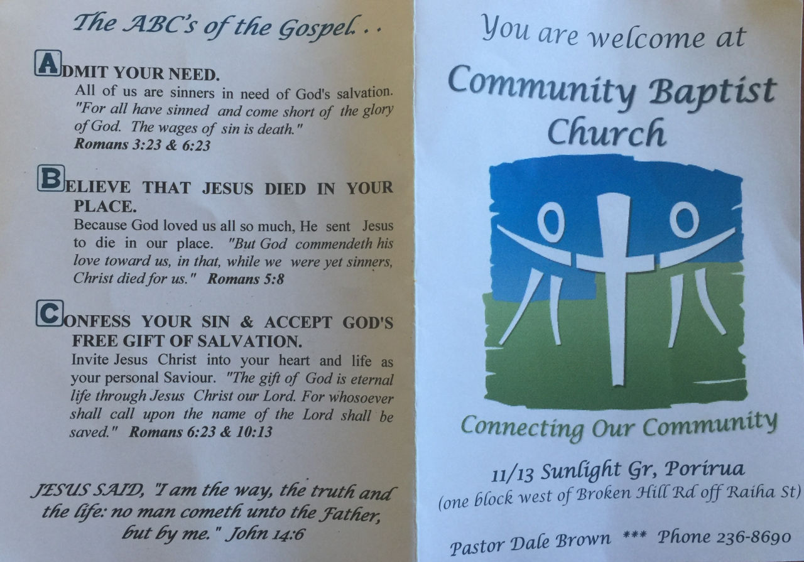
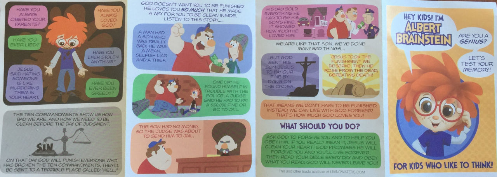
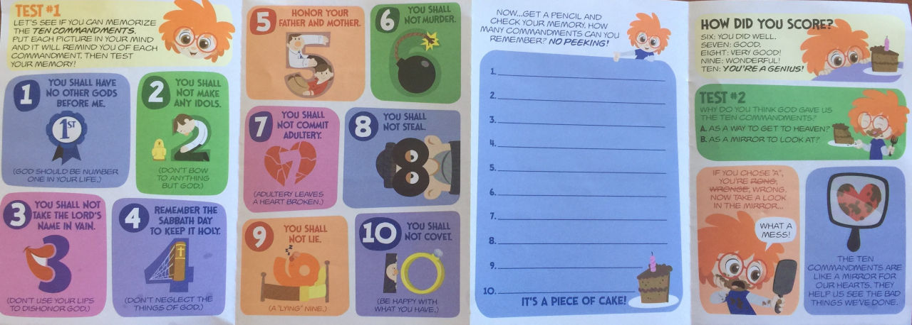

My kids went out trick or treating the other day for halloween, and came back with more than just chocolate and lollies. Religious pamphlets were being handed out at some of the local houses, and my 10 year old daughter knew that I'd be interested to see them.

<!-- more -->

One of the leaflets was made by Living Waters, the organisation run by a famous Kiwi evangelist, Ray Comfort. Ray is well known for using a banana to try to prove the existence of god, and also for using a simple set of questions to try to bring people to god:

@[youtube](https://youtu.be/Ab90Lk6APx0&t=32m57s)

This tactic, pushed by Ray Comfort's Living Waters organisation under the name of Way of the Master, attempts to get people to admit that they have failed to meet god's expectations and then repent.

1. Would you consider yourself a good person?
2. Do you think you have kept the Ten Commandments?
3. If God judges you by the 10 Commandments on the Day of Judgment, will you be innocent or guilty?
4. Based on that, would you go to heaven or hell? Does that concern you?

Question 1 would normally be answered with a Yes - but then being good is equated with keeping the commandments in question 2, which is a bait and switch trick. Nobody's going to say that they're kept the 10 commandments, especially in the form that Ray Comfort tells them (a lustful look = adultery, etc).

Question 3 is an obvious Guilty, and then there's an effort to use Pascal's Wager when you're asked if you'd go to heaven or hell and if that concerns you. A nuanced look at this would make people realise that the choices are not Christian god or no god - and the chances are not 50/50.

Ray is fond of putting videos up on YouTube of him bamboozling people with these and similar questions.

The pamphlet my kids (including my 3 year old) were handed tells them that they're a genius if they can memorise the 10 commandments, and that if they break the commandments they'll go to hell - unless they "obey" god.

It's sad to see that, not content with the Christian holidays they already have, Christians are using a secular occasion to tell children that they're going to hell if they don't choose the correct god to believe in.
