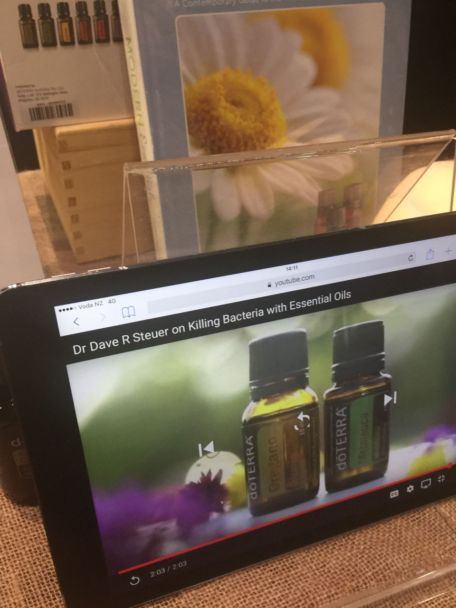

There's [lots of nonsense](http://www.gogreenexpo.co.nz/exhibitor-directory/) at this year's Go Green expo, and I'll be there today sampling the weird and wonderful.

<!-- more -->

The Expo seems to contain more and more alternative health products each year, and less and less actual environmentally conscious products. This year a group of 6 skeptics visited the event, and spent several hours listening to talks and engaging with stallholders. We drank lots of weird coloured samples of powdered drinks, many of which tasted like grass. Thankfully there was no end of berry flavoured samples to wash them down with.

I talked for a while with doTERRA, the MLM company that made the news recently because of local agents making claims of being able to treat cancer and other serious conditions. I was told that . They were surprised that a man would come up to them and talk about the oils, and said that interest mainly came from women. I was shown pictures of a miraculously fast recovery from a serious burn to the face, but from what I could tell they weren't given the pictures by doTERRA - it appears that they had to sneakily take the pictures during an event they were present at.

Several exhibitors were well known to us from previous years, and it was sad to see so many of them still using advertising that we know they're not supposed to use, as we've submitted complaints to the ASA about them.

A new stall was selling the Cyclo-ssage (a portmanteau of cycloid and massage, I think) mat. It had vibration, heat and some spikes - and probably cost a few hundred dollars to manufacture. The asking price was $8,700. I was told that it was portable, so I asked if it's often used to deliver a home service. The response surprised me - a home service is useful when trying to convince someone who has mobility issues to fork out the $9k to buy their own.

Avatar were there - a skeptic was telling me that they're an off-shoot of Scientology. I chatted with them for a few minutes and they helped me complete an exercise in compassion:

Shuzi told us that they don't know how their jewellery works, as the company doesn't tell them everything - but that it's a chip made out of an alloy. Apparently they're running a clinical trial next year at a clinic in Tauranga, but I'm skeptical.
