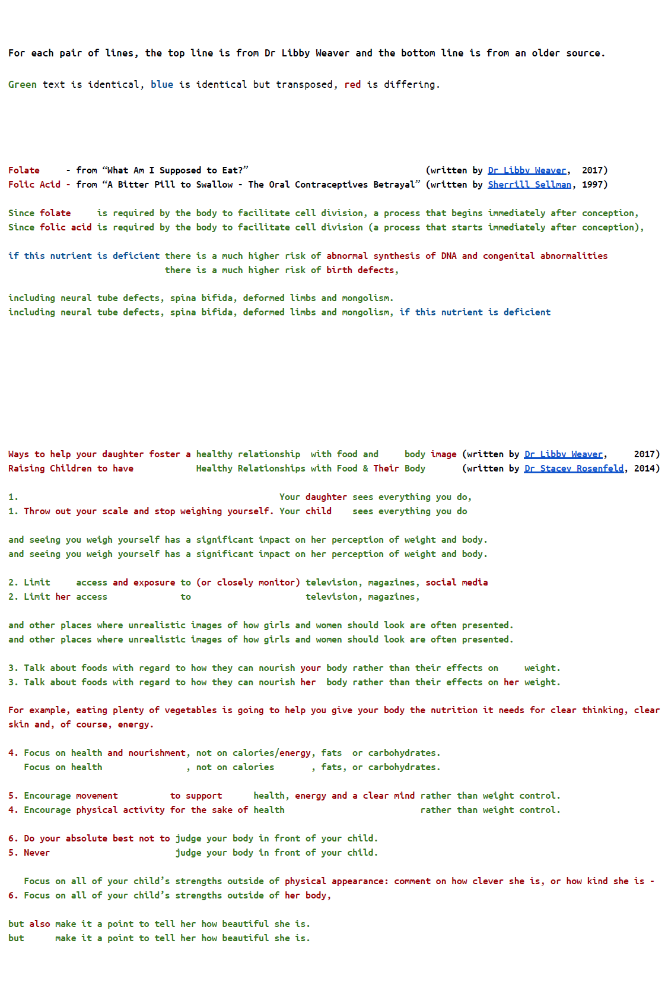

Dr Libby is a nutritional biochemist, not a medical doctor, who regularly posts alternative medicine articles in Stuff. She sells books, goes on speaking tours, has promoted a Multi Level Marketing scheme - USANA over-priced vitamins - and now sells her own alt-med products

<!-- more -->

Dr Libby was called up last weekend by the parent of a child with Down syndrome. The parent pointed out that use of the word "mongolism" in her newest book, "What am I Supposed to Eat", released in August. was considered to be offensive. Dr Libby [responded by apologising](https://www.stuff.co.nz/life-style/well-good/98593411/dr-libby-weaver-recalls-book-over-use-of-term-mongolism).

However, an IT worker decided to do some sleuthing, and found out that the text Dr Libby used that included the word mongolism was [copied from an old conspiracy magazine](https://www.stuff.co.nz/life-style/well-good/98632438/dr-libby-recalls-another-book-over-mongolism-controversy) from 1997. When I heard about this I searched for other instances of plagiarism and quickly found out that an article by Dr Stacey Rosenfeld was also copied. Dr Libby says that the similarities are a coincidence, probably because they've read the same research. However I've made a comparison of the text, and to me it looks extremely unlikely to be coincidence.

[Source](https://docs.google.com/document/d/1p656MZJRpMvtQQBi6m4PrL1dEwLPPsTDJ51A-b3GNLc)
