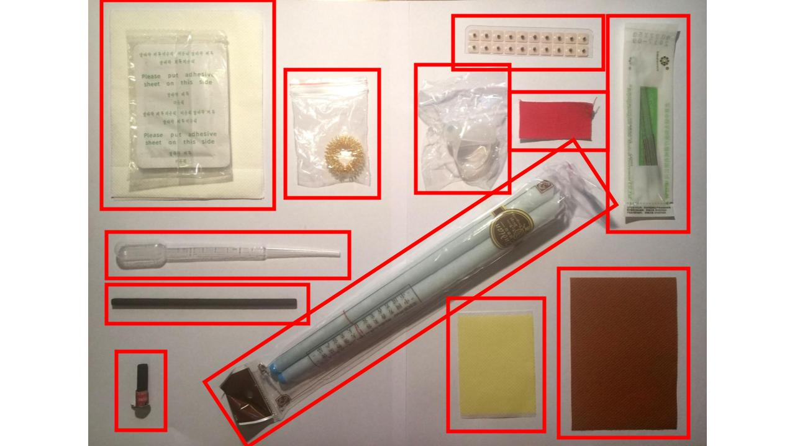

### NZ Skeptics Conference

The NZ Skeptics conference was a great success, with a quiz on the Friday night and a weekend of fascinating talks. We gave all the attendees a bag of alternative medicine nonsense.

<!-- more -->

On the Sunday afternoon, I ran a workshop. As part of the workshop, we read an [article in the Guardian](https://www.theguardian.com/business/2017/nov/21/uk-water-firms-admit-using-divining-rods-to-find-leaks-and-pipes) about dowsing:

Dowsing is a widely discredited method for finding water, pipes, cables and other objects underground. It's a form of divining, with no good quality evidence that it works and no plausible scientific mechanism for how it works, despite many news stories [to the contrary](http://www.cbc.ca/news/canada/montreal/montreal-underground-passage-1.4428833).

Dowsers usually use two metal rods bent at right angles, or a Y-shaped stick, although a pendulum can also be used. The rods cross or the stick moves downwards when near to whatever the object is that is being searched for. The most plausible explanation for this is the ideomotor effect, where our brain can subconsciously cause small coordinated muscle movements.

When high quality testing has been performed on dowsers, such as by James Randi, dowsers have consistently been shown to do no better than chance. Of course, they always come up with a reason after the test as to why they failed - usually something interfering with energy flow.

Sally Le Page in the UK was told by her parents that they had seen someone from a water board dowsing to find a pipe. She then asked the UK's 12 water companies if they use dowsing to find water, pipes, leaks, etc.

Of the 12, 10 responded that they have workers who use dowsing. Thankfully the media in the UK were aghast that taxpayer money was being spent on such silly nonsense.

At our conference, I showed people how to use the website FYI.org.nz to submit a request for information. I asked Auckland Council if they use dowsing. They got back to me pretty quickly [with a reply](https://fyi.org.nz/request/6883/response/22694/attach/html/3/SC284EA473917113009570.pdf.html)!

> "Watercare does not use this technique; the company uses sophisticated electronic devices."

<object data="/docs/skepticism/SC284EA473917113009570.pdf" width="100%" height="800px" />

Next up I'll send the same request to other councils.
