Stuff had [an article this week](https://www.stuff.co.nz/life-style/well-good/teach-me/103568893/the-rise-of-personalised-vitamin-services-in-new-zealand) about personalised vitamins. Companies who require you to talk to a dietician before being recommended vitamins have been around in NZ for a while, but two companies have started up in New Zealand recently that recommend which of their vitamins you should take based on online questionnaires.

<!-- more -->

@[youtube](https://youtu.be/YrKAxvuMKVg)

I took the questionnaires and found out some interesting stuff. I was asked about my age, gender, libido, sperm count, diet, smoking and alcohol intake.

- Age: 42
- Gender: Male
- Low Libido: No
- Low Sperm Count: No
- Smoke: No
- Alcohol intake: Moderate

The questionnaires were very similar, with almost exactly the same questions asked in the same order. I answered them both as honestly as I could, and both came out recommending I spend about $50 on vitamins per month, but with quite different recommendations:

### Vitally

[https://vitally.co.nz/](https://vitally.co.nz/)

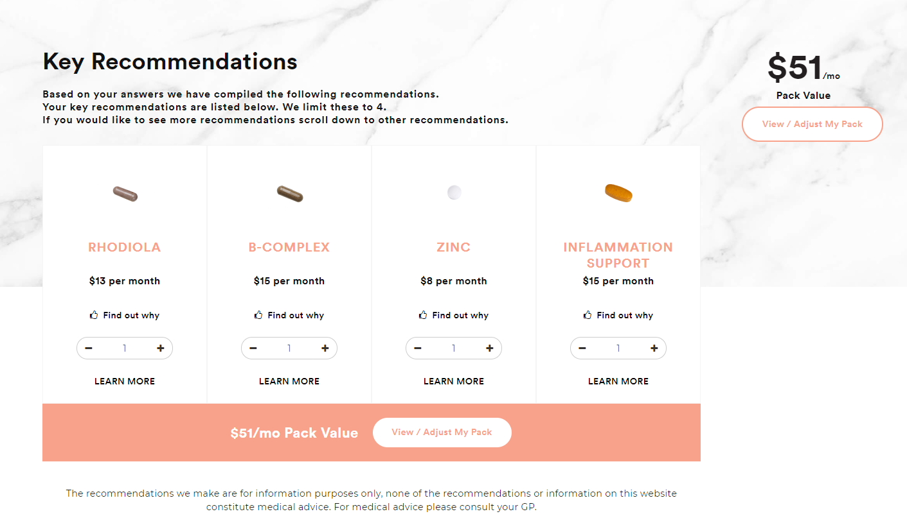

### Wondermins

[https://wondermins.co.nz/](https://wondermins.co.nz/)

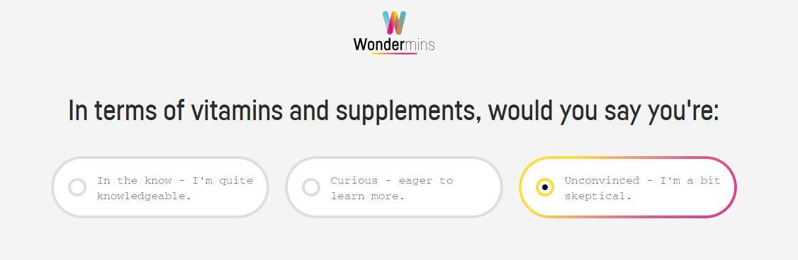

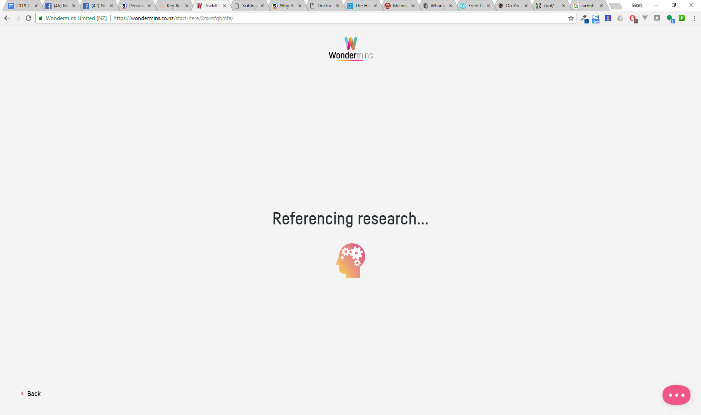

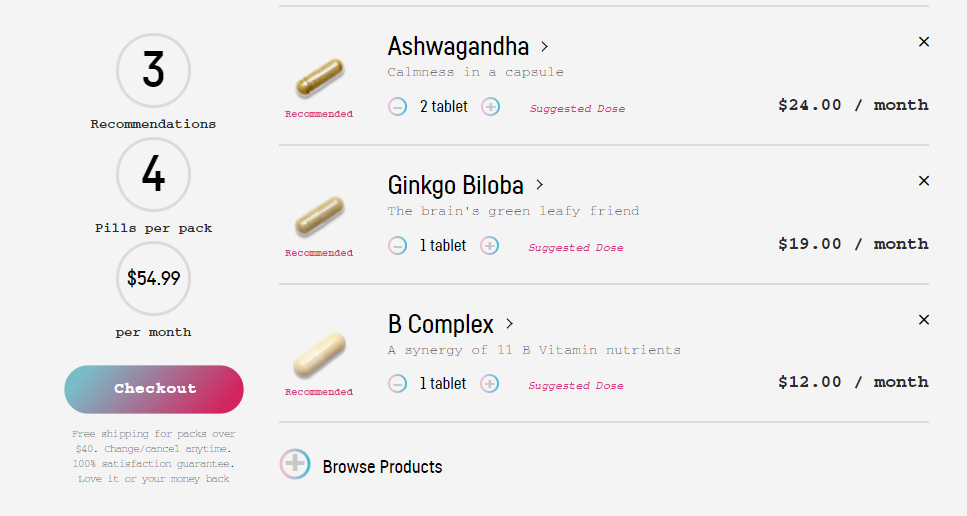

I tried pretending to be a fit, healthy 32 year old who doesn't smoke or drink, has a healthy diet and exercises regularly, and just has minor mood problems, and I was still recommended over $50 of vitamins a month:

### Vitally

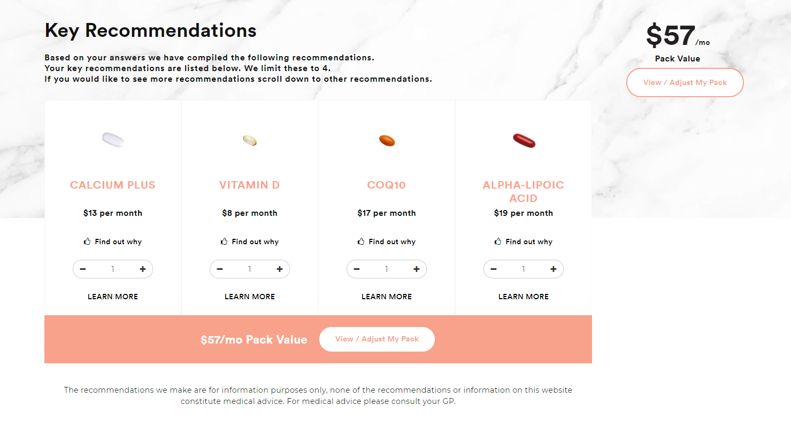

### Wondermins

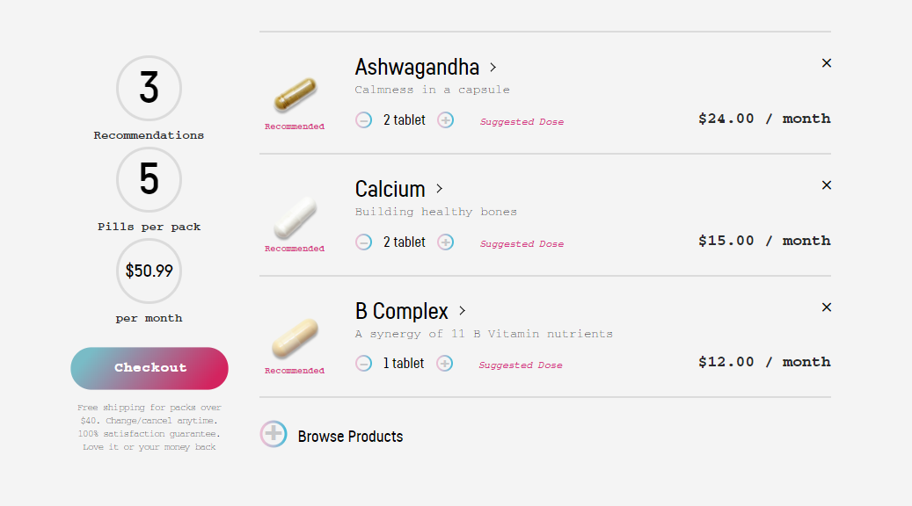

As a 110 year old chain smoking alcoholic with bad diet, no exercise and a raft of health problems, my monthly cost went up to $70 and $90 per month:

### Vitally

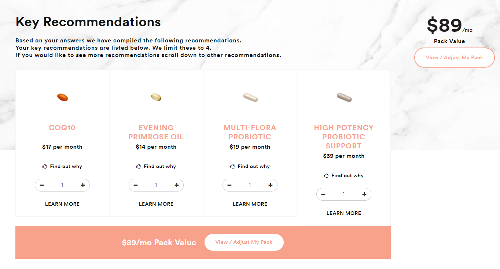

### Wondermins

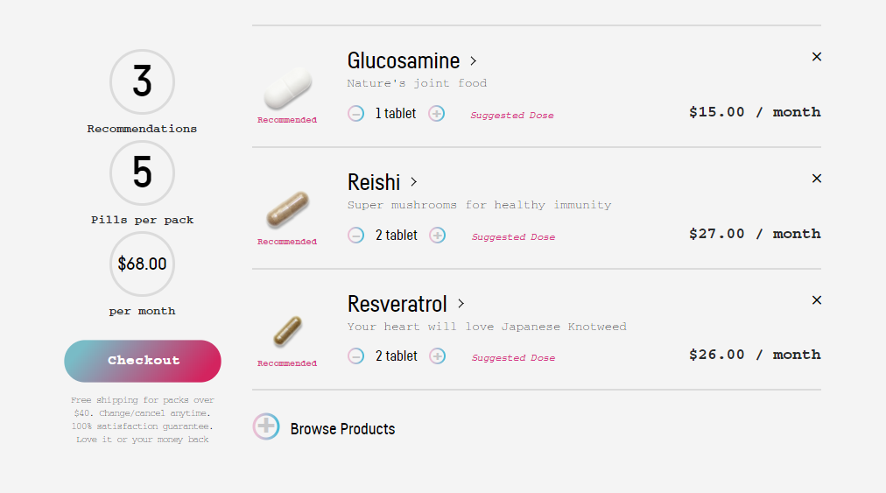

Wondermins asked if I was known to be deficient in any nutrients (which sounded like they're asking me to do their work for them), so I tried responding yes to all four:

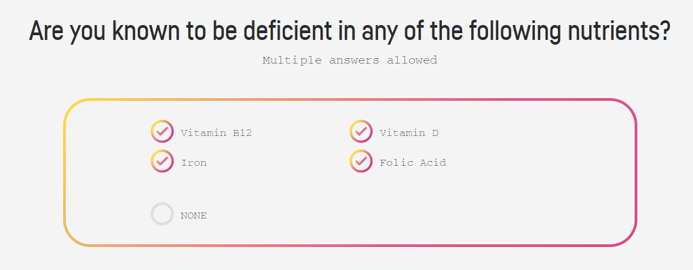

Weirdly, the suggested supplements for me to purchase only contained two of the four nutrients I said that I was deficient in:

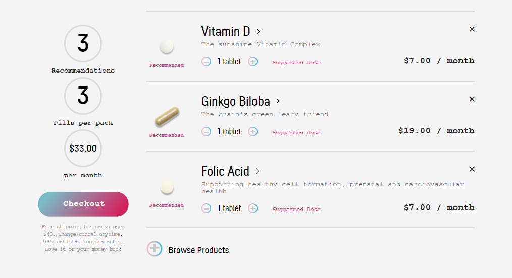

Checking out the information on each supplement, it appears that the companies offering these vitamins are careful to sprinkle a large amount of weasel words into the descriptions, with the word "support" appearing up to thirteen times in the few pages I checked out:

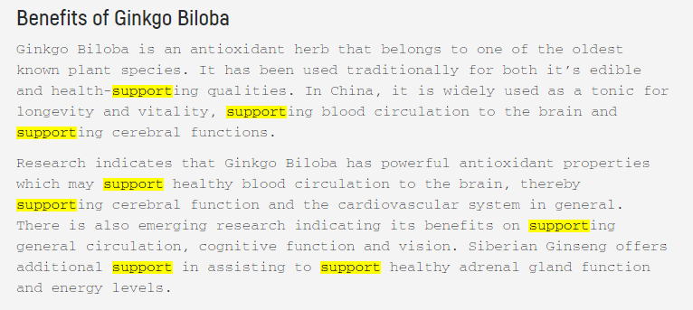

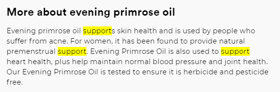

The Stuff article about these new services quoted registered dietitian Brad Brosnan for a slice of skepticism:

> "All too often I see people's mindset relying on supplementation instead of healthy food. In most cases people should take a food first approach to improving their health before supplementation." People should seek a "personal and clinical assessment, rather than talking to a computer"

As always, if you have concerns that you're not getting the vitamins you need, see your GP. The people who are selling vitamins are likely to always tell you that you need their product.

There's more on this from [Mark Hanna](https://sciblogs.co.nz/honestuniverse/2018/05/08/personalised-supplements/).
