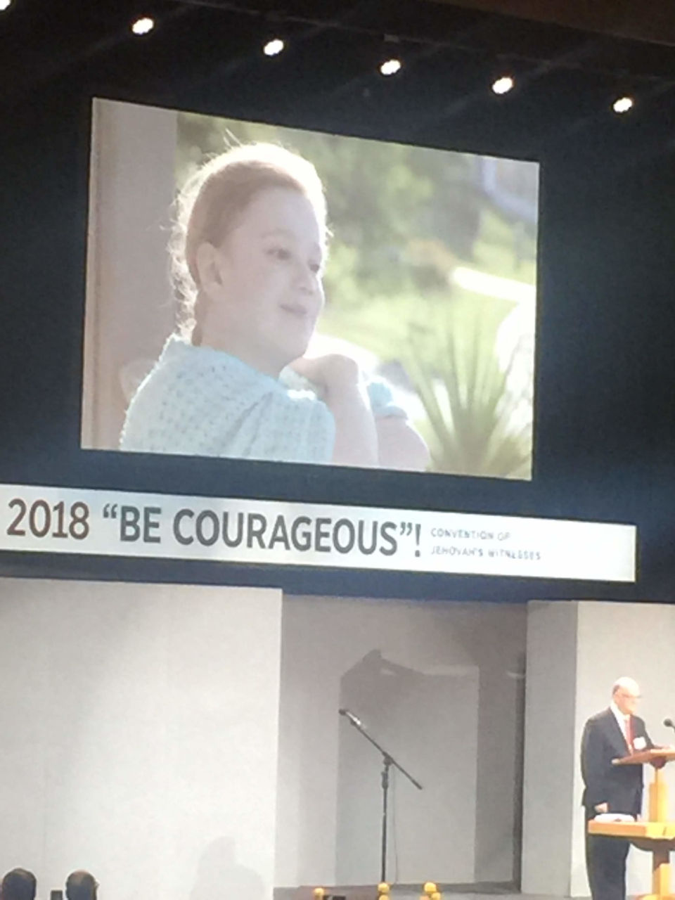

[Source](https://www.radiolive.co.nz/home/on-demand/weekend-variety-wireless/2018/08/skeptical-thoughts--190818-charlatains.html)

I've spent this weekend at the [Jehovah's Witnesses convention](https://www.jw.org/en/publications/books/convention-program-2018/), titled "Be Courageous", in Porirua. There were estimated to be 2,000 attendees. I ended up going this year because a couple of local Jehovah's Witnesses, both of which have come to my door over the last few years, made a point of visiting me earlier this week to invite me.

<!-- more -->

After my visit, I contacted an ex Jehovah's Witness friend, who was able to fill in some of the details about the conventions. They apparently happen all over the world, and have the same message, same talks, same videos, etc. As they are staggered over a period of time, some locations had already had their convention and so my friend was able to supply me with videos from a convention in the USA. Apparently there are scripts for most parts of the convention, so although there is the occasional mention of local issues, the thrust of the messages is the same over the world.

I skipped Friday, but went to the Saturday afternoon session with a fellow skeptic, and then went back by myself for the Sunday morning session.

Both days had a similar structure - singing, then one or more main sections of talks. Each section was split into five or six short talks given by a local elder, and the talks were accompanied by professionally made videos.

For saturday, firstly we were given five animals - the lion, horse, mongoose, hummingbird and elephant. They were accompanied by videos about these animals that were narrated by someone who sounded like, but definitely wasn't, David Attenborough. Next were stories of overcoming adversity from JWs in six continents, with two videos shown from each. The videos were well done, with voiceovers by english speakers who had accents matching the native language of the people telling the stories - until the Venezuelan video, which was strangely voiced by someone from Birmingham in England. One funny point was where they attempted to add drama to a story by talking about how a couple were sitting at home and then suddenly there was an ominous knock on the door. It turns out that it was the police, but it made me think of just how often around the world that ominous knock means that a Jehovah's Witness is at someone's door, trying to convert them. I've certainly heard stories in the past of elderly, vulnerable people joining the church and donating large sums of money to the church.

Sunday's segment was about the future - or at least the Jehovah's Witnesses idea of what will happen in the coming years - the end times. The videos were fictional, but all revolved around a group of elders who were steering their congregation. Each video would start with a male elder talking about one of the people they looked after, and would cut to a scenario where the person had to be courageous, before cutting back to the elder saying what lesson that person had learned.

There were some interesting points about the church and its beliefs that I noticed during the weekend:

## Patriarchy

A frequent issue with religious groups is how they treat their women, and the Jehovah's Witnesses are no exceptions. Of course, a JW will tell you that their attitude to women is moral, because it comes from the bible (or, more properly, it comes from a man's interpretation of words written by another man thousands of years ago)

There were no women giving any of the talks. During our Watchtower study session on Sunday there were finally women on stage, but only men read scripture, and with only one exception when a man and woman were on the stage together to speak, the man spoke first. Often the man spoke first and last, with the woman speaking in the middle.

There were mentions of women being subservient to men, and about how selfish and independent thought is a definite no-no:

<audio controls src="/media/audio/skepticism/IndependentThought.mp3" />

I get that selfish thought should be frowned upon, but the idea that independent thought is wrong feels creepy - like it's meant to make life easier for those at the top.

There was a lot of talk of trusting Elders (and, of course, all Elders are men), and how learning to trust the Elders now, even if their commands make no sense, is good practice for the end times, when Jehovah will be giving instructions in order to help save the Jehovah's Witnesses. So, even if bad instructions are given by the elders in the here and now, at least it's good training for thoughtlessly obeying Jehovah in the future.

These ideas echo conversations I've had when visited by Jehovah's witnesses, where I've been told that every family needs a head, someone to make final decisions, and that the head should always be a man. Analogies of pilots and co-pilots and talk of needing a final decision maker made it no clearer in my mind as to why that would have to be the man in a relationship.

On Sunday there were videos showing people how to be courageous. Most of them showed women learning lessons from men - and each one started and ended with a group of men (Elders) talking about how much the women were improving. In one of them a group of women were talking about an issue, and their elder could be seen hovering around in the background, listening in.

I've been told by my ex JW friend that there's a secret manual for Elders - "[Shepherd the Flock of God](https://jwvictims.org/2013/12/26/the-8-biggest-shocks-from-the-elders-secret-handbook/)" - that has been leaked on to the internet. For anyone wanting to see some of the hypocrisy in the church, search for "Shepherd the Flock of God" online:

## Worldly pursuits

Jehovah's Witnesses tend to see themselves as "in the world, but not of the world". They do not allow blood transfusions, voting, serving in the military, celebrating holidays or marrying outside of the religion.

There was talk on the weekend of politics being out of bounds for JWs, and one reason given was that because no political party will truly be able to bring peace, it's not worth voting for any party. I couldn't see the logic in this - they were saying that because no party is perfect, it's best to not vote for any party. In my mind, it still seems prudent to vote for the better of the options you have available, even if they're not perfect.

There was also occasional mention of entertainment being bad, especially when it involves spiritualism.

Despite this shunning of worldly things, all the JWs seemed to be very well dressed - lots of makeup, sparkly dresses, new hair dos and men in suits. I definitely stood out simply for not wearing a tie. I jokingly messaged my ex JW friend, asking him if the lack of beards around me was official church policy. He quickly responded with a link to an old Watchtower article, from 1968, warning members about beard wearing:

> "In recent years in many lands a beard or long hair on a man attracts immediate notice and may, in the minds of the majority, classify such a person undesirably with extremists or as rebels against society."

## Revelation

There was a lot of talk about the end times, which the Jehovah's Witnesses believe they have correctly divined from a careful reading of the Bible. Their ideas are based on Revelation, with selected passages from other parts of the bible backing up their interpretation of Revelation.

They don't seem to like the UN:

<audio controls src="/media/audio/skepticism/ReligionDestruction.mp3" />

Apparently the UN is the wild beast, and the world's false religions are Babylon the Great (the harlot). In the end days, which are coming soon, the UN will defeat all false religions, leaving Jehovah's Witnesses standing as the only remaining religion.

After this there will be an attack on Jehovah's people from the North, but they will be protected without having to fight. There were several mentions of large hailstones and people fighting amongst themselves, although with a lot of these predictions Jehovah's Witnesses say they're unsure whether they will be literal or metaphorical.

After this, Satan will be locked away for a thousand years while what is left of mankind has time to work on preparing the New Earth. Then Satan will be released and given a time to tempt people before once again peace will reign.

Of course, there's no evidence for any of this. The JWs who have been visiting me would like to start a Bible Study - apparently there are metrics that members of the church are rated on, including return visits and starting a Bible Study with a potential new member. I've said that I'm interested in doing a Bible study with them, as long as it can focus on the evidence for their belief - I've made it clear that I don't see faith as being a virtue.

## Persecution

There was a lot of talk of persecution - the Watchtower study was about the persecution of Jesus, and the end times talks made frequent mention of the ways in which the Jehovah's Witnesses will be persecuted in the end times. Mentions were made as well of Witnesses being treated badly around the world, and not being given basic human rights. The videos on the Saturday included people who had their church burned down, were arrested and were ousted from their village.

However, when it comes to ideas such as gay rights, the JWs seem to be happy with the idea that people's rights should be restricted because of God's word.

A video was played which showed a Jehovah's Witness "courageously" standing up for her right to not stand up for the rights of others, because she considers them to be immoral:

<!--<video controls src="/media/video/CourageousJW.mkv" style="width: 100%;" />-->

@[youtube](https://youtu.be/rcEmX9wRAnQ)

The Jehovah's Witnesses also have a policy of "disfellowship", where the church can declare that an ex member can no longer be associated with. Family members have to cease communication with their loved ones who have been disfellowshipped. This seems particularly cruel, especially as the church promotes itself to its members as being their whole world. To put yourself in a place where people rely on you, only to then punish them by removing that support, seems particularly unethical and unloving to me. I've listened to church members defending the policy, saying that members who sign up to the church, including kids, are fully aware of the policy, and that this form of tough love is necessary to save them for eternity - but given that the church doesn't even seem to have evidence that this policy is effective, it seems cruel that they are so willing to use it on their own ex members.
