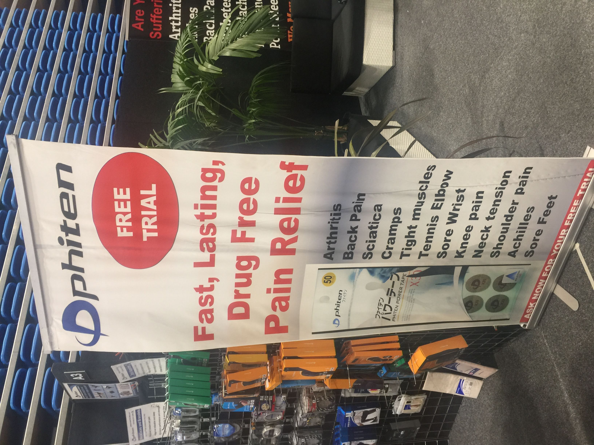
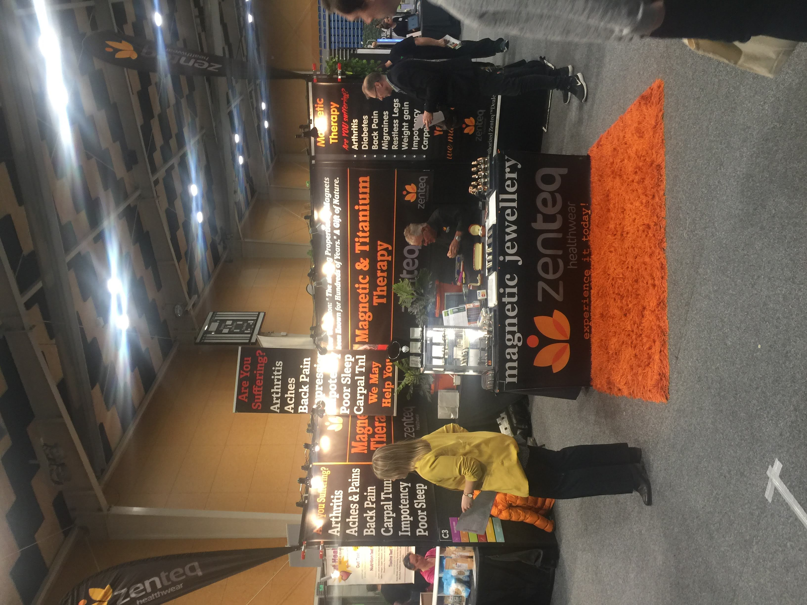
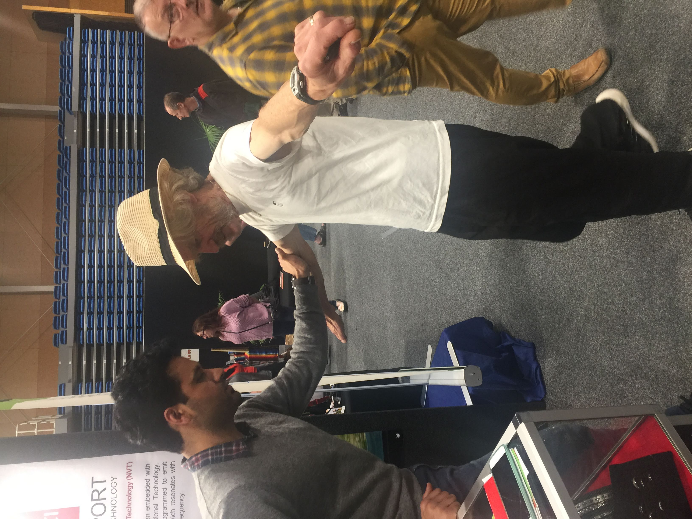

Yesterday I went to an "[Allergy Free and Healthy Living Show](http://www.healthylivingshow.co.nz/location/wellington/)" in Porirua. Sadly there were very few stands at the expo that were about allergies - there was Allergy NZ and Coeliac New Zealand. Most of the stands were selling fake cures for big bucks.

<!-- more -->

### ZenTeq

I talked to ZenTeq - a maker of magnetic bands. We've talked about them before, because Victor Rieter was taken to court after he [started a fight](https://www.stuff.co.nz/national/health/85411808/stallholder-selling-health-bracelets-assaults-rival-at-home-show) a couple of years ago with a seller of rival product Shuzi - Victor ended up punching the Shuzi seller in the head, and had to pay medical costs.

The ZenTeq stand made all sorts of dodgy claims, which was strange because I complained to the Advertising Standards Authority about these claims back in 2016 and Zenteq were asked to stop making them. I've also complained to the Advertising Standards Authority about Shuzi. In fact, I think I'd probably successfully complained about maybe half a dozen companies that were in the room.

I talked with Victor about the bracelets he was selling, and he "explained" how they worked:

<audio controls src="/media/audio/skepticism/ZenTeq.mp3" />

We then proceeded to test the bracelet with a common Applied Kinesiology test. I stood on one leg and put my arms out, and Victor pushed down on one arm which pushed me off balance and I had to put my leg back down to not fall over. Then I held the bracelet in my hand and we did the same thing, but this time I didn't lose my balance.

Skeptics know that this works because the pressure applied to the arm is applied in a different direction each time. If the force points away from the body, you will lose your balance, but if it's towards your body, you'll stay stable.

I asked Victor if we could try a blind test, where I wouldn't let him see if I was holding the bracelet or not and he would try to push me over. A few repeats of that would do a good job of working out whether the band worked. Victor declined my suggestion, saying that he was far too busy - despite the fact that nobody else was at his stall.

### ASEA

Next up was the ASEA stand, where the seller told me that she'd cured her cancer with healthy living many years ago, but that ASEA salt water can also cure cancer. When pressed about her own recovery, it turned out that she disagreed with medical professionals who told her that she didn't have cancer. So, essentially, she used natural methods to cure a cancer that probably didn't exist in the first place.

On the topic of allergies, we talked about her dairy allergy:

<audio controls src="/media/audio/skepticism/ASEA.mp3" />

It's about $200 for four 1 litre bottles, but it can be cheaper if you join their Multi Level Marketing scheme! I was recommended to use a four bottle case per month, which would set me back around $2,400 a year. Apparently this salt water protects against cancer, and so ideally I should drink it for the rest of my life.

We've talked about an ASEA seller in the past - "Dr" Monica Maritz, who was implicated in two unnecessary deaths of cancer sufferers last year.

### Avatar

I talked to someone from [Avatar](https://en.wikipedia.org/wiki/Avatar_Course), who tried to sell me a personal development course.

<audio controls src="/media/audio/skepticism/Avatar.mp3" />

A lot of what I heard, for example about "present time" and about Avatar being compatible with other religious beliefs, sounded eerily familiar. It turns out that Harry Palmer started his Avatar group by paying to re-use L. Ron Hubbard's Scientology Tech. At $400 for a two day course, it's a little bit more expensive than Scientology - but that's not an endorsement of LRH and his ideas!
