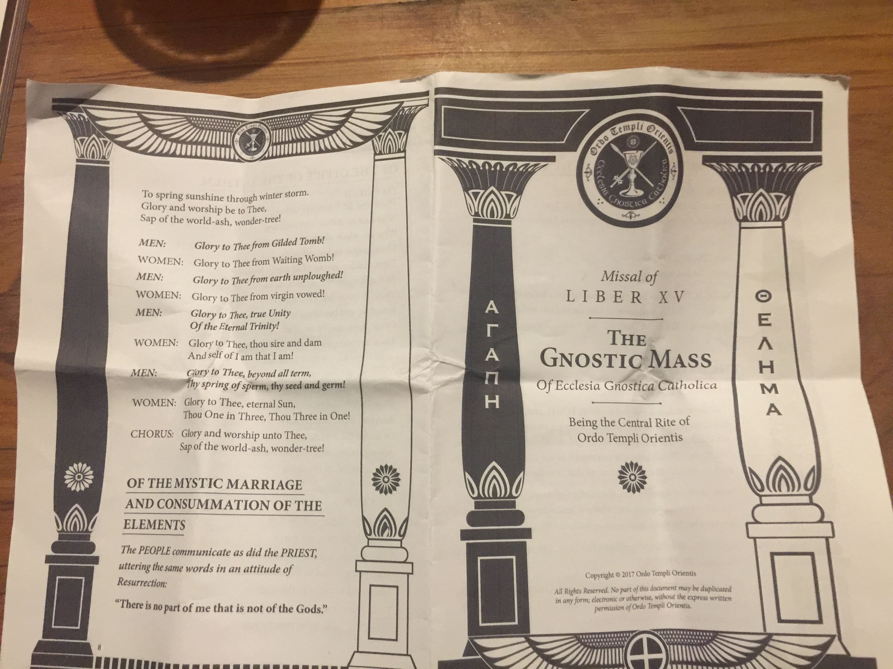
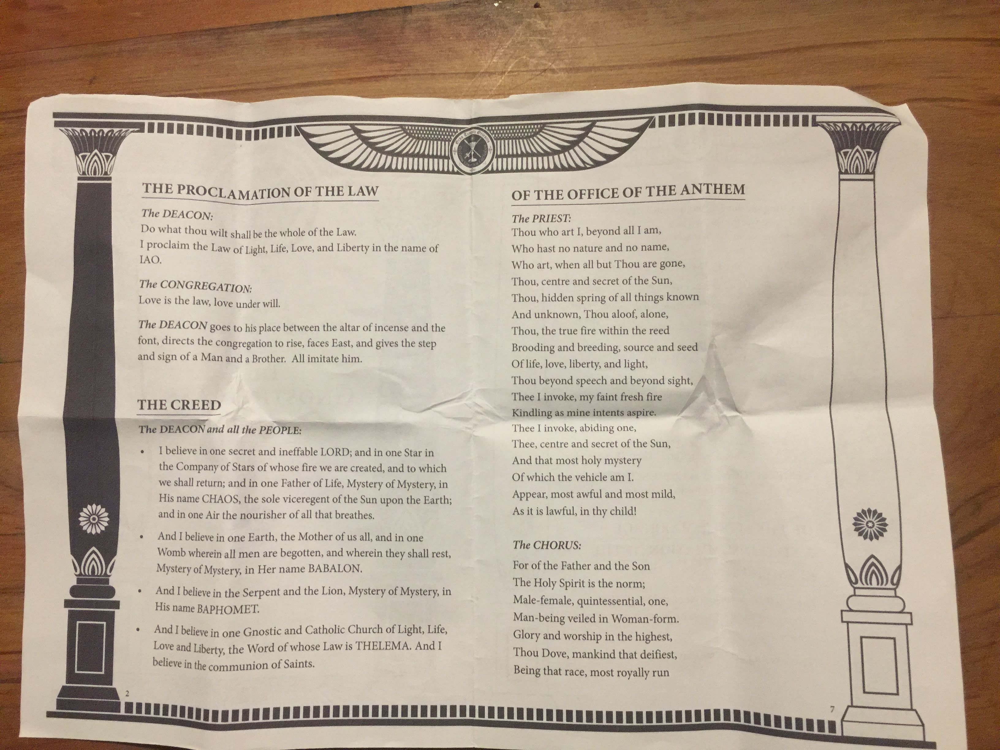
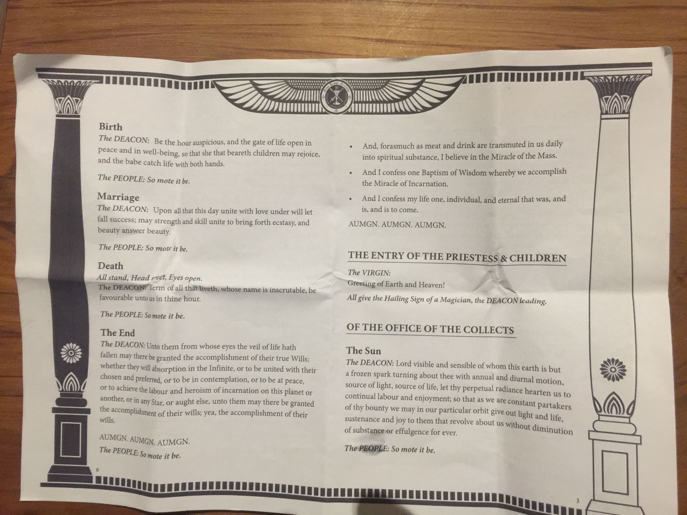
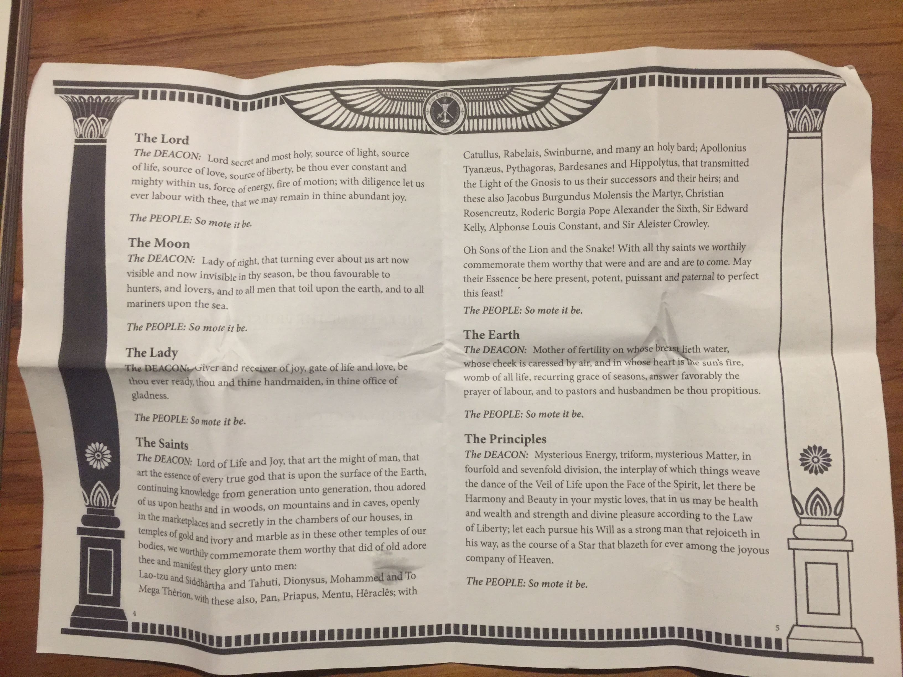

At the end of last year I went along to an occult ceremony, the OTO's Gnostic Mass. I tried to return in June for the Winter Solstice, but the venue was changed on me at the last minute - apparently they had an issue with the normal venue.

<!-- more -->

This time I kept an eye on the local chapter's Facebook page - Eschaton Oasis - to make sure I didn't miss any updates. Myself and my friend Tim both went, and it turned out we were the only two people to attend. We sat outside for about half an hour while they completed setting up, and were then taken in by the Deacon - a woman dressed in a white robe.

When we entered, the service started. The Deacon was joined by the Priestess, and then, after a few minutes, the curtain over the coffin was pulled back and the Priest was revealed.

Tim and I were sitting opposite each other, and managed to follow along with the service, performing the actions as required and speaking where needed. Here's some audio of the Priest singing, and then the Deacon talking, accompanied by me and Tim:

<audio controls src="/media/audio/skepticism/GnosticMass.mp3" />

Salt was added to water and used as a blessing. There was a lot of walking in circles, many crosses drawn in the air, and a lot of attention paid to the priest's lance (a long wooden spear).

There were some comedy moments, like when the curtain got stuck while the priest was trying to open it to reveal the high priestess naked on the altar. The veil was supposed to be pierced by the priest's lance (yes, there's a lot of sexual symbolism in the service!), but the curtain ring got caught on the join between the two halves of the curtain rod. I was afraid for a few seconds that the priest's attempts to free the curtain were going to bring the curtain crashing down, along with the large pillars that it was attached to, but eventually the ring shifted and all was good.

Here's the audio from when the curtain got stuck. You can hear the jangling of the curtain rings, and the banging of the priest's lance on the curtain rail:

<audio controls src="/media/audio/skepticism/OTOCurtains.mp3" />

I noticed this time round that the word "sperm" was mentioned a couple of times before the communion.

> "Glory to Thee, beyond all term, Thy spring of sperm, thy seed and germ!"

> "Touto esti to sperma mou" (which apparently translates as "this is my Seed")

There are also several other mentions of seed, e.g.:

> "Brooding and breeding, source and seed"

> "Therefore by seed and root and stem and bud and leaf and flower and fruit do we invoke Thee"

The communion biscuit, with the priest's sperm in it, seemed to be nicer than last time - they may have added something fruity, so the taste was okay. However, it was just as dry as before. I was prepared, though, and spent 30 seconds before I went up for communion filling my mouth with saliva. This definitely helped me to eat the biscuit faster, and the glass of wine was definitely handy for washing it down.

After the ceremony we were invited to go to the pub with the three members who ran the service. We declined, but next time I will make sure I go along.

