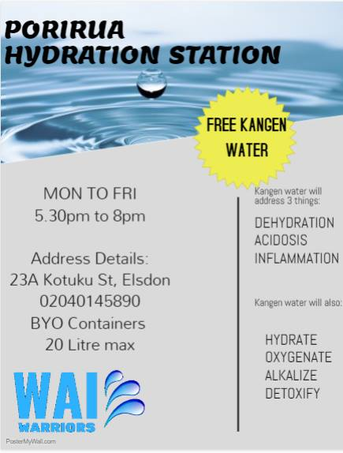
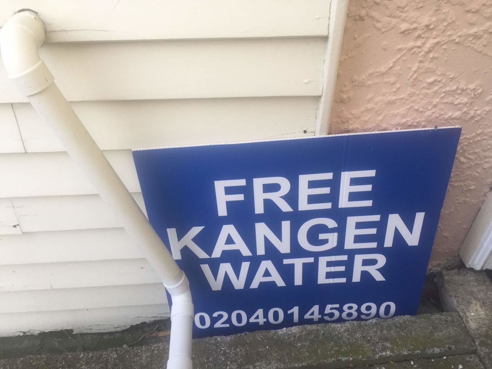
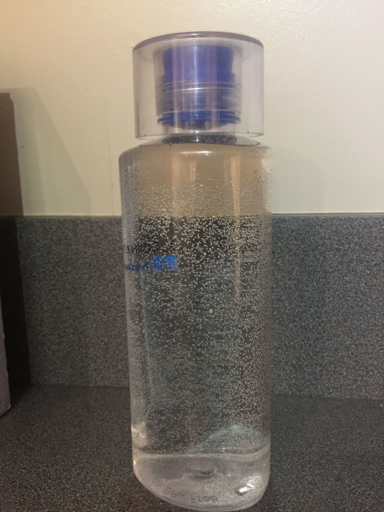

Last week a friend let me know that someone in my area was [giving away kangen water for free](https://www.facebook.com/photo.php?fbid=1710084989102799&set=gm.2381021538580963&type=3&theater) - presumably in an effort to get people to sign up to buy a water filter.

<!-- more -->

Kangen is a water filter that’s supposed to turn the water alkaline, and this goes hand in hand with an idea in alternative medicine that having an acidic body causes illness and drinking alkaline water is sufficient to fix this - both of which are daft. On the poster, claims were made both that the water addresses dehydration and that it hydrates - a little redundant! There are also claims of helping with acidosis and inflammation, and our old friend the nonsense claim of detoxifying.

Here’s the audio of me collecting my water:

<audio controls src="/media/audio/skepticism/Kangen.mp3" />

And here's the water I collected:

The claims that were made are interesting - obviously the medical claims are nonsense, because our bodies regulate our pH and won’t be affected by drinking mildly alkaline water. I can find nothing to support the claim that hospitals in Japan are using Kangen water filters and giving the water to patients.

I’ve also read claims online that many Japanese people own an ionising water filter, and that Japanese people look younger and live longer - surely the two must be connected! Similarly, I wonder if Japan’s good health is due to their use of nuclear power plants, or the prevalence of vending machines in the country.

It just tasted like normal water - the machine was set to pH 8.5, but unfortunately I don’t have anything to test the pH of the water I have. Maybe I should pop out and buy some universal indicator strips and see if it even managed to do what it claims to do.

In the meantime, I recommend for everyone to be skeptical about claims of the ingestion of alkaline water helping with any medical condition, and avoid expensive Multi Level Marketing schemes like Enagic’s Kangen water.
