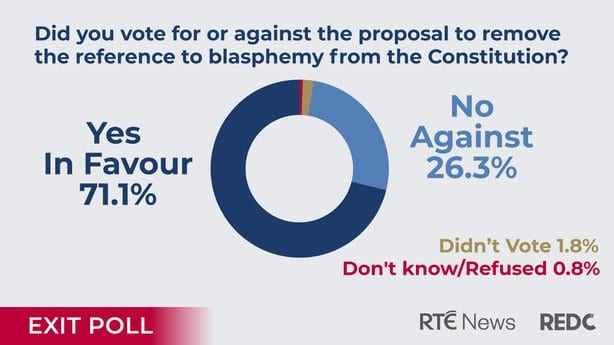

Ireland has had a bit of a rocky history with its blasphemy law, with a complaint made against a local comedian for calling the Catholic communion wafer "haunted bread", and Stephen Fry being threatened with legal action for an interview he gave on Irish TV a few years ago.

<!-- more -->

@[youtube](https://youtu.be/-suvkwNYSQo?t=75)

However, Ireland has now run a referendum, and [exit polls suggest]((http://friendlyatheist.patheos.com/2018/10/27/after-historic-vote-blasphemy-may-no-longer-be-a-crime-in-ireland/)) that the public has voted overwhelmingly to remove Ireland's blasphemy law (71% - 26%), which states:

> The publication or utterance of blasphemous, seditious, or indecent matter is an offence which shall be punishable in accordance with law.

Let's hope that this leads to a change in Ireland's law, and that maybe this piece of news is heard by our MPs in New Zealand, who are readying for a second reading of a bill (the [Crimes Amendment Bill](https://www.parliament.nz/en/pb/bills-and-laws/bills-proposed-laws/document/BILL_77614/crimes-amendment-bill)) that will remove our blasphemy law. Things are [looking positive so far](https://www.parliament.nz/resource/en-NZ/SCR_80467/0345e3993bfc6424d9697ecce280b46c8c513a96), with recommendations from the Select Committee that the law be repealed:

> We recommend no changes to clause 5, which would repeal section 123, doing away with the offence of blasphemous libel.
>
> We heard concerns that the repeal would encourage hate speech against God, incite violence, and remove a safeguard for religious freedom. It was suggested that the repeal would disrupt the maintenance of wholesome boundaries in the media, and would insult God and the Christian foundations of New Zealand.
>
> We consider it highly unlikely that the repeal of this little-known provision would result in any of these issues.
