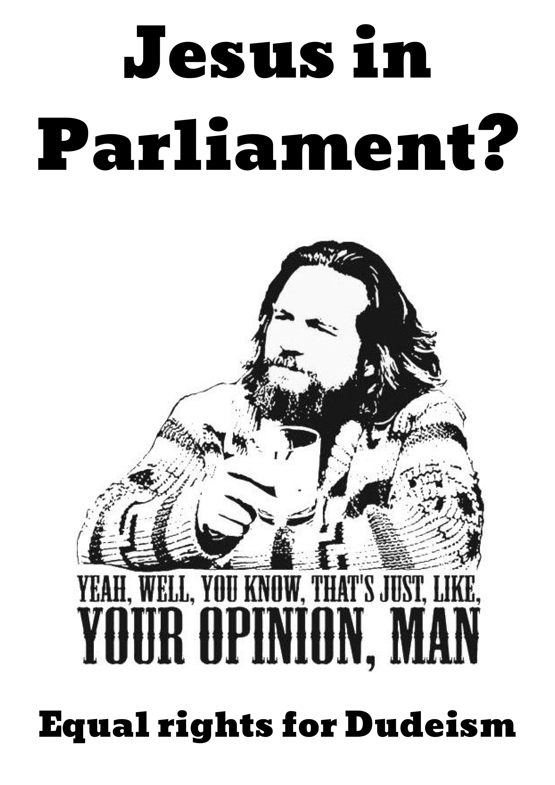
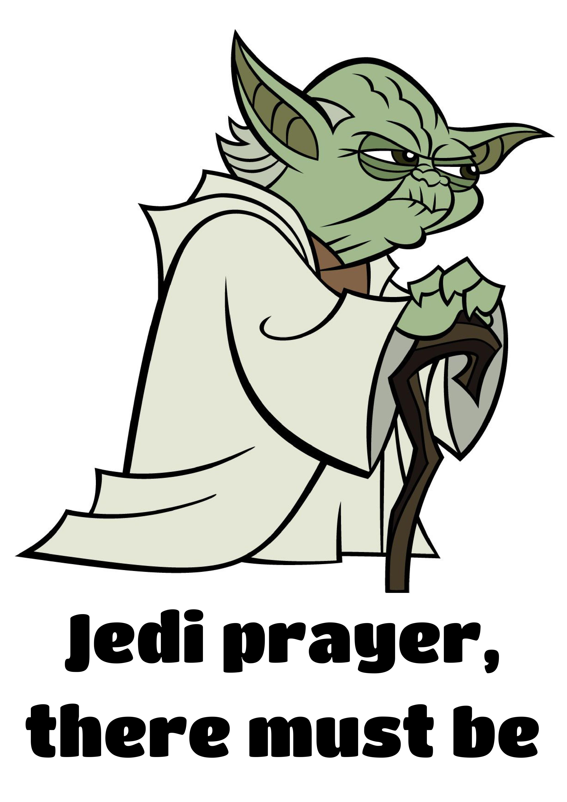
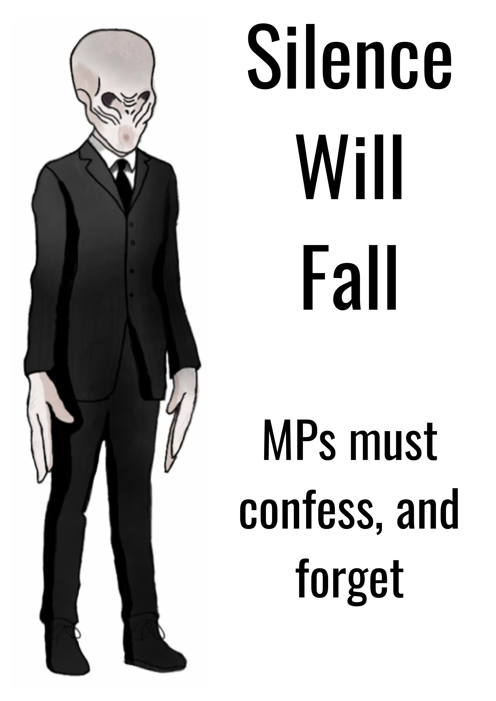
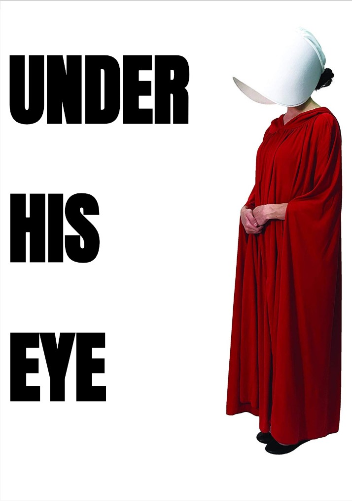

On Tuesday, hundreds of Christians are expected to march on Parliament - as part of a rally called [Jesus for NZ](https://www.jesusfornz.org/). Their cause is that of the Parliamentary prayer. Until recently, the prayer included mention of Jesus:

<!-- more -->

@[youtube](https://youtu.be/Gt0XAD-vJ7Y?t=41)

> Almighty God,
>
> Humbly acknowledging our need for Thy guidance in all things, and laying aside all private and personal interests, we beseech Thee to grant that we may conduct the affairs of this House and of our country to the glory of Thy holy name, the maintenance of true religion and justice, the honour of the Queen, and the public welfare, peace, and tranquillity of New Zealand, through Jesus Christ our Lord.
>
> Amen.

The new, shorter version does a good job of removing some of the more overtly Christian parts of the prayer:

> Almighty God, we give thanks for the blessings which have been bestowed on New Zealand.
>
> Laying aside all personal interests, we pray for guidance in our deliberations, that we may conduct the affairs of this House with wisdom and humility, for the public welfare and peace of New Zealand.
>
> Amen.

The website for the protest says:

> The nation needs you at this time to make a stand as 'one' for our Lord Jesus Christ on the steps of Parliament in Wellington.

Their [press release](http://www.scoop.co.nz/stories/PO1810/S00258/protest-against-agenda-to-remove-god-from-parliament.htm) was particularly galling:

> Pastor Ross Smith of Jesus for New Zealand says that what Rt. Hon. Trevor Mallard has done will marginalise all faiths and religions

Given that the changes that have been made to the prayer make it so that it retains the idea of god, but avoids mention of any specific god, it seems to me that rather than marginalising all faiths and religions, the changes open up the prayer to be meaningful to many other - but not all - faiths and religions.

And, of course, we mustn't forget those of us who are are no faith or religion - the growing group of people in New Zealand who consider themselves in the census to be of "No religion". This demographic made up 42% of all kiwis in the 2012 census, and has been rising at a steady rate of 1% per year for the last 20 years or more - while the number of Christians has been dropping by about 1% per year, and was at 49% in the 2012 census

Of course, it shouldn't matter what the dominant religion is. Civil society should be secular, and stay neutral, in order to be welcoming of people of all beliefs - and that includes non-belief. Having Jesus in our parliamentary prayer was small issue, but it was an issue. It's good that's the Speaker of the House, Trevor Mallard, has fixed the problem, and sad to see people wanting to roll back progress so that their particular belief gets special treatment.

I enjoy activism, and this seems to me to be a good opportunity to counter-protest and have a bit of fun at the same time. Rather than arguing the secular principle that government shouldn't promote religion, a few skeptics and humanists in Wellington (and maybe from further afield) are planning to carry placards arguing that not only should Jesus be in our prayer, but other faiths should be included as well - including weird and wonderful beliefs, such as Satanism and Pastafarianism.

I've thrown together some posters, and started making them into placards, ready for Tuesday.

Anyone is free to join us - we're meeting at the cenotaph next to parliament at 11:45am. We'll most likely head to the pub after the event for a swift pint as well.
