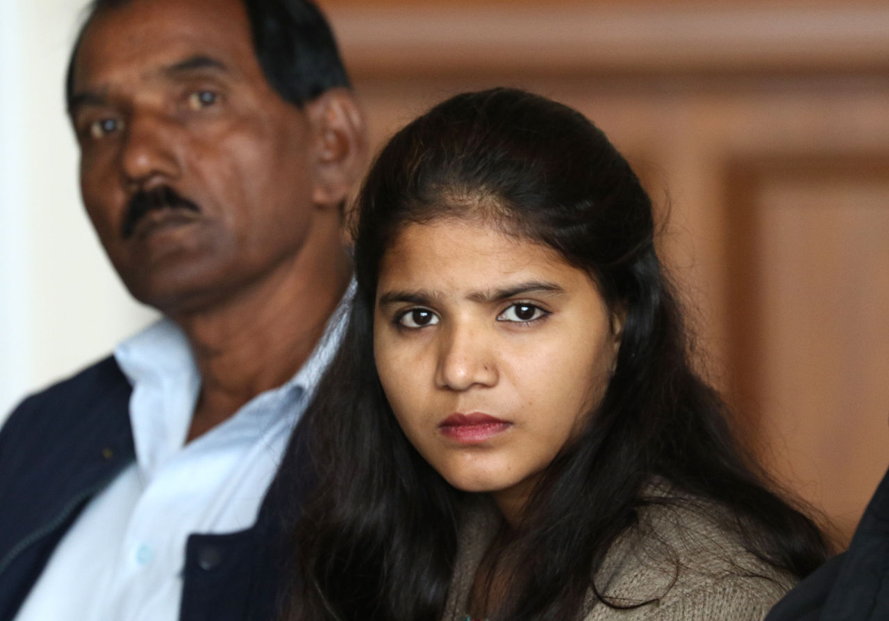

Asia Bibi, who has been on death row in Pakistan for blasphemy for nearly 10 years, has  been acquitted this week. Unsurprisingly, this is far from the the end of her troubles.

<!-- more -->

Since her acquittal, members of a religious political party, the TLP, have been protesting and striking, which has allowed them to negotiate with the judiciary about this case. They have so far struck a deal where they can appeal the decision, and Asia will now be added to Pakistan’s Exit Control List (the same list human rights activist Gulalai Ismail was added to recently), meaning that she won’t be able to leave Pakistan.

Adding her to the ECL will quite possibly be a death sentence for Asia. Her lawyer has already fled Pakistan, fearing for her safety, and her husband has publicly begged for asylum in the UK, Canada or US. Apparently two Western countries have offered Asia asylum, but it’s going to be hard for her to take them up on the offer while she’s banned from leaving the country. I wonder if it’ll be possible to smuggle her out to safety.
