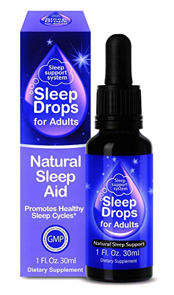

SleepDrops is a New Zealand based company offering herbal/homeopathic products that are supposed to help you to sleep, although there’s absolutely no evidence that they work.

<!-- more -->

Last month SleepDrops had a [round of fundraising](https://www.pledgeme.co.nz/investments/333-sleepdrops-2-million-funding-target-min-of-500-000-reached) - hoping to secure up to $2 million to allow them to expand their operations:

As part of this, SleepDrops needed to open up their books for potential investors to see how healthy the company is. [Stuff reports](https://www.stuff.co.nz/business/109035978/fma-commerce-commission-field-sleepdrops-complaints) that the Financial Markets Authority have received a complaint about SleepDrops because of irregularities in their accounts, which is not surprising - the company, despite winning several business awards, has always seemed to be naive, and uses duplicitous tactics to sell its products.

The Stuff article also mentions that the Commerce Commission are dealing with a complaint about SleepDrops as well. I actually helped to write the complaint, which details illegal medical claims being made by the company, and also points out places where SleepDrops try to use sneaky wording to make claims without getting into trouble. Kirsten Taylor, who owns SleepDrops, admits in an article:

> “We can’t even use the word insomnia on our website or in any of our marketing material… We’ve adapted though and it just means we have to be a bit more creative with our marketing and PR”

This makes some of the claims on their website make sense:

> “Due to New Zealand law we can't legally refer to them as a cure for insomnia but we are confident you will sleep better!”

> “Legally (due to NZ med safe regulations) I am not allowed to go into any detail at all about what results people can expect from my SLEEP DROPS but the name of the product pretty much covers it.”

Hopefully this spotlight on SleepDrops will help to expose the fact that there is no evidence that their products do anything at all to help you sleep, and that sneaky marketing is not okay.
