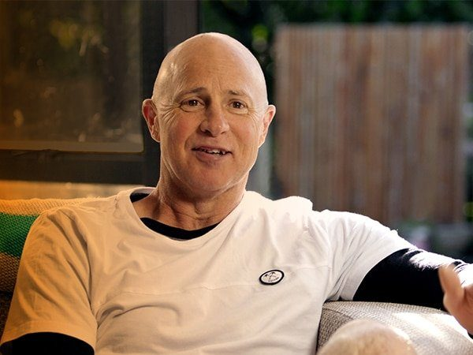

Cocksy, a celebrity builder on New Zealand TV, has cancer and is currently on an experimental new treatment.

<!-- more -->

In an [article on the NZ Herald](https://www.nzherald.co.nz/entertainment/news/article.cfm?c_id=1501119&objectid=12173052), Cocksy spoke about how until recently he’s been self medicating with Te Kiri Gold - a fake cancer cure that is unfortunately still for sale in this country. He said:

> "I'm off it. They won't allow me to keep drinking it with the medication. I have to be totally free of other drug supplements too."

It’s sad to see another celebrity, who has a sway over the public, talk about a quack cure in positive terms. At least he’s listening to the advice of his doctors now, and I wish him the best with the new chemo drug he’s trialing.
