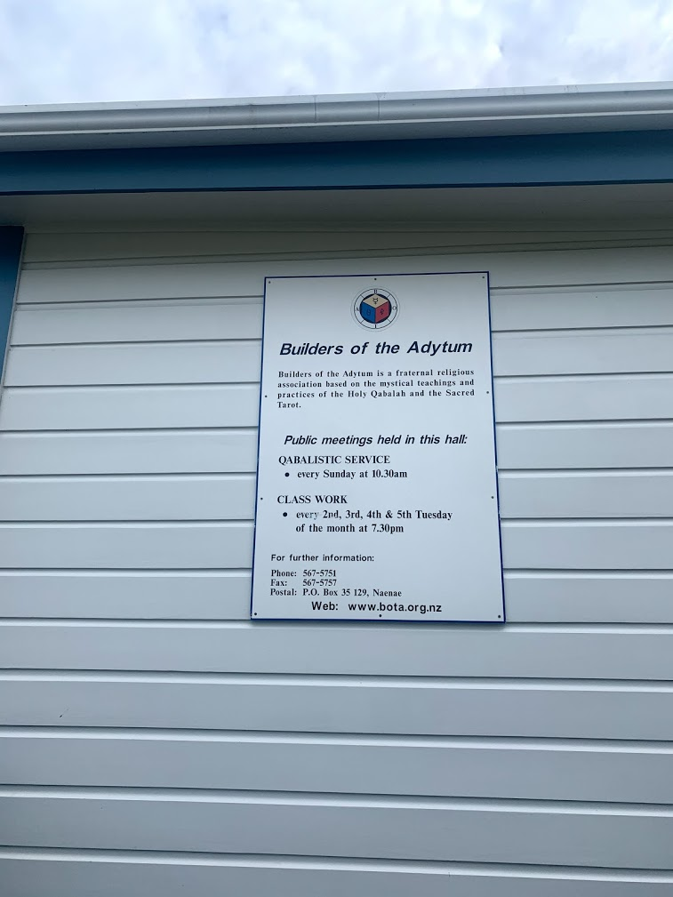

I mentioned three weeks ago that I was going to visit the Ancient Mystical Order of Rosicrucians, and I can report that I survived the meeting intact. My friend Tim and I had a great chat with three of the group’s members about their beliefs, and about the history of the organisation. Much of what we heard sounded very familiar, with an organisational structure that reminded me of Scientology (making your way up the "Bridge") and a belief in visualisation that was akin to Rhonda Byrne’s "The Secret", where if you imagine something enough it will come true for you.

<!-- more -->

After this event, we decided to visit a Hemi-Sync event ([binaural beats](https://en.wikipedia.org/wiki/Beat_(acoustics)#Binaural_beats)) and a Share International meeting about angels. However, both of these meetings fell through, and so instead I woke up yesterday morning and jumped into my car to visit our local Wellington chapter of the [Builders of the Adytum](https://en.wikipedia.org/wiki/Builders_of_the_Adytum) for a Qabalistic Service. Unfortunately, contrary to the assertion on their sign, the doors to the temple were firmly shut.

So my fellow intrepid explorers from Wellington Skeptics in the Pub and I walked up the road and joined Kirtan at the local [Sikh temple](https://sites.google.com/view/wellington-gurudwara-sahib), followed by driving to nearby [Arise Church](https://www.arisechurch.com/hutt) where we took part in an evangelical Christian service with a rock band, stage lighting and cheering crowd:

All in all it was a good morning, and we’ve promised the Sikh temple that we will visit them again soon as they are keen to sit down and chat with us.
