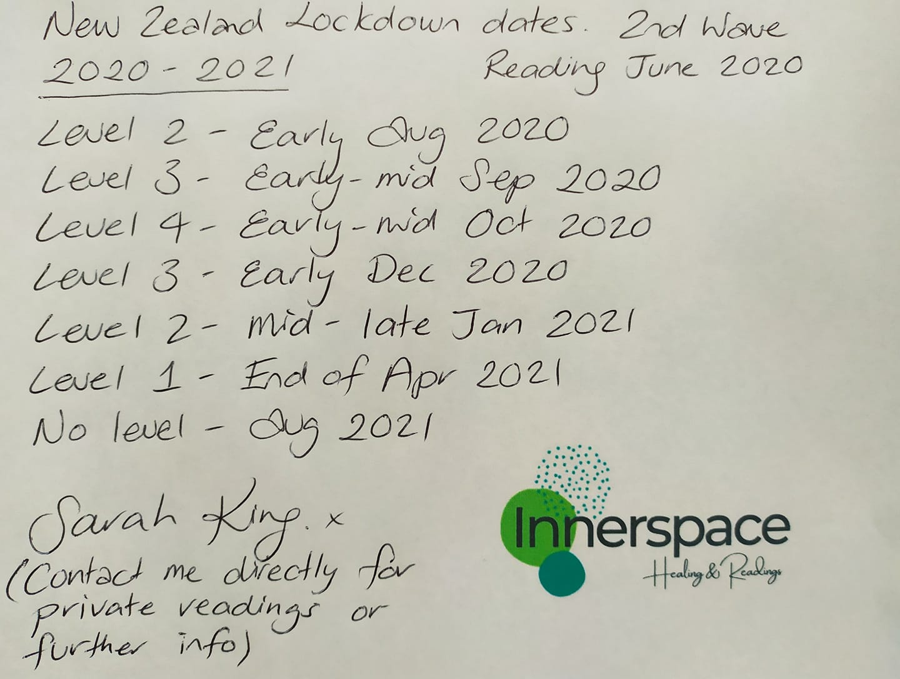
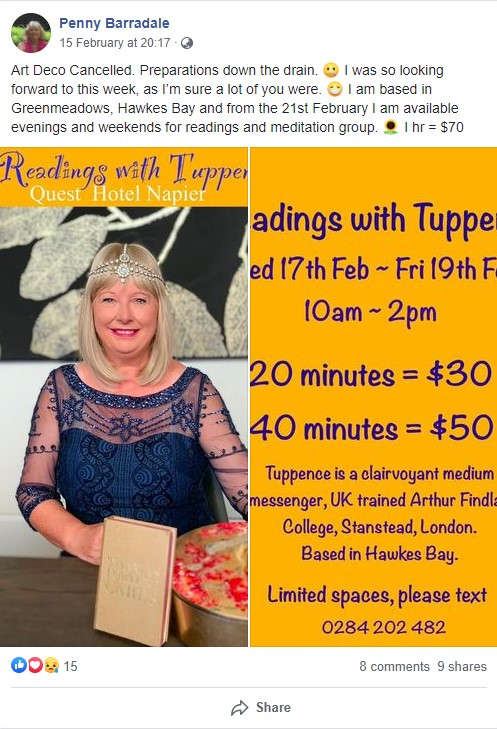
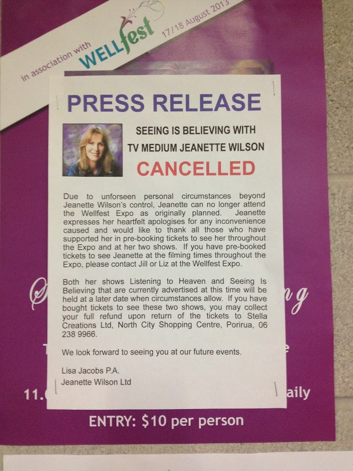

Lockdown timing predictions from a Hamilton based psychic, [Sarah King](https://www.theinnerspace.online/), have been unearthed and posted to our Facebook group this week:

<!-- more -->

Sarah said when she made these totally wrong predictions, back in June last year, that she has been finely tuning her “spiritual ninja skills”. It’s refreshing to see a psychic who’s still willing to make concrete predictions, rather than just uttering vague platitudes designed to make people feel good. Of course, most psychics avoid being this specific because they’re invariably shown to be totally inaccurate. I’m guessing that Sarah will learn this valuable lesson in time!

Another post in the Skeptics FB group this week showed Tuppence, a Hawkes Bay medium, telling her followers that she was saddened by the sudden cancellation of the Art Deco festival in Napier, where she had planned to offer her psychic services. Of course the main question being asked by skeptics is why she didn’t see it coming.

This reminds me of the time Jeanette Wilson was due to give readings at an event that was attended by a group of skeptics back in 2013, but she had to cancel her appearance due to “unforseen personal circumstances”.

