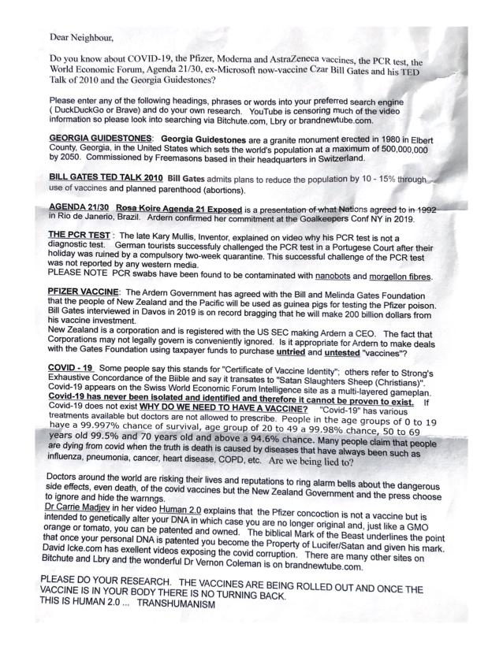

A member of the NZ Skeptics emailed us this week to share an unaddressed letter she received in her mailbox. Thankfully the anonymous author of the document has joined the dots of all the conspiracies I’ve mentioned above and more, and has figured out that the overall aim of the New Zealand government is transhumanism - apparently we’re going to be converted to Human 2.0 via the COVID vaccine. As a technology enthusiast I’m having a hard time seeing the downside to being upgraded, although I have to admit being worried that, given Bill Gates’ involvement, my new nanobots may be running on a Windows based OS. Hopefully I’ll be able to flash them to a more stable BSD or Linux operating system, just as soon as I figure out where my serial port is.

Anyway, in case you too would like to be a part of this Human 2.0 experiment, here’s a copy of the letter listing your required reading materials:

