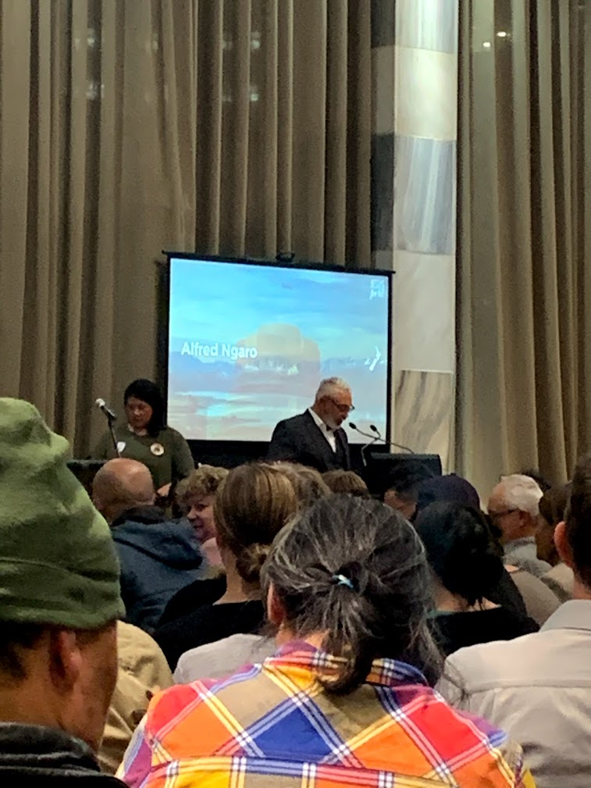
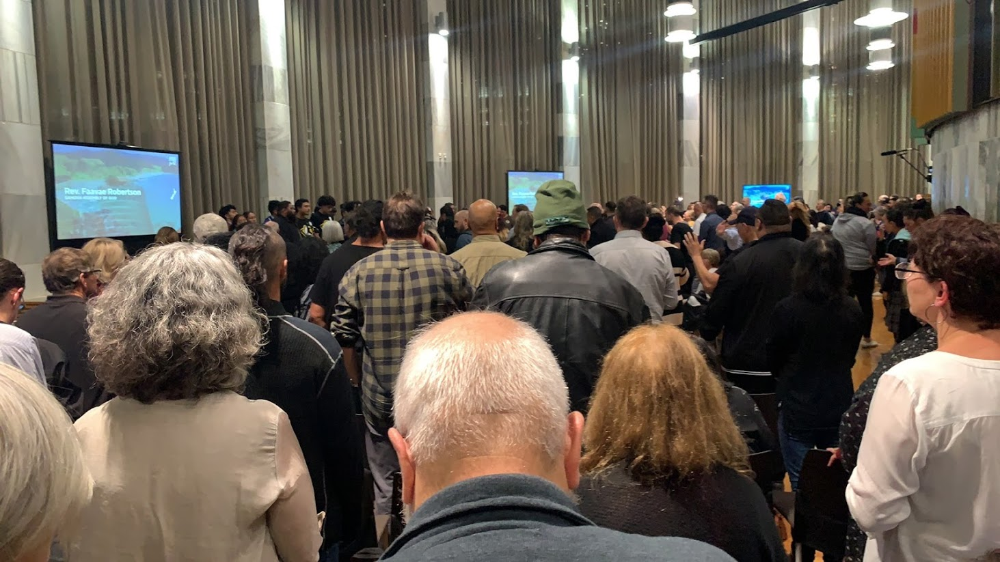

On Monday night I visited parliament, where a group called [Jesus for NZ](https://www.jesusfornz.org/) had been invited by National MP Simon Bridges to hold a church service called the Power of One.

<!-- more -->

Jesus for NZ is a loose affiliation of churches, including [Victory](https://victorychristiancentre.co.nz/), [Celebration](http://www.celebration.org.nz/) and the [Samoan Assemblies of God](https://www.facebook.com/Wellington-Samoan-AOG-New-Zealand-173625589699/), who came together a few years ago when Jesus was removed from the prayer said at the opening of parliament. Back then they organised a rally in the grounds of parliament, asking for Jesus to be re-added to the prayer, and I organised a small counter-rally outside of parliament, where myself and a few other atheists held placards and told everyone that we wanted not just Jesus, but all gods to be added to the prayer, to ensure that parliament is fair and equitable. Needless to say, neither of our groups got what we wanted!

Alfred Ngaro, ex National MP, was MCing the event, which consisted of a lot of singing (including the national anthem), some prayers and a couple of testimonies. Vanessa Shlogl spoke, although it was hard to work out what she was trying to say - I think she was telling people that simply announcing something in the name of Jesus was enough to make it happen, and so people needed to ask for New Zealand to become a Christian nation. She also managed to slip in the occasional phrase in tongues.

@[youtube](https://youtu.be/Jkegmee0tr8?t=2790)

Last year, just before the election, I went to see Vanessa’s husband speak at their church, Victory Christian Centre. He told his parishioners that he couldn’t tell them who to vote for, as it could jeopardise their charity status, but that he could tell them who God wants them to not vote for. He then proceeded to rule out every political party except for the New Conservatives, and followed it up by reminding people that their vote didn’t belong to them, it belongs to god.

There was a lot of talk about strength and revival, and of Jesus sweeping through the nation until we’re eventually all living under the one god. But I can’t help thinking, when I hear these declarations, that the truth is quite the opposite. Successive census results show us that the number of non-religious people in New Zealand is increasing by around 1% each year, and as of the last census only 37% are Christian - down from 59% in 2001. The time of Christianity being dominant in this country is over, no matter how often church groups meet inside parliament, and it’s about time that we became a properly secular society - not one that pushes non-religious beliefs on everyone, but one that treats people of all faiths, and those with none, equally.

After the event myself and my skeptical companions retreated to a local pub, and after a while some of the religious leaders from the event started trickling in and heading upstairs to a private room, including Simon Bridges. I wasn’t surprised to see him cozying up to evangelical christians like this, given that just last week the NZ Herald reported that the National Party is [having issues](https://www.nzherald.co.nz/nz/bill-ralston-national-party-fracturing-along-religious-lines/55AUSY4EZP2MEZIHMA4CEYOE64/) due to differences of opinion within their ranks on religion. I was hoping to see the staff take up cigars and whisky to the group, or maybe a tray full of fresh hopped IPAs, but boringly it looked like they all ordered either water, lemon lime and bitters or coffee.
