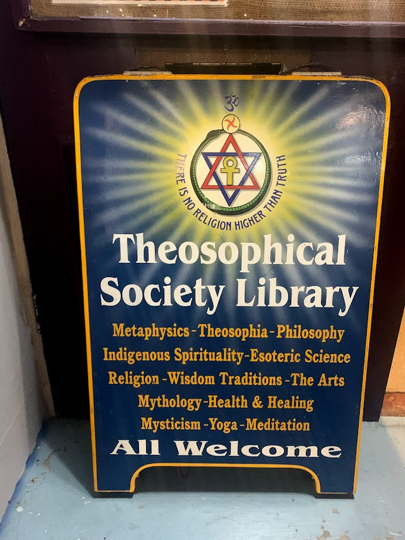
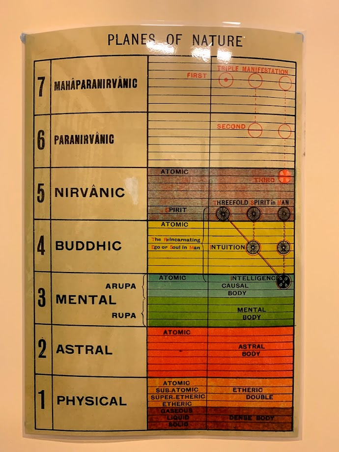

Last night I visited the [Theosophical Society](https://theosophy.nz/centres/wellington)’s building in Wellington to hear their National President, John Vorstermans, give a talk titled “The Ageless Wisdom”. The Society has a great little building on Marion Street, with a comfortable library of esoteric mystical books at the front, and a large main room with lots of wood and painted mystical symbols, and a particularly Masonic feel to it.

<!-- more -->

John’s talk started by covering the basics of Theosophy - that the Society is interested in finding the truth of all religions. In this way the organisation felt diametrically opposed to skepticism: whereas skeptics look at spiritual beliefs and conclude that none of them have yet shown they have any of the answers to life, the Theosophical Society considers that they all have the answer, or at least part of the answer. We were told that members like to focus on different spiritual beliefs, such as numerology, astrology, eastern religions and the Christian gnostics.

Although the society’s motto is “There is no religion higher than Truth”, the fact that they seem to accept pretty much any spiritual belief without good evidence suggests that the truth is not particularly important to them. In a way it felt like the members were tourists, dabbling in spiritual ideas without actually committing to them beyond maybe just learning the basics and memorising a few quotes.

As with most spiritual groups, a single opinionated person started the modern Theosophy movement - in this case, [Madame Blavatsky](https://en.wikipedia.org/wiki/Helena_Blavatsky). She has the usual back story: a self-educated maverick, eccentric, with fantastical tales about her past and accomplishments, and an unwavering conviction that she had access to a deeper truth than anyone else about the world.

Last night’s talk focused on three main ideas that are apparently core to Theosophy:

1. We are not individuals - we are all part of a single connected spirit. Each of us inhabits our physical body temporarily, and only part of our soul is inside our physical body. This spirit inhabits everything we see around us.
2. Everything is cyclical, and what goes around comes around. Societies come and go, ideas are lost and re-discovered, our souls return to the source and are eventually placed in new bodies (aka reincarnation).
3. Our purpose in life is to progress spiritually, and move up through the levels of spiritual understanding:

None of this struck me, or the skeptics with me, as very original. It just felt like a rehash of tired old hippie beliefs. However, the members were a really friendly bunch, and it was nice to chat with them after the talk about their beliefs and interests. I left with a handful of pamphlets and booklets, and will definitely be returning the next time there’s a free event.

